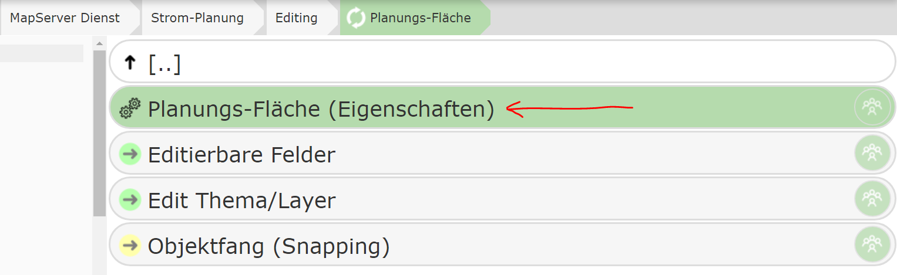
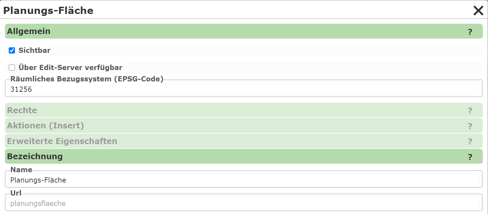
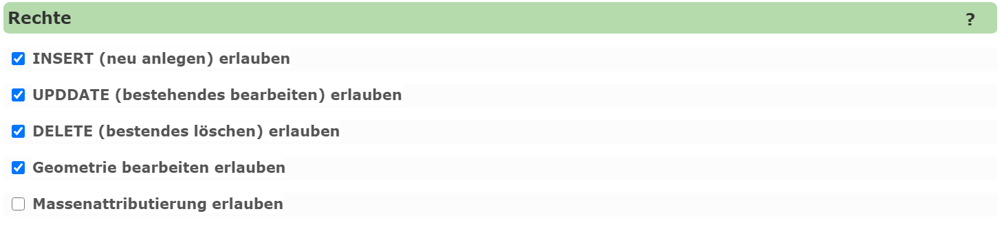
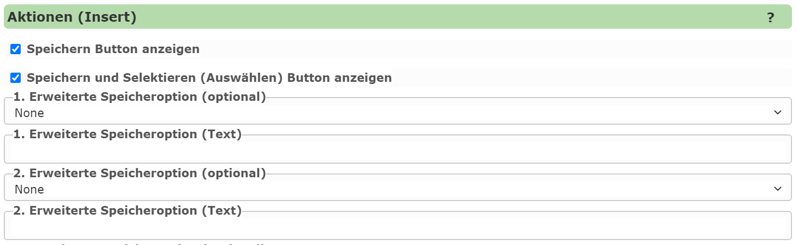
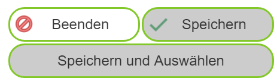
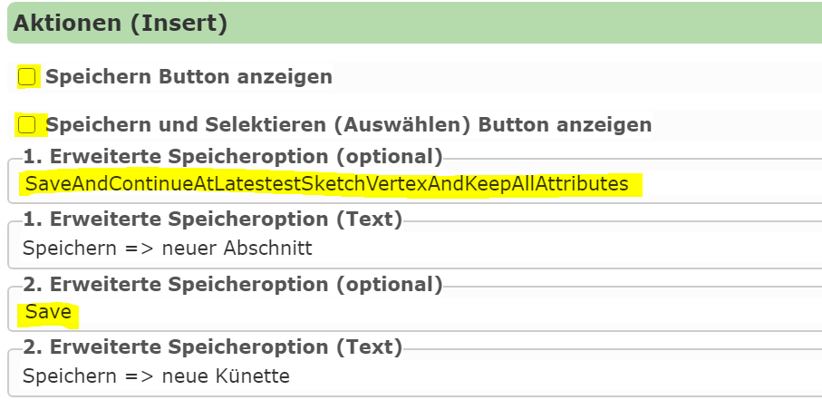
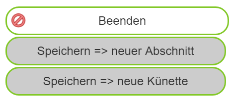
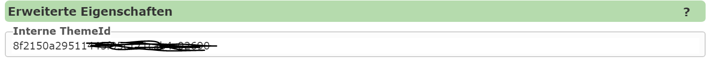

Editing Edit Theme Properties
==================================

Under ``Properties``, general settings for a created edit theme can be defined:

The properties are shown in a dialog with different categories:

General
---------

This specifies whether an edit theme should be shown in the editing tool. For the topic
to be usable in the map viewer, the ``Visible`` option must be enabled.
However, topics can also be edited via other methods, e.g. via prebuilt app templates for the
*AppBuilder* (Collector), which can be used to capture data. For these tools to be allowed to use the edit theme,
the ``Available via edit server`` option must be set.

.. note::
   For security reasons, only the necessary options should ever be enabled. ``Edit server`` should only be
   enabled if access via an app is actually intended. If editing is done exclusively via an app,
   ``Visible`` should not be enabled, since this option relates to the map viewer.

Another important setting is the ``spatial reference system (EPSG code)``. This specifies the
coordinate system in which the data is exchanged via the (AGS) *FeatureServer*. You should specify the coordinate system
in which the data is also stored in the database. This does not need to match the coordinate system of the map
in which the data is edited. By specifying the native reference system of the data, unnecessary
projection can be avoided, which can reduce rounding inaccuracies.

.. note::
   Projection should be avoided as much as possible when editing. For example, if only attribute data is changed
   and the geometry should remain unchanged, saving again could cause unwanted changes due to inaccuracies
   from the projection.

Label
-----------

This specifies the name of the edit theme and can be changed if needed.

Permissions
-----------

For each edit theme, the *permissions* settings determine which actions are allowed:

* **INSERT:** New objects may be created.
* **UPDATE:** Existing objects may be edited.
* **DELETE:** Existing objects may be deleted.
* **Geometry:** In addition to the attribute data, the geometry may also be changed. This can be useful if
  the user is only allowed to edit attribute data of existing objects, but should not be able to make geometric changes.
* **Bulk attribution:** If this option is enabled, the user can change attribute data for all selected objects at the same time.

Actions (Insert)
-----------------

This section specifies which options the user has for saving a created geo-object.
By default, an edit theme has the following *buttons* in the ``Create new object`` form in the map viewer,
in addition to the attribute input:

The user can click ``Save`` and then either draw another object of the same type or leave
the input form. After successful saving, the object appears on the map, and the
attribute-data input form is reset to the default. For a new object, all attribute data must be entered
again – with the exception of *resistant* fields, which can be set once and retained.

With ``Save and Select``, the user can save the created object and then select it directly.
Without this button, the object would first have to be saved and then selected using the query tool.
This action is useful if, for example, a proximity calculation should be performed after the object is created.
This requires that a query for this topic exists in the service.

The two default buttons ``Save`` and ``Save and Select`` can be disabled via the options in this dialog.

Additional Save Options
----------------------------

For special requirements, there are further optional buttons for saving geo-objects.
Up to five additional buttons can be defined via the dialog. For an optional button to be shown,
a *save action* and a *text* for the button must be specified.

The following *actions* are available:

* **Save:** Corresponds to the default ``Save`` button, but can be given alternative text.
* **Save and Select:** Corresponds to the default ``Save and Select`` button.
* **Save and keep attributes:** The attribute values in the attribute-data form are retained after saving.
  This allows the user to directly create another geo-object without having to enter all values again.
* **Save and continue drawing from last vertex:** After saving, the last point of the created
  object is used as the starting point for the next object.
* **Save, continue drawing from last vertex, and keep attributes:** A combination of the two previous actions.

Example Use Case
------------------

A short example in which the different save actions can be usefully applied:

For planning pipeline objects, the trench route should be captured in the map viewer (line object).
Based on the line length, the estimated excavation costs can be calculated. These costs depend
significantly on the ground surface (e.g. lawn, asphalt), which is why a corresponding *ground surface* attribute can be
selected.

If the ground surface changes within a longer pipeline project, the planner must save the line at the
transition points and continue the new *segment* at the last point of the previous segment.
Since this is a new geo-object, all attribute data (planning number, variant,
person responsible, etc.) would normally have to be entered again.

Optimization with Automated Saving
-------------------------------------------

The action **"Save, continue drawing from last vertex, and keep attributes"** provides considerable relief.
With a click on a specially configured button, a new segment could be started this way, with
all attributes – except for the *ground surface* – being retained.

Configuring the Actions (Insert)
-----------------------------------

The *actions (insert)* can be parameterized as follows:

1. The two default buttons are hidden.
2. The default save action is added as an optional button with new text *"Save ⇒ new trench"*.
3. The first optional action (1) allows continuing to draw directly with retained attributes (*"Save ⇒ new segment"*).

In the map viewer, the buttons for this edit theme then appear as follows:

==================

Advanced Properties
------------------------

Every edit theme is internally assigned a unique ID for identification. If the edit theme is used not only
in the map viewer, but also in external applications (e.g. apps like *Collector*), this
ID must be stored in the corresponding JavaScript code.

Since a descriptive ID is often desirable, the value can be changed manually here.

.. note::
   If the ID is changed manually, you must ensure that it remains **unique** within the CMS.
   The system does **not** check uniqueness, so this is the responsibility of the CMS author.
   Additionally, the ID should not be changed afterwards, since a change would have to be applied in **all connected apps**.
   If a descriptive ID is desired, it should be defined directly after the edit theme
   is created.
