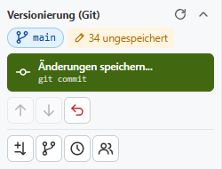
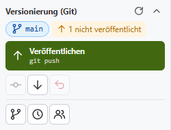
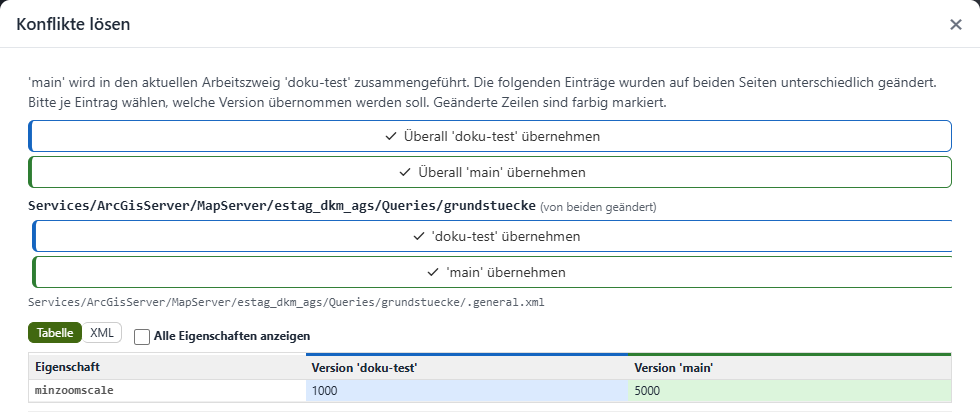
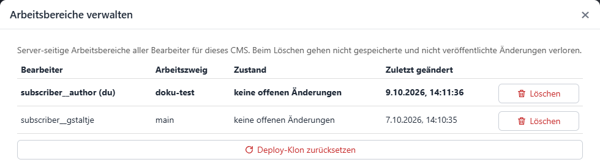

.. _cms-git:

Versioning with Git
===================

.. versionadded:: 9.26.4102

Optionally, a CMS tree can be versioned with **Git**. Every change is then traceable (who changed what and when), can be compared and restored, and several editors can work on the same CMS at the same time without getting in each other's way.

Whether a CMS is versioned with Git is defined by the administrator in the ``cms.config`` (see :ref:`cms-config-git`). If no Git is configured for a CMS, the CMS works exactly as before: all editors work in the same tree, and every change is immediately visible to everyone.

Basic principle
---------------

With Git, the following applies:

- **Own workspace:** Every editor gets an own workspace (a copy of the CMS tree) on the CMS server. Changes of other editors only become visible once they have been published and taken over into the own workspace.
- **Git server:** The shared state is stored in an external Git repository (e.g. GitLab, Gitea, Azure DevOps, GitHub). It contains the complete history.
- **Main branch main:** The main branch (usually ``main``) is the *published state*. Only this state is published by the normal deployment (see :ref:`cms-deploy-git`).
- **Working branches:** Larger changes can be prepared and tested in a separate working branch before they are merged into ``main``. Smaller changes may also be saved directly in ``main``.

The user interface deliberately uses simple terms. The corresponding Git commands are shown in small print below them:

.. list-table::
   :widths: 30 20 50
   :header-rows: 1

   * - **In the CMS**
     - **Git**
     - **Meaning**
   * - Save changes
     - ``git commit``
     - The changes are saved with a description in the own workspace. They are not on the Git server yet.
   * - Publish
     - ``git push``
     - The saved changes are transferred to the Git server and are thus available to other editors.
   * - Update
     - ``git pull``
     - Gets the latest changes of other editors from the Git server into the own workspace.
   * - Branch
     - ``git branch``
     - An own development branch in which you can work independently of ``main``.
   * - Take over changes from main
     - ``git merge main``
     - Gets the current state of ``main`` into the current working branch.
   * - Merge into main
     - ``git merge`` → ``main``
     - Merges the working branch into ``main`` and publishes the result.

.. note::

    The **entire** CMS tree is versioned, including permissions (``.acl`` files) and encrypted secrets. The Git repository must therefore be private and hosted on a trusted server.

Getting a workspace
-------------------

When an editor opens a Git-versioned CMS for the first time, there is no workspace for them yet. The CMS shows a corresponding notice. With one click, the current state is fetched from the Git server and the workspace is created. After that, you can work in the CMS tree as usual.

If the Git repository is still empty, it is automatically filled with the existing CMS tree (``path`` from the ``cms.config``) when the first workspace is created.

The Git panel
-------------

In the sidebar, the panel **Versioning (Git)** appears in the *Tools* section:

The panel shows:

- the **current branch** (here ``main``),
- the **state** of the workspace, e.g. *34 unsaved*, *1 not published*, *Up to date* or *x new change(s) on the server*,
- a **main action** (green button) that depends on the state: *Save changes...*, *Publish*, *Merge into main...*, *Resolve conflicts...* or *Finish merge*,
- further **tools** as icons. The tooltip of an icon describes its function.

.. list-table::
   :widths: 35 65
   :header-rows: 1

   * - **Tool**
     - **Description**
   * - Check status
     - Checks the Git server for new changes (``git fetch``). The icon is located next to the panel title.
   * - Save changes...
     - Opens the dialog for saving the changes (``git commit``).
   * - Publish
     - Transfers saved changes to the Git server (``git push``).
   * - Update
     - Gets new changes from the Git server (``git pull``).
   * - Take over changes from main
     - Only in a working branch: gets the current state of ``main`` into the working branch.
   * - Discard all changes
     - Discards all unsaved changes and restores the last saved state.
   * - Branches...
     - Create, switch and delete working branches.
   * - History...
     - Shows the history of all branches and changes.
   * - Differences to main
     - Only in a working branch: shows all differences between the own state and ``main``.
   * - Manage workspaces...
     - Shows the workspaces of all editors of this CMS (see below).

Changed nodes are highlighted in the CMS tree with a color and a dot (e.g. *Dienste •*), so it is easy to see where there are unsaved changes.

If the Git server is not reachable, you can still keep working. The panel then shows the notice *Server not reachable*. Changes can be saved locally, but only published again once the server is reachable.

Saving changes
--------------

A click on *Save changes...* opens a dialog with all changed nodes:

.. image:: img/git-commit-dialog.png

For each node, the state (*changed*, *new*, *deleted*), the name and the path in the CMS tree are shown. If only the order of sub nodes has been changed, *Order changed* is shown. Using the icons on the right, you can:

- show the **differences** (as a table of the changed properties or as XML text),
- **discard** the change of this node,
- show the **history** of this node (see below),
- **jump** to the node in the CMS tree.

The **description of the changes** is suggested automatically and can be overwritten. A meaningful description makes it easier to follow the history later. *Save* stores the changes in the own workspace.

The logged-in CMS user is recorded as the author.

Publishing
----------

Saved changes initially only exist in the own workspace. The panel then shows e.g. *1 not published* and *Publish* as the main action:

Only *Publish* transfers the changes to the Git server.

If another editor has published changes in the same branch in the meantime, these are automatically taken over first when publishing. If the same nodes were changed on both sides, conflicts arise that must be resolved before publishing (see :ref:`cms-git-conflicts`). Changes on the server are never overwritten.

.. note::

    Publishing in Git does **not** mean that the changes are visible in the WebGIS yet. A :doc:`deployment <deploy>` is still required for that.

Working branches
----------------

Using *Branches...*, own working branches can be created, switched and deleted:

.. image:: img/git-branches.png

The user name is suggested as a prefix for the name, but the name can be chosen freely. A new working branch always starts with the current state. Branches that only exist on the server (e.g. from other editors) are marked with *server only* and can be selected as well.

When you are in a working branch, the panel shows its name. The main action is then *Merge into main...*:

.. image:: img/git-panel-branch.png

A working branch can be deployed to a development or test environment for testing without changing the published state (see :ref:`cms-deploy-branch`).

Taking over changes from main
~~~~~~~~~~~~~~~~~~~~~~~~~~~~~

If several editors work in parallel, ``main`` evolves while you work in your own working branch. *Take over changes from main* gets the current state of ``main`` into the working branch. This is useful before testing a working branch or merging it into ``main``.

Merging into main
~~~~~~~~~~~~~~~~~

Once the work in the working branch is finished, it is merged into the main branch with *Merge into main...*:

.. image:: img/git-merge-into-main.png

This will:

1. take over new changes from ``main`` into the working branch (possibly with conflicts, see below),
2. merge the changes of the working branch into ``main`` and publish them,
3. switch to the main branch.

If the option *Delete working branch afterwards* is set, the working branch is deleted locally and on the Git server. Any existing branch deployment of this working branch is removed as well.

.. note::

    Afterwards, a deployment of the published state is required for the changes to become visible in the WebGIS.

.. _cms-git-conflicts:

Resolving conflicts
-------------------

A conflict arises if the same node was changed differently on both sides, e.g. in the own working branch and at the same time by another editor in ``main``. Conflicts are resolved **per CMS node**, not per file. A changed order of nodes is merged automatically (own order first, new nodes of the other side are appended).

While a merge is running, editing the CMS tree is locked. A notice with the buttons *Resolve conflicts...* and *Abort merge* appears above the tree:

.. image:: img/git-merge-banner.png

The dialog *Resolve conflicts* shows all affected nodes with the differing properties of both versions:

For each node, you choose which version to keep. *Use ... everywhere* resolves all conflicts at once. The differences can be shown as a table of properties or as XML text.

Once all conflicts are resolved, the merge is completed with *Finish merge*. After that, you can work and publish as usual again.

The state of a running merge is kept, even if the CMS is closed in the meantime. *Abort merge* restores the state before the merge.

History
-------

*History...* shows all saved changes as a graph, optionally for all branches. Labels mark the current state, the branches, the state on the server (``origin/...``), the last deployed state (*deployed*) and changes that have not been published yet.

.. image:: img/git-history.png

A click on a change shows author, date, commit and the changed files. The differences can be shown for each file.

History of a node and restoring
~~~~~~~~~~~~~~~~~~~~~~~~~~~~~~~

Using the history icon of a node (e.g. in the dialog *Save changes* or *Differences to main*), the history of this node only is shown. An earlier state of the node can be brought back with *Restore this state*. The result is an unsaved change that can be checked, saved or discarded again.

Differences to main
-------------------

In a working branch, *Differences to main* shows all nodes that differ from the current state of ``main``, including unsaved changes:

.. image:: img/git-compare-main.png

For each node, the differences can be shown, the history opened, or the version from ``main`` taken over (as an unsaved change). *Update* fetches the current state of ``main`` from the Git server.

Managing workspaces
-------------------

All CMS editors are administrators. Therefore, *Manage workspaces...* shows the workspaces of all editors of this CMS with branch, state and last change:

A workspace can be deleted here, e.g. if an editor no longer works on the CMS. **Attention:** Unsaved and unpublished changes of this workspace are lost. Your own workspace must be fetched again afterwards.

*Reset deploy clone* deletes the copy of the repository that the CMS uses for deploying the published state. It is fetched again automatically with the next deployment.
