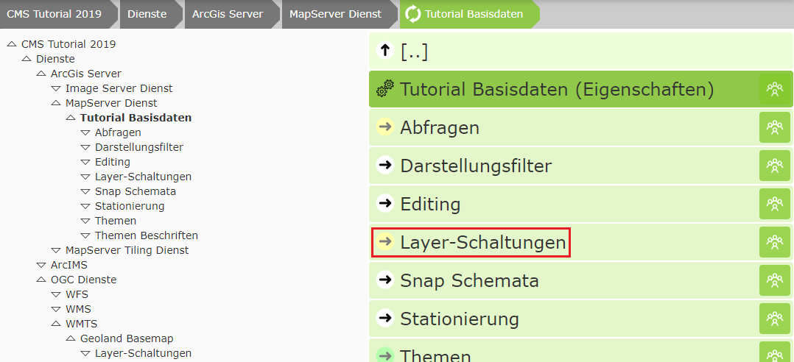
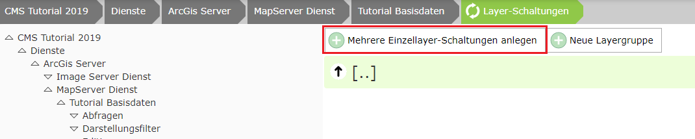

Layer Toggles
=================

.. note::
   This section cannot be applied to *dynamic services* (see previous chapter).
   If a value other than ``None`` is set for the service's properties in the CMS under
   ``Dynamic presentation variants``, this section is not available in the CMS.

Later, in the map viewer, some selected topics should be easily switchable as presentation variants.
Services are generally quite extensive by now, and not all topics are relevant for every user.
For this reason, we have moved to making only those topics accessible via the presentation-variants TOC
that are relevant for the majority of users. Via a workaround shown in the "What's new" section, an
experienced user can access all topics if needed. A TOC that is too extensive usually overwhelms
most users.

Via *schemes*, it can later even be distinguished whether a user logged in via desktop or via a
mobile device. For mobile devices, presentation variants can be further restricted
or look completely different (see below).

To create layer toggles, click on the corresponding section next to the service:

A layer toggle is a set of layers that can be switched with a single click. This allows a user to
switch several layers of the service with one click, without needing to know anything about the structure of the service.

For simple services, such as the base-data service here (consisting mainly of administrative boundaries),
complicated layer toggles are usually not necessary. Here it is legitimate to create one layer toggle per layer.
In this case, you should click the ``Create multiple single-layer toggles`` button:

Select the desired layers and click ``Apply``.

The order can be set by dragging. However, this has no relevance later in the viewer, since the
actual appearance of the presentation-variants tree is defined later under the CMS node "Map Viewer" (formerly GDI).
