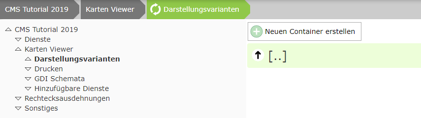
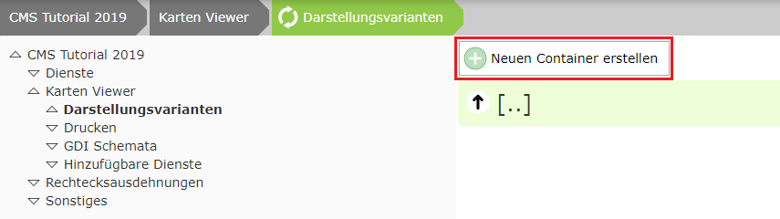
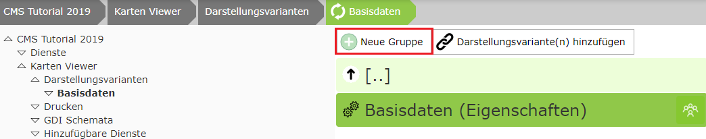
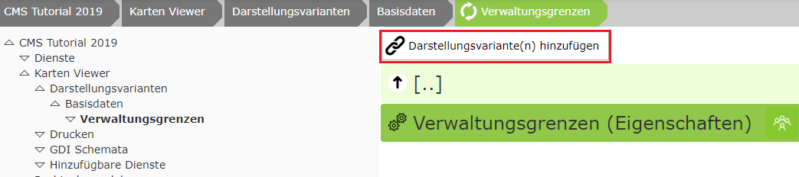
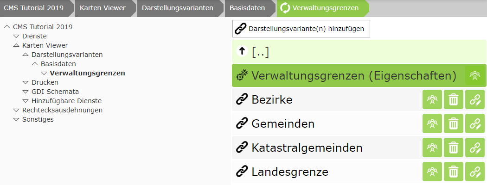

Presentation Variants (Providing Layer Toggles for the Viewer)
======================================================================

For this, switch to the node ``Map Viewer/Presentation Variants``:

The first step is to create a container.
This represents the top level in the presentation-variants TOC. These containers can later be expanded individually by the user.
Inside a container, there can be the actual layer toggles or one or more expandable group(s), which in turn can contain layer toggles.
The maximum depth is therefore three. This also ensures that the presentation-variants tree does not become too complex and that the user usually reaches the desired result with just a few clicks.

In the tutorial, we parameterize two services:

* Base data (administrative boundaries)
* Cadastre

The layer toggles of both services should be located in a container "Base Data" in the viewer.

For this, the container must be created via the ``Create new container`` button.

Layer toggles can now be added inside this container:

In this tutorial, however, we also want to create an expandable group named *Administrative Boundaries*:

The layer toggles created earlier can now be added here. If there are several services in the CMS, you may still need to navigate to the desired service in the dialog:

For the layer toggles inserted here, the order for the listing in the viewer is now also relevant. This can be set by dragging the nodes.
