Queries
========

.. note::
   This section cannot be applied to *dynamic services* (see previous chapter). If a value other than ``None`` is set for the service's properties in the CMS under ``Dynamic Queries``, this section is not available in the CMS.

In addition to the cartographic display of *geo-objects* on a map, some map services offer the ability to search or query *geo-objects*. To do this, switch to the ``Queries`` section for the respective service in the CMS:

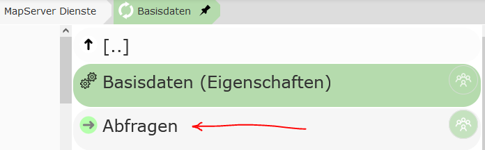

There, the ``New query`` button can be used to create a new query for this service. In the following dialog, you must first select the topic from the service that should be queried:

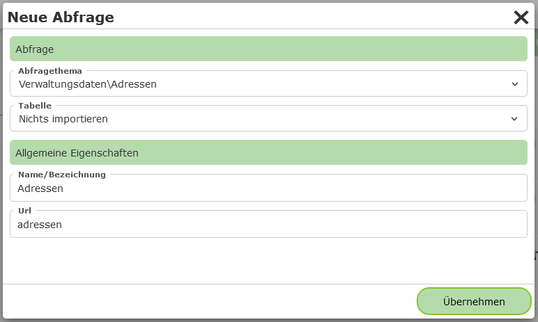

Under ``Table``, you can select which fields for this topic should be imported into the result table when it is created:

* **Import nothing:** Nothing is imported when the query is created. The desired fields are defined at a later point in time.

* **Import fields dynamically - (*):** A field with the "field name" ``*`` is created for the table. This means that all fields are shown in the table.
  The available fields are always read at runtime in the *map viewer*. If the data model behind the layer changes, the changes are automatically reflected in the map viewer.

* **Import individual fields:** All fields that exist at the time the query is created are adopted for the table. Later changes to the data model must be applied manually afterwards. This option can be helpful for quickly creating queries. The imported fields can, if desired, be edited (field type, order, label) and supplemented in the CMS in the next step.

.. note::
   Not all service types provide information about the field names of the topics via the *capabilities*. For these service types (e.g. WMS), the last option may not be available.

Under ``General properties``, a name and a unique ``URL (name)`` must still be assigned for the service.
The ``URL (name)`` can be used to pass a search via a parameterized call of the map (``...&query=addresses&...``).
The query can then be created with ``Apply``. The query should now appear in the list.

Under the query, you will find the following items:

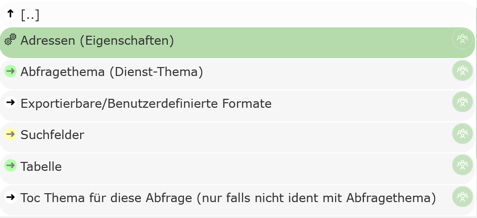

* **[Query Topic] (properties):** Properties of the query.

* **Query topic:** The topic of the service that is queried.

* **Exportable/Custom formats:** Special rules can be defined here from which text files are generated based on the query results. These can then be downloaded by the user via the map viewer. If nothing is defined here, an export of the data as CSV is still available.

* **Search fields:** If data should not only be queried, but the user should also be able to search within certain fields, these fields can be defined here.

* **Table:** The individual columns that are shown in the result table are listed here. In addition to simple value columns, columns with *expressions* and *hotlinks* (composed of the values of one or more columns) can also be created.

* **TOC topic for this query:** Topics from this or another service that the query relates to can optionally be specified here. If the user sets ``visible topics`` when querying, this query is included in the query process if the query topic or one of the topics listed here is within the visible map area.

General Query Properties
================================

The following options can be set under the general properties of a query:

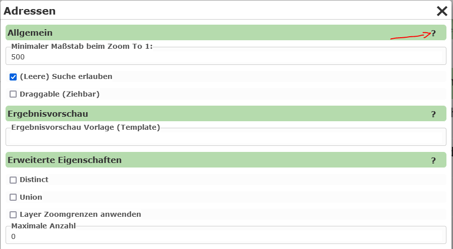

Since a description of the individual properties is available via the ``?`` in the dialog, not all details are covered here.

``General``

* **Minimum scale:** After a search, the map viewer view switches to the search result. If this is only a single point, a scale can be specified here that should be zoomed to.

``Advanced properties``

* **Distinct:**
  If there are objects with identical geometry (e.g. the same point), and the attribute values retrieved by the query are also identical, an object is shown only once in the result list. The data is first retrieved by the WebGIS application from the map/feature service, and Distinct is then calculated from this (server-side).
  An example use case could be customer orders that are all delivered to the same address. If, for example, only the customer name and address are shown in the result table, identical points would be shown stacked on top of each other as markers for each order. With ``Distinct``, these identical points would only appear as a single marker.

* **Union:**
  Result markers that are located at the same place on the map (identical point) are combined into a single object. In the table view, the marker contains all affected 'records'.
  The same example as for ``Distinct`` can be used here. If the order number is also included in the table, the individual points can no longer be combined via ``Distinct``, because the order number will differ between the individual points (customer:orders = 1:n). So that multiple markers do not need to be shown at the same place on the map, markers with the same insertion point can be combined. If the user clicks on one of these markers, all affected orders are shown as the result. For each *record* (order), only the first column is shown. The user can expand the *record* by clicking the first attribute and thus see all values.

.. note::
   Map services always return only a maximum number of geo-objects during a query (e.g. ArcGIS Server services return a maximum of 1000 results by default). If the ``Union`` option is selected for a query and the maximum number of queryable geo-objects is exceeded, WebGIS returns a message stating that the query is not possible. The reason for this is that otherwise a non-existent completeness of the data would be concealed.
   If not all geo-objects can be queried, a point would still be shown, but it would not be guaranteed that the *records* shown under this marker are complete. Therefore, in this case, no result is shown at all, along with a note, so that incomplete data is not mistakenly interpreted as complete.

.. note::
   To mitigate the effect described above, a larger value can be specified under "Maximum number". Even if the underlying service returns a maximum of only 1000 objects, multiple queries can be attempted in the background in order to retrieve all geo-objects. However, the value should also not be too large, since this can lead to a higher server load.

.. note::
   Another way to address this effect is to enable the ``Apply layer zoom limits`` option. The query can then only be performed if the user is within the scale limits of the query topic on the map. The zoom limits are defined in the map service. This value is also useful if this query is integrated as *dynamic content* via the MapBuilder or via a *Dynamic Content Marker* presentation variant.

Search Fields
==============

Search fields can optionally be parameterized for a query. If a query contains no search fields,
the topic can *only* be queried (e.g. with the Identify tool).
If search fields are defined, the query additionally appears in the *map viewer* under "Detailed search".

.. note::
   Not all service types support searching within a topic, e.g. WMS.

To create a search field, switch to the ``Search fields`` area and click ``Add search term``.

In the dialog, you must first select the field to be searched.
Under ``Query method``, you can set how the corresponding field should be searched.
With ``Exact``, for example, the user must enter the search term exactly as it appears in the
database (useful for IDs, numbers). It is usually more user-friendly if the search
is automatically performed with *wildcards*. With ``EndingWildcard``, a wildcard (* or %) is automatically appended after the
entered search term. This finds all geo-objects for which the
corresponding attribute begins with the entered search term. The selection list
shows further options, for example replacing all spaces with *wildcards*
(``SpacesToWildcard``, ``SpacesToWildcardWithEndingWildcard``, ...).

.. note::
   To ensure the search performs well, make sure that the search fields
   are indexed accordingly in the database.

Finally, a name must be specified that is shown in the search mask for this field.
Under ``Url``, an ID that is unique for this query should be entered for the field.
When the *map viewer* is called, parameters can be passed in the URL this way that already
run a query on start. The corresponding parameters for the search fields correspond to
what is entered here (``...&query=addresses&address=mainsquare...``).

If you close the dialog with ``Apply``, the search term should appear in the list.
There, the properties can also be edited afterwards, and the order of the
search terms can be changed. Via the properties, further options such as
selection lists, whitelists, etc. can also be parameterized.

Selection Lists
=================

To make it easier for the user to enter search terms, selection lists can be offered.
When the user enters a character in a search field, the database is queried in the background
and suggestions are offered to the user based on this.

Selection lists also work in a cascading manner: search terms already entered can be taken into account.
(Example: only parcels of a cadastral community are offered once the cadastral community number has already been entered.)

Let's assume a parcel search in which the user can enter a cadastral community number or a cadastral community name,
and a parcel number:

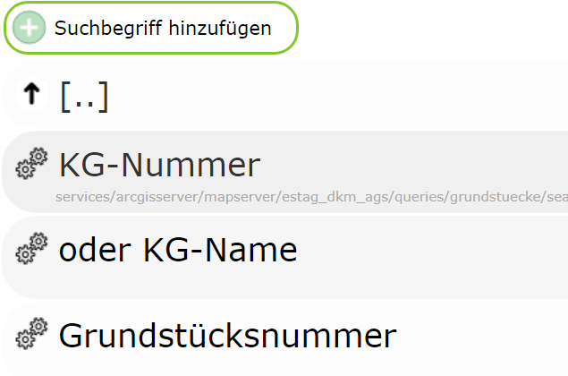

In the example, the database fields to be queried are called:

* ``KG``: input field ID - ``kg``
* ``KG_NAME``: input field ID - ``kgname``
* ``GNR``: input field ID - ``gnr``

For selection lists to work, this must be specified in the properties of the corresponding search field:

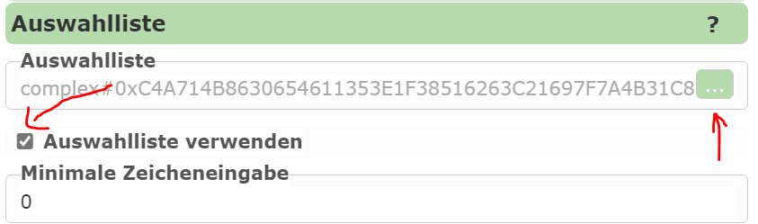

The corresponding SQL statement can be defined via the selection-list editor:

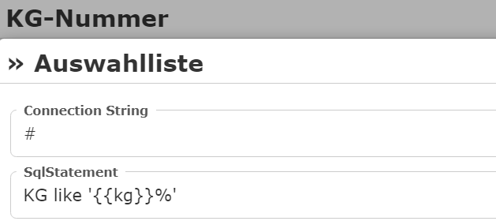

Under *ConnectionString*, the connection to the database to be queried can be specified.

.. note::
    If you use *ArcGIS Server* or *gView* (via the GeoServices REST interface) as the server, no
    direct connection to the database needs to be specified. In this case, the selection-list values can be
    queried directly via the *MapServer* (recommended).
    In this case, simply specify the abbreviation ``#`` as the *ConnectionString*.

Under *SqlStatement*, the expression used for the search is now specified. For a database
query with a *ConnectionString*, this is usually a complete ``SELECT FROM WHERE`` statement.
If you use the *MapServer* for the query (ConnectionString = ``#``), only the ``WHERE`` clause is specified here (without WHERE).

The names of the search terms can be entered as placeholders (e.g. ``{{kg}}``, don't forget wildcards).

For our example, the *SqlStatements* could look as follows:

**KG**

.. code-block::

    KG like '{{kg}}%'

**KG Name**

.. code-block::

    KG_NAME like '{{kgname}}%'

**Parcel number**

.. code-block::

    GNR like '{{gnr}}%'

    #if kg
      AND KG='{{kg}}'
    #endif

    #if kgname
      AND KG='{{kgname}}'
    #endif

Here, the query is further restricted if a cadastral community number or a cadastral community name has already been entered.
The ``#if`` directives can be used to enforce that the corresponding piece of code is only included in the statement
if the user has entered a value for this field.

.. note::
    In the example here, selection lists were defined for all three input fields.
    This is not strictly required. If it makes sense for the task, only
    one input field can offer selection lists.

Table
=======

This lists which fields are shown in the result list. For the query to
work, values must be entered here. An exception here is WMS services,
where the schema of the data is not known via the *capabilities*. Here, a table can generally
not be defined.

If, when creating the query (see above), you selected ``Import fields dynamically`` under Table,
there is already a *column* under ``Table``:

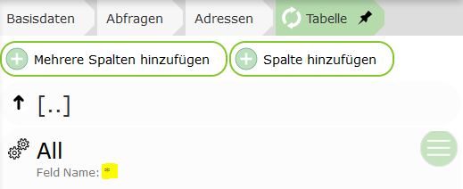

This is a special case: ``*`` is specified here as the field, which
means that the fields are determined automatically at runtime. All attributes that can be
returned by a query from the *map service* are shown.

.. note::
   This option can also be used if, for a WMS service, ``GetFeatures Type`` is set to,
   for example, ``application/geojson`` or ``txt/xml``. In that case, all fields are likewise
   adopted into the table here. Alternatively, the individual fields could also be
   created manually here.

If you want more control over the table, fields can also be specified individually here.
For this, the ``Add multiple columns`` and ``Add column`` buttons can be used.
The first option, however, only works if the underlying service also provides information
about the data schema of the individual topics (AGS, IMS, ...).

Once columns have been added, the properties can be edited further:

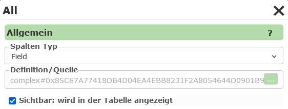

The ``Column type`` specifies what is shown in the table column. The default value
here is ``Field``, which means that the value of an attribute of the geo-object is shown in the
column. For this type, a field from the query topic must be specified under ``Definition / Source``:

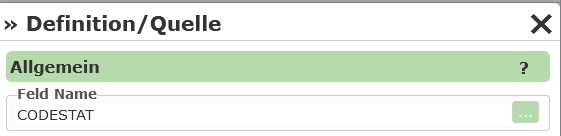

If, for example, you select ``Hotlink`` as the ``Column type``, a *hotlink* appears in the table, via
which the user can be redirected to a new page. Under ``Definition / Source``,
a ``Hotlink URL`` can be specified here. In this URL, fields from the
corresponding geo-object can be specified as placeholders (in square brackets):

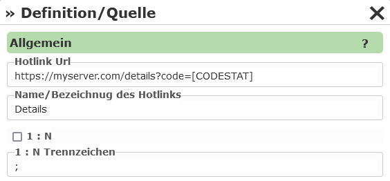

Under ``Name / Label of the hotlink``, you can enter the text with which the hotlink is shown in the
table.

``1:n`` specifies whether the link can be invoked for all rows of a table. A
delimiter can also be specified here, with which the individual values are separated in the URL.

**Settings for opening the hotlink**

In the hotlink settings, there is a dropdown field "Target for new browser window". Here you can select how the hotlink is opened:

- **_blank**: Opens the hotlink in a new tab.
- **dialog**: Opens the hotlink in a modal dialog window.
- **datalinq_pdf_report**: Downloads a DataLinq PDF report in the background.
- **_self**: Opens the link in the same tab/window (default behavior).
- **_parent**: Opens the link in the parent frame, if the page is located within a frame or ``iframe``.
- **_top**: Opens the link in the entire browser window and closes all frames/iframes.

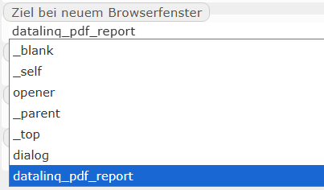

This selection controls how and where the user is redirected after clicking the hotlink.

Further column types include, for example:

* **Expression:**
  Here you can specify an *expression* consisting of (multiple) fields and free text.
  The placeholders for the fields are again specified in square brackets, e.g.: ``Area: [THE_AREA_FIELD]m²``.
  Additionally, functions for calculating and formatting can also be used with Expression (see below).

* **ImageExpression:**
  Like Hotlink, except the target URL must be an image file. The image is shown in the result table.
  The size can be adjusted.

* **EmailAddress, PhoneNumber:**
  The result is shown in the table as a clickable email address or phone number.

* **DateTime:**
  The result is shown as a date. Under Definition, you can set
  how the date should be formatted.

Functions Within Expressions
------------------------------------

For table columns of type *Expression*, in addition to the placeholders for fields shown above in square brackets,
functions can also be inserted within the expression. These are used for special calculations and formatting of the field.

Functions always begin with ``$`` followed by the function name. The argument is passed to the function in parentheses, e.g. ``$eval(42*42)``.
Attributes from the current object are again passed to the function as placeholders in square brackets, e.g. ``$eval([THE_AREA_FIELD]*42)``.

The following functions are available:

* ``$eval()``: calculates a mathematical expression (addition, subtraction, multiplication, division), e.g. ``$eval(11+1)``, ``$eval([AREA]*[COST])``

* ``$sin()``, ``$cos()``, ``$tan()``, ``$asin()``, ``$acos()``, ``$atan()``: trigonometric functions. The calculation and result are always in radians.
  The function ``$pi()`` can be used for conversions, e.g. ``$sin(45.0*$pi()/180.0)``

* ``$round0()`` ... ``$round5()``: rounds the given value. The number specifies the number of decimal places, e.g. ``$round0(100.123)``, ``$round2([AREA])``

* ``$n0()`` ... ``$n5()``: converts a number into the *standard numeric format*. This format, for example, inserts thousands separators into a number (1000 => 1,000).
  The number specifies the number of decimal places. This function can therefore also be used as an alternative to ``$round``.

* ``$n0_de()`` ... ``$n5_de()``: with the function ``$n()``, the display uses the server's current ``culture``. If the language on the server is English,
  the results may not be formatted correctly (1000,123 => 1,000.123). To avoid this, ``$n0_de()`` can be used to force German formatting.

.. note::
   The individual functions can also be nested:

   - ``$round2($eval([AREA]*[COST])) €``
   - ``$n2_de($eval([AREA]*[COST])) €``

.. note::
  ``$n0()`` or ``$n0_de()`` should always be the outermost function. If you use the result to calculate further results,
  errors can occur, because calculation functions cannot handle thousands separators:

  - ``$eval($n0([AREA])*$n2([COST])) €`` => WRONG
  - ``$eval($round0([AREA])*$round2([COST])) €`` => CORRECT
  - ``$n2_de($eval($round0([AREA])*$round2([COST]))) €`` => CORRECT

.. note::
  If you make a syntax error (parameterization error) in the expression, this is shown as an exception in the result list (affects all rows in the table).

.. note::
  If an error occurs when calculating the value, for example because a field ``COST`` does not contain a valid numeric value, the result in the
  table is ``NaN`` (Not a Number). This then only affects the corresponding rows in the table.
