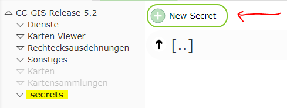
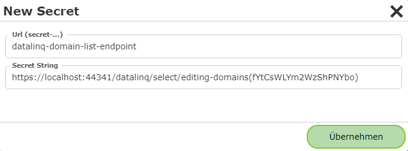
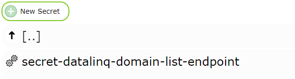
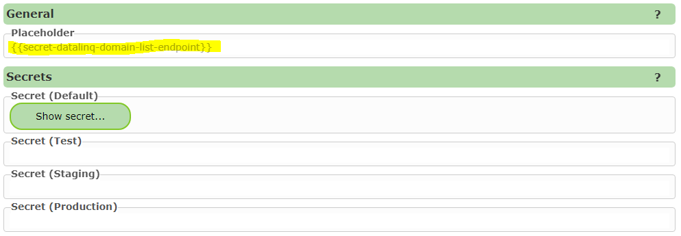
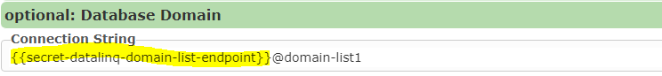
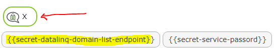

Secrets
=======

Secrets can be used to store *connection strings* and *passwords* centrally within a CMS.
This has the advantage that these *connection strings* do not keep appearing in different places.
If, for example, a *password* needs to be changed, this ensures that the change only needs to be
made in one place.

Creating a Secret
==================

To create a *secret*, switch to the ``Secrets`` area in the CMS and select ``New Secret``:

.. note::
   If this area is not available, a ``Reload Root`` via the *sidebar* may be necessary.

If, for example, the selection lists of a *DataLinq endpoint* are accessed repeatedly, it is recommended
to adopt part of the URL (including the token) as a secret.

``https://.../datalinq/select/editing-domains(fYtCsWLYm2WzShPNYbo)`` @domain-list1

The newly created secret is given a name with the prefix ``secret-``:

Clicking on the *secret* opens the following dialog:

Under ``Placeholder``, it is shown how this secret can be used. The secret can be inserted anywhere in the CMS as part
of a *connection string* or as a password:

In every dialog, an icon is shown at the top that lets you display the *secret placeholders* available for the CMS.
Clicking on a placeholder copies it to the clipboard:

Different *secret values* can be created for different environments (*environments*). If no value is specified for an
environment, the value from ``Default`` is used. The environment for a deployment can be set by
system administrators in ``cms.config`` (node ``deployment`` under ``environment``).

.. note::
   When publishing a CMS, the environment used is shown:

   .. image:: img/secrets6.png
