=========================
Permissions (Security)
=========================

By default, all nodes of the CMS tree are visible to every user (who can see maps with services from this CMS).
If a user is allowed to use a map, for example, they can theoretically add all other services from the CMS to the map via the ``Add services``
button in the **Map Viewer** (provided this button is offered in the map).

If this is not desired, individual nodes of the CMS tree can be secured with permissions in the CMS. If a node is not authorized for a user,
neither the node nor the nodes below it are visible to that user. If, for example, the node of a map service is secured with permissions,
these permissions also apply to all queries and edit themes of this service.

.. note::
   The permissions of a node are inherited by all nodes below it.

Naturally, this also makes it possible, for example, for a service to be visible and queryable for all users, while editing of topics
is reserved for a restricted group of users only. And here too, individual edit topics can again be authorized differently.

Securing a Node with Permissions
==================================

Every node in the CMS can be secured with permissions. To do this, click the *permissions icon*
next to the corresponding node in the list:

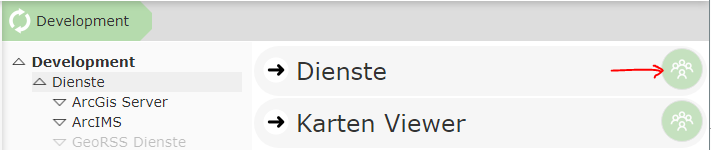

This opens the **node security** dialog for this node. By default, the following is shown here for an
*unprotected* node:

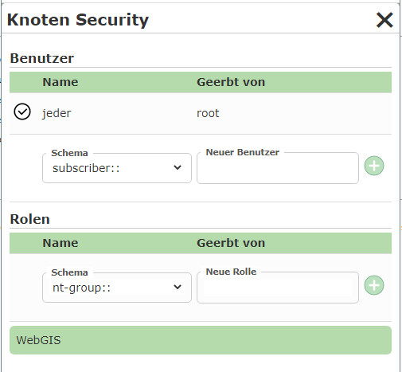

In principle, individual users or user groups (roles) can be authorized. The user *Everyone* is a special user here
that corresponds to all real users. If the user *Everyone* is authorized for a node, all users can see this node.

Depending on the configuration of the WebGIS instance, different *schemas* are available for users and groups. A *schema*
describes the method used to perform authentication. For Windows authentication, the corresponding
*schemas* are, for example, ``nt-user::`` and ``nt-group::``.

Which WebGIS instance the login schemas refer to can be seen in the dialog under the ``WebGIS`` section:

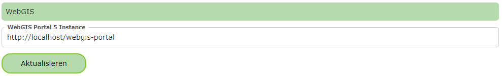

Clicking the ``Update`` button refreshes the selection lists for the *schemas* accordingly.

If, for example, you want to authorize a group for a node, you must first select the correct *schema* and then enter the group name.
Depending on the *schema*, suggestions are shown after entering a few characters. Clicking the *plus* button afterwards adds this group to the list for
this node.

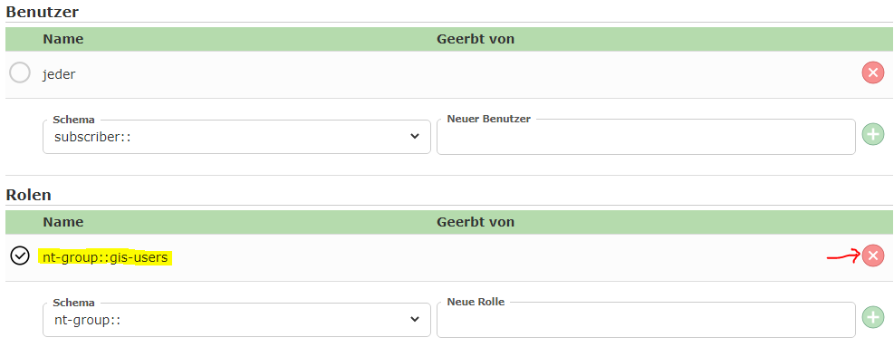

In this view, the default permission for *Everyone* was also removed (the checkbox is not checked). The *delete* icon removes a permission again.
Only permissions that were explicitly set for this node can be removed. Inherited permissions can only be overridden (by checking or unchecking).

If a permission is inherited from a parent, the path of the node where the actual permission was set is shown:

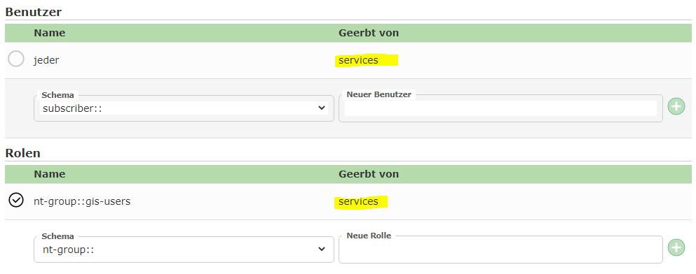

If you want to revoke an inherited permission for the current node, this is done by unchecking the corresponding permission. This sets the
corresponding permission for this node anew, and the inheritance is overridden:

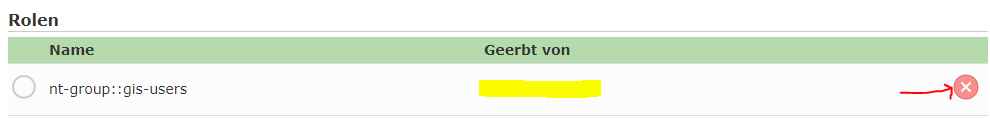

Since the permission has now been set anew for this node, it can be removed again with the *delete* icon. After that, the inherited
permission would be shown again:

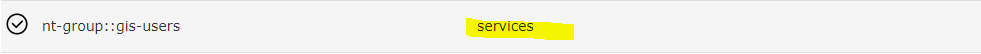

Display of the Permissions Button
===================================

To keep track in the CMS of which nodes are secured with permissions, the permissions button is shown in different colors:

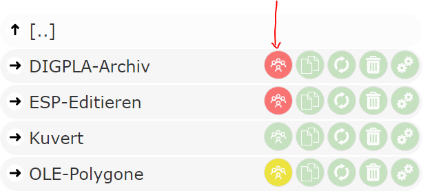

The following colors are possible:

* **Green** (default color - like all other buttons): There is no permission for this node. The node is visible to *everyone*.

* **Red**: There is a permission for this node that excludes at least one user from this node.

* **Yellow**: Permissions have been defined for this node, but they do not restrict any users. This node is still visible to all users.

Regarding the last point, you might ask why a node should be secured with permissions "without" any restriction. This makes sense, for example, for a
parent node such as ``Services``. There, the permission could look something like this:

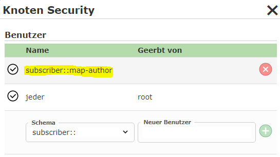

Here, in addition to ``Everyone``, the user ``subscriber::map-author`` is also added. This is, for example, the map author, who should of course also see all
services. Since all services are created under this node, this right is inherited by all service nodes.

If you now want to authorize a specific service node for a user group, for example ``nt-group::gis-edit-users``, the setting for this
node would be as follows:

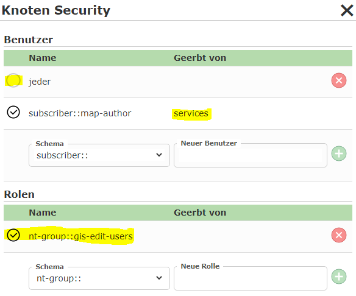

The user ``Everyone`` is explicitly unchecked. Instead, the Windows group ``gis-edit-users`` is authorized for this node.
Although the map author ``subscriber::map-author`` is not in the Windows group, they can still see the service, since this right is
inherited from the parent node.

**Red** permissions buttons additionally also exist in a somewhat *paler* display:

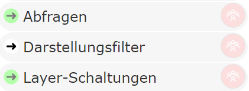

This coloring means that there are restrictions for the node (not visible to everyone), but all restricting rights were inherited.

Exclusively Authorizing a Node
================================

Prerequisite: Build >= 3.21.502

Nodes can also be authorized *exclusively*. This means that you grant a user or a group exclusive rights for this node.
All other permissions then lose their validity for this node.

Exclusive permissions are useful during the development phase or during maintenance, when nodes should not yet be reachable in production. For this, for example,
only the administrator is given the exclusive rights on the node. Only once everything is finished are the exclusive rights removed again.

The advantage of exclusive permissions is that the final *normal* rights can already be set here. However, when the CMS is
published, these are marked as "*ignored*" as long as there is at least one exclusive right on the node.

In principle, any permission, whether for a group or an individual user, can be marked as *exclusive*. To do this, the suffix ``.@@EXCLUSIVE`` (case does not matter)
must be appended to the user when inserting it, for example ``subscriber::my_admin_user.@@EXCLUSIVE@@``.

.. note::
   It does not matter whether the user (e.g. ``subscriber::my_admin_user``) has already been inserted. This does not change the existing settings. For maintenance, this user can be added
   at any time and removed again later, without changing the existing settings.

If you insert an exclusive right, all other permissions for this node are shown transparently and the exclusive right is highlighted:

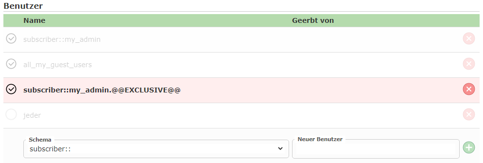

If a node has an exclusive right, this is also shown in the list via a black icon:

If there are exclusive rights in a CMS, the permissions are adjusted accordingly when the CMS is published.
The *output console* shows at the end how existing permissions are modified:

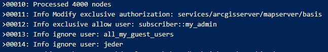

If you delete the exclusive permissions again at a later point in time, the permissions that were already set are applied to this node again:

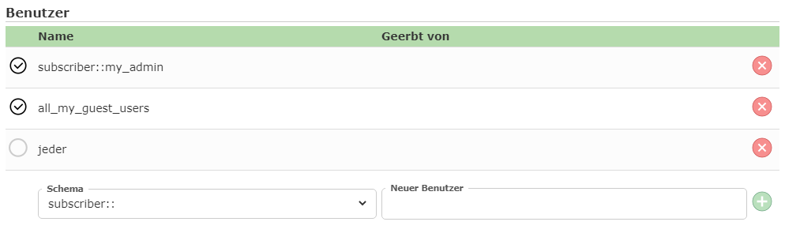

Instance Roles
===============

Among the permissions in the CMS, there is a special role with the prefix ``instance::``.
These permissions relate to a specific WebGIS instance.

One use case would be, for example, giving a node exclusive rights for a WebGIS test instance.

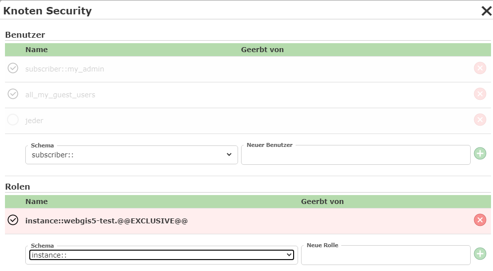

This node would then not be visible for other instances (production system). This makes it possible to ensure that, for the entire
period during which new map applications are being developed, these changes are not shown in the production system, even if the CMS
is published for this instance in the meantime.

Which instance roles are possible for a WebGIS instance is shown via autocomplete when typing. Of course, you must
enter the URL to the corresponding WebGIS portal page and confirm it with ``Update``:

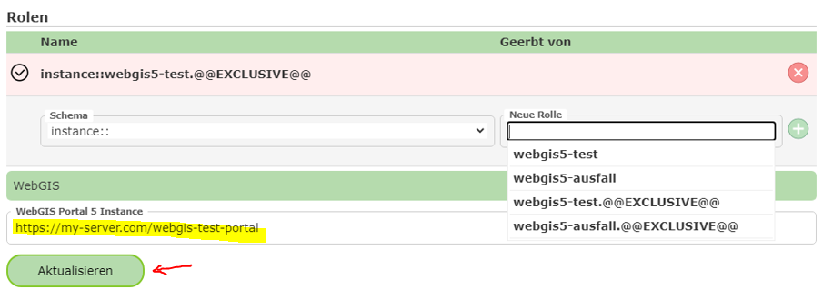

Which instances are possible depends on the operator of the WebGIS instance. They have the option, via the ``api.config`` file, to specify
any instance roles:

.. code::

   <add key="instance-roles" value="webgis5-test,webgis5-ausfall"/>

.. note::
   Instance roles should be defined by the operator at the start and should only be extended afterwards where possible. Otherwise, CMS
   permissions already assigned for the instance might stop working.
