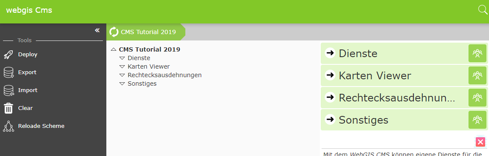

CMS Web Interface
==================

From the CMS account's properties page, the ``Open CMS Account`` button takes you to the
actual CMS web interface (the first call can take a few seconds, since the CMS tree is created here).

As a first step, background services should be created.

**Note:** In practice, you would also first define a rectangular extent in an empty CMS.
This is required in WebGIS in order to be able to initialize a map at all. This object specifies
not only the coordinate extent of a map, but also the scales (resolutions). These
must match the resolutions of the integrated tile caches. In the cloud, however, you can later
use ready-made extents for WebMercator from the public CMS "webgiscloud".
The Basemap.at tiles are also already available in the public cloud CMS "webgiscloud"
and could be used. Nevertheless, they are integrated here for demonstration purposes.
