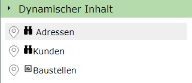
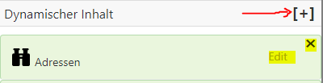
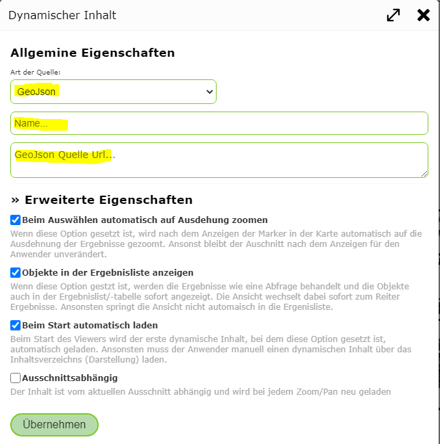
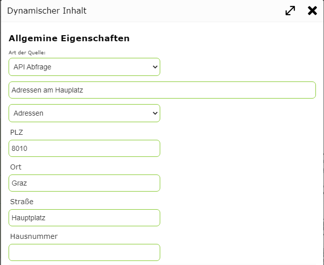

Dynamic Content
==================

In addition to map tiles and map services, so-called *dynamic content* can also be integrated into a map.
*Dynamic content* is shown as marker points that the user can click to get more information about the selected location.

The following sources are possible for *dynamic content*:

* **GeoJSON**: a GeoJSON with points that can be retrieved over the internet.

  .. code::

     {
        "type":"FeatureCollection",   // A GeoJSON Response
        "features": [ ...]
     }

* **GeoJSON (Embedded)**: this is a special form of GeoJSON. Here, the underlying service does not directly return a GeoJSON, but instead returns a JSON response containing a ``response`` attribute,
  which contains the actual GeoJSON.

  .. code::

     {
         ...
         "response":{
            "type":"FeatureCollection",   // The GeoJSON Response
            "features": [ ...]
         }
     }

  This format can, for example, be the result of a *Solr* search service. An example of this follows below, to show how a viewport-dependent *Solr* service is integrated.

* **GeoRSS**: a GeoRSS feed of points that can be retrieved over the internet.

* **API query**: a query against a map service provided by the WebGIS API.

For the user, *dynamic content* appears in the presentation-variants TOC in its own *container*:

If the user clicks on one of the offered content items, the results are shown as markers on the map.

.. note::
   Only one dynamic content item can be shown at a time on a map. The display corresponds to a search/query.
   If the user selects a different *dynamic content* item or queries a specific topic, the current *dynamic content* is hidden.

Adding Dynamic Content
----------------------------

*Dynamic content* is created in the *MapBuilder* via the *sidebar*, under the corresponding *container*:

Already created *dynamic content* can be edited via the ``Edit`` link or deleted via the ``x`` button. For *dynamic content* to be integrated into the map,
it must appear selected in the list of *dynamic content*.

The dialog for creating or editing a *dynamic content* item appears roughly as follows:

Under ``General Properties``, the type of the service must first be selected (e.g. ``GeoJSON``). In addition, a name must be assigned, under which the service is shown in the map viewer in the ``Dynamic Content`` container.
If the type is ``GeoJSON`` or ``GeoRSS``, the URL from which the content should be retrieved must also be specified here.

For the URL, placeholders can be set at runtime for the types ``GeoJSON``, ``GeoJSON (Embedded)``, ``GeoRSS``:

* ``{lat_min}``, ``{lng_min}``, ``{lat_max}``, ``{lng_max}``: the current extent of the map in geographic coordinates. This requires that the content is marked as ``viewport-dependent`` via the ``Advanced Properties`` (see below).

  Example: *Solr* service with the bounding box passed:

  .. code::

     https://myserver.com/suche/...?q=*&rows=200&fq=geowgs:[{lat_min},{lng_min} TO {lat_max},{lng_max}]

If you select ``API query`` as the type, no URL needs to be specified; instead, an existing query of a service is selected.
To restrict the objects, this can optionally be done via the search terms offered by the query (e.g. only addresses of a specific street):

Under ``Advanced Properties``, you can define which additional action should be performed when the service is loaded, and whether the content is automatically active when the map is opened.
For example, for some content it makes sense to automatically *zoom* to the location of the results after selection.

A special case is the ``Viewport-dependent`` option. If this option is selected for a *dynamic content* item, the data is always reloaded whenever the user changes the map extent (pan, zoom).
This is useful for content with very many results. The user always only gets the data relevant to the current extent.
This requires that the specified source supports passing the current extent. For the ``API query`` type, this is provided automatically. For other types,
it depends on the underlying service. If a service does not support this option, it should not be selected, since the entire content would then be loaded on every zoom.

.. note::
   If queries are parameterized in the WebGIS CMS, some of the properties set there also determine the behavior of *dynamic services* (for the ``API query`` type).
   If the ``Apply layer zoom limits`` option is selected under the ``Advanced Properties`` of a query in the WebGIS CMS, a *dynamic content* item would also only be shown
   if the map is within the scale limits of the underlying layer.

Clicking ``Apply`` creates the new *dynamic content* item for the map, or applies the changes.
