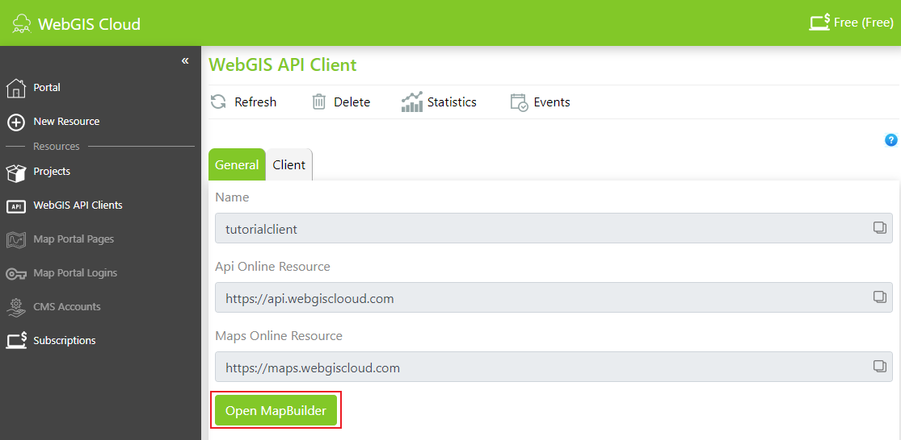
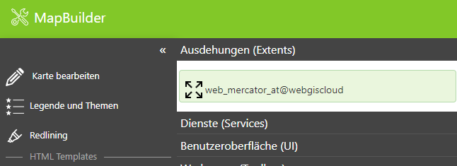
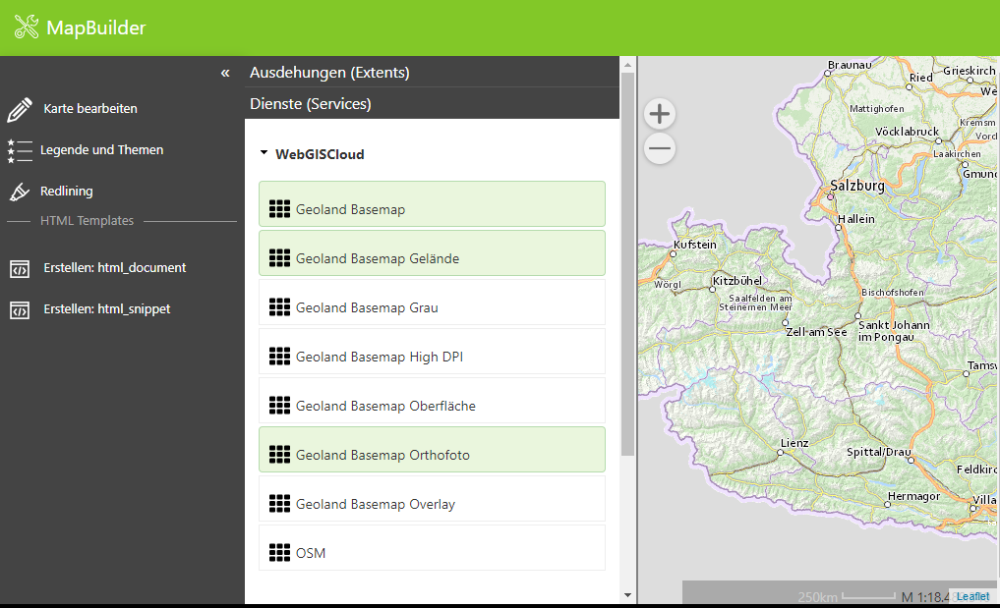
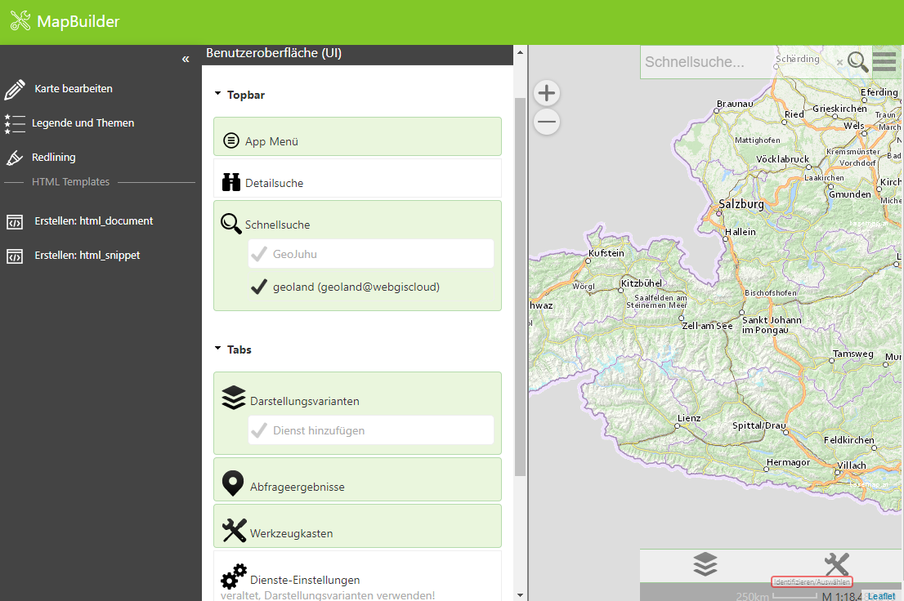
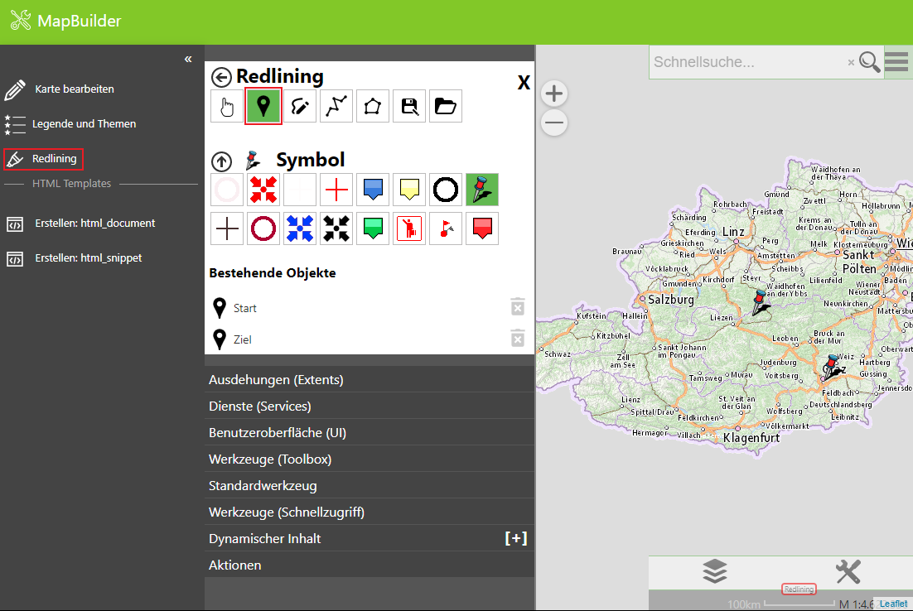

=================
WebGIS MapBuilder
=================

With the MapBuilder, simple maps can be created.

After clicking on the client created in the previous step, the MapBuilder can be opened.

As a first step, the extent must be selected. For this, we use the extent predefined by WebGIS Cloud:

This extent defines the rectangular extent of Austria and the scale levels of the Web Mercator projection (used, for example, by Google, OpenStreetMap, and Basemap.at).

In the next step, we select the services:

Once we select services here, the map preview should build up.

**Note:** For the map preview to build up, at least one extent and one service must be selected.
Background (tiling) services must match the scale limits from the extent in order to be displayed correctly.

Under User Interface (UI), only presentation variants, query results, toolbox, quick search, and app menu are enabled:

With that, our first map is complete.

Redlining
---------

Under Redlining, points can, among other things, be placed and annotated with a comment.

.. toctree::
   :maxdepth: 2
   :caption: Contents:

   mapdescription/index
   dynamiccontent/index
   uimaster/index
   snapshots/index
