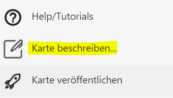
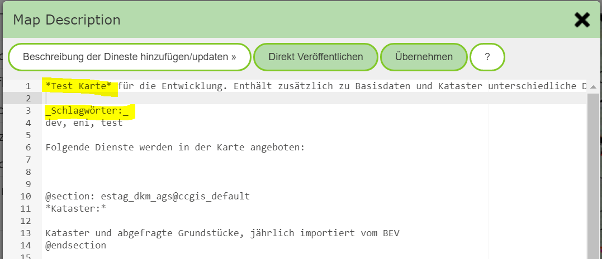

Describing Maps
=======================

This section shows how maps can be described for the user.

The map description is shown when the user clicks the (c) icon in the map (bottom left) or `Map Info & Copyright` in the *burger menu* (top right).
This area also shows the descriptions of the individual services, including copyright information.

The description can be created or edited in the MapBuilder via the *sidebar button* `Describe Map`:

This opens a dialog for creating/editing the map description:

In the text, simple *markup* commands can be used to later show text in the description as **bold** (text within asterisks) or *italic* (text within underscores).

.. note::
   Maps can also be searched for on the portal page via a search field. For this, not only the title of the map is used, but a full-text search is also performed over the description created here.
   Therefore, it is recommended, as marked here in the example, to include some keywords that the user can use to find the map.

The dialog also offers the following tools:

* **Add/update service descriptions:** As already mentioned, searching for maps via the portal page is done via a full-text search. If you also want to use the description of the individual services for this,
  this can be added via this button. The services are inserted into `@sections` for this. This allows the text to be updated again here at a later point in time. The text within the `@sections` should not be changed,
  since it would be lost on the next update. `@section` marks the automatically generated description.

.. note::
   Adding the service descriptions should only be done where it makes sense. If you do this for every map, the full-text search for maps will later return too many results. If, for example, the cadastre service is present in every
   map, a search for cadastre would then return all maps.
   A good practice is to add meaningful keywords to the actual description, by which the map can be found.

* **Publish directly**: This button is only offered if the MapBuilder was opened with an existing map. For this map, the description can be changed here and published directly.
  This saves the intermediate step of simply applying the changes and then publishing the entire map afterwards. This option is recommended if only the description of a map should be edited.
  The map then no longer needs to be published separately afterwards.

* **Apply**: The changes made to the description are applied. This does not automatically publish the description yet. Publishing only happens once the map is also published.
