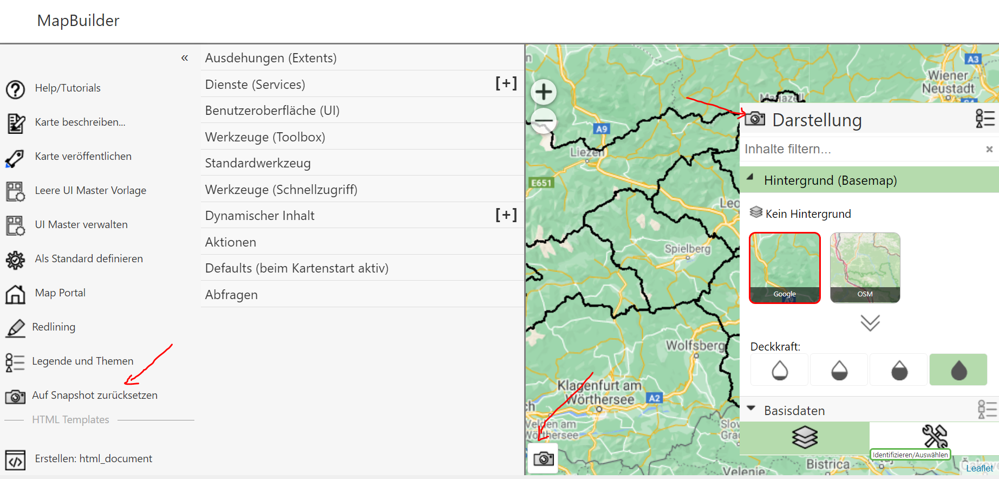
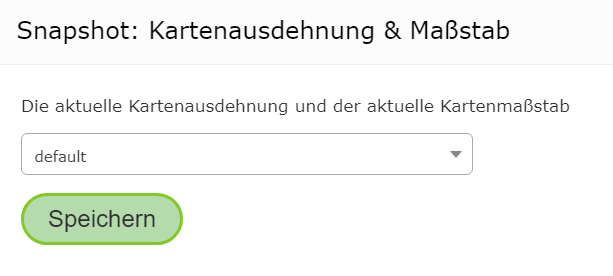
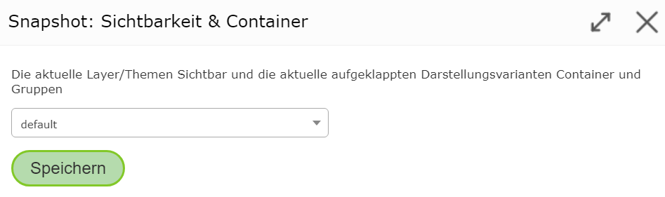
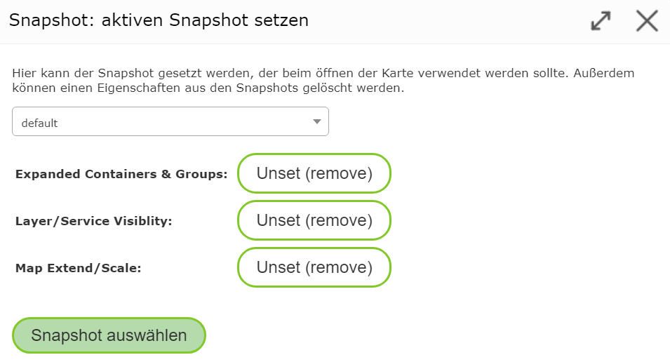
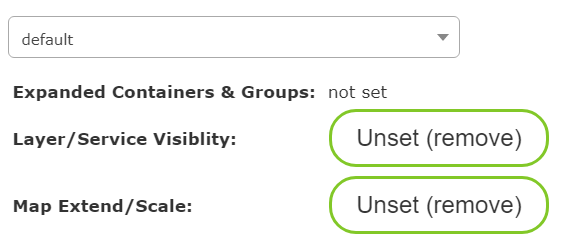

Snapshots
=========

In the MapBuilder, you can zoom within the *preview map* or change the current layer/topic visibility.
When a map is published, these settings are adopted. When a user opens a published map,
the map is shown with the last settings.

For this reason, you must always switch back to the desired settings before publishing.
Since it can often be necessary to change the view in the MapBuilder while creating maps (e.g. to test the map services),
restoring the starting settings for the map can be quite time-consuming.

To simplify this process, *snapshots* can be used.
*Snapshots* store certain properties of the map. When the map is opened, the stored *snapshot* properties are loaded,
instead of the properties shown at the time of publishing.

The following properties can be stored within a *snapshot*:

* Map extent and scale
* Current topic/layer visibility
* The containers and groups expanded in the presentation-variants TOC
  (this property can even be stored exclusively via a *snapshot*)

The management of *snapshots* for a map can be found in the *MapBuilder* in different places:

Map Extent and Scale
----------------------------

In the bottom left corner of the map there is a *snapshot* icon. Clicking on it
opens the following dialog:

A *snapshot* can be selected here.

.. note::
   Generally, you should always use ``default``. Alternative snapshots only make sense if,
   for testing purposes, you need to jump back and forth between different views.

Clicking ``Save`` adopts the current map scale and extent into the snapshot.

Topic/Layer Visibility and Containers
---------------------------------------

If you use the presentation-variants TOC, there is also a *snapshot* icon in the ``Presentation`` heading. Clicking it
opens the following dialog:

Again, ``default`` should be selected here. This stores the current visibility of the topics/layers.
It also stores which groups and containers are expanded in the presentation-variants TOC.

.. note::
   When a user opens a map, by default the first presentation-variants container (usually background) is always
   shown expanded. If you want a different container to be shown expanded on start, this is done via *snapshots*,
   as shown here.

Managing Snapshots
-------------------

There is also a *snapshot* icon in the *sidebar* with the text ``Reset to Snapshot``. Clicking this
button opens the following dialog:

Here, the individual *snapshots* can be managed. It also shows which properties are stored in the *snapshot*.
If, for example, you don't want the expanded topic groups to be stored, they can be
removed with the ``Unset (remove)`` button. The display of the properties then changes, for example, to:

Clicking the ``Select Snapshot`` button applies the properties to the current map preview.
The *snapshot* selected here is also used later in the published map.

.. note::
   If you don't want to use a *snapshot* for a map, remove all properties in this dialog with ``Unset (remove)``.

