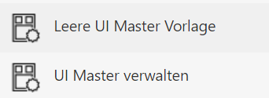
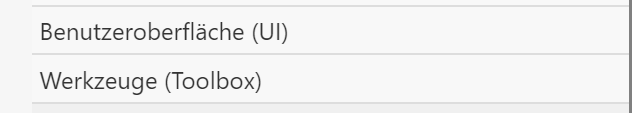
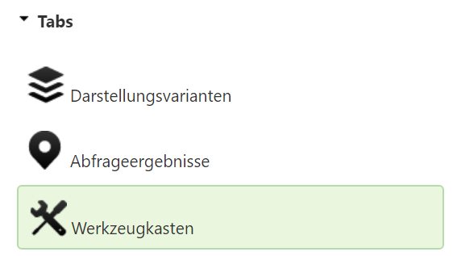
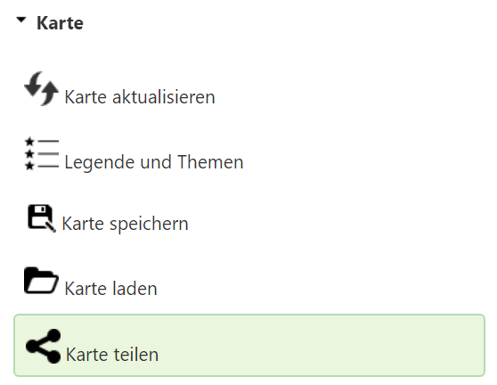
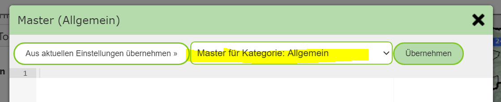
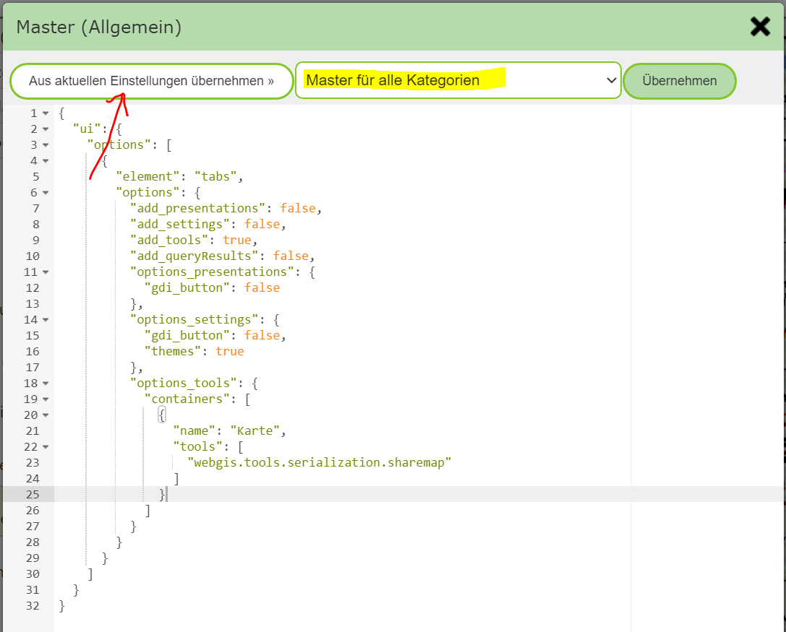
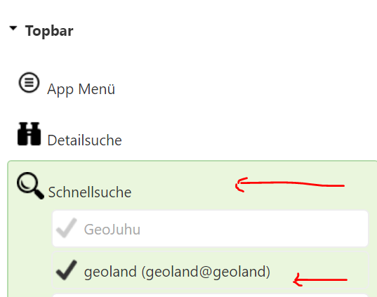
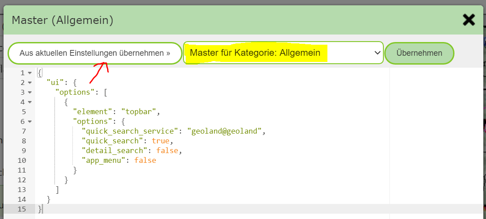

Creating UI Master Templates in the MapBuilder
==============================================

The practical approach for creating *UI master templates* is done with the MapBuilder.

First, an existing map must be opened with the MapBuilder. In the *sidebar* of the
MapBuilder, the following tools are available for *UI master templates*:

.. note::
   These tools are only visible if the *MapBuilder* is opened with an existing map.
   Since *UI master templates* also relate to a map category, this must be passed to the MapBuilder via the
   URL parameter ``categorie``. This happens automatically when you start
   with an existing map.

Since you generally only define a few elements that are used for all maps, all
unnecessary elements in this map must be deselected.
Elements that can be affected by *UI master templates* are located in the two groups:

To simplify this step, the tool ``Empty UI Master Template``, already mentioned above, can be used.
The tool opens a notice that all UI elements will be removed from the map. This does not affect the
already published map, as long as it is not published again after this step.

If you confirm the dialog with ``Remove UI Element``, all elements from the two groups mentioned above
are deleted (UI, Tools).

.. note::
   All other elements from the other groups can/should be kept and have no influence on
   the result. However, in order to later be able to create templates, at least one map extent and one map service
   must be selected. Which one is not relevant, since map services are not included in the templates.

Now, for example, you can make the *Share Map* tool available for all maps.
For tools, it is important to first activate the *tab* ``Toolbox`` under ``User Interface (UI)``.
Without a toolbox, the tools will not be shown later in the template:

Then, under ``Tools (Toolbox)``, select the corresponding tool:

In the map preview, the toolbox with exactly this one tool should now also be visible again.

Once the map preview is fully built, you can click ``Manage UI Master`` in the *sidebar*.
This opens an editor in which the *UI templates* for the current map category or the entire portal page
can be managed:

The selection list determines what the displayed template applies to:

* Master for category: [current category]
* Master for all categories

Both templates are empty after the first call. Since we want to add *Share Map* to all maps on the portal page,
we switch to ``Master for all categories``.
To adopt the template from the current settings in the MapBuilder, click ``Adopt from current settings``:

Clicking the ``Apply`` button saves the current template.

.. note::
   To avoid errors, when saving it is also checked whether the template is a valid JSON object.

.. note::
   A template can be deleted or changed again later. To delete it, remove the entire text and
   click ``Apply``.

If you also want to add the app menu for all maps, for example, this must be selected under ``User Interface (UI)``,
and the steps above repeated.

Now we want to add a quick-search service for all maps in the current map category.

To do this, we start again with the ``Empty UI Master Template`` tool and then select, under
``User Interface (UI)``, the quick search and the corresponding service:

Here too, the quick search should first appear again in the map preview.
Afterwards, open the ``Manage UI Master`` tool and adopt the current settings for the map category:

.. note::
   After the *UI master templates* have been created, leave the MapBuilder again.
   Do not publish the current map, since otherwise all originally set UI elements would
   disappear from the map.
