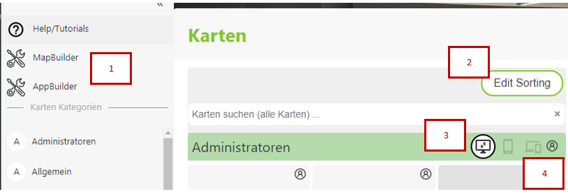

================
Managing Pages
================

Map portal pages are the entry point to the maps for the user. Within *map portal pages*, several maps
can be grouped into different categories. The maps appear on the portal page as tiles with a title and, optionally,
an individual logo/thumbnail and description. The maps are created with the *MapBuilder*.

In addition to *map viewer* links, *map portal pages* can also contain links to *WebGIS apps*. These *apps* are
created with the *App Builder*. *Apps* are prebuilt *templates* tailored for specific tasks. Via the *AppBuilder*,
a template can be selected and extended with the necessary parameters (e.g. services). A simple *redirect* to another
website can also be created via an *app*. This makes it possible to insert any links as a tile on a *map portal page*
(see the AppBuilder documentation for this).

For the administrator/map author, the portal page looks roughly as follows:

1. Here, the *MapBuilder* and the *AppBuilder* can be opened to create new maps or apps for this *map portal page*.

2. If maps (tiles) and categories have already been created, the ``Edit Sorting`` button can be used to change the order of the maps and categories.
   For maps, simply drag the desired tile. The order of the categories is set via the *sidebar* (on the left).

3. When publishing maps and apps, the preferred target platform for this application can be specified. Depending on which device (desktop, phone)
   the user uses to open the *map portal page*, only the corresponding tiles are shown. However, the current view can always be changed (also by the user).
   This is done with these buttons (desktop, mobile devices, hybrid). This icon is also shown in the individual tiles next to the map title.

4. Content within a *map portal page* can be further restricted. The *permissions button* can be used for this. It is available
   both for an entire *category* and for individual *tiles*. The user must pass through the entire *permissions stack* in order to be able to open a map:
   **Portal page** => **Category** => **Map (tile)**. If one of these steps is denied, the tile is not visible to the user.

