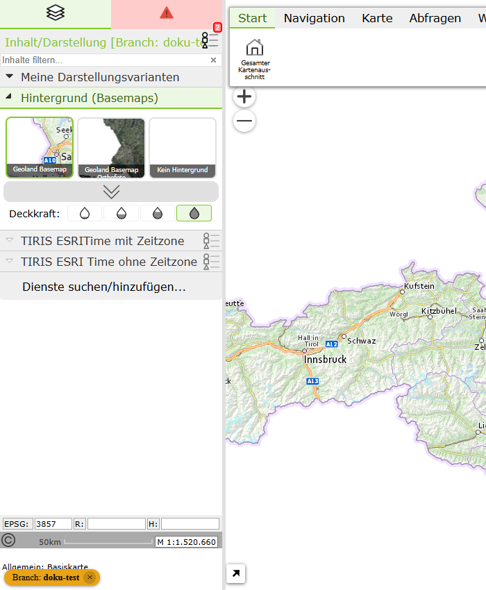
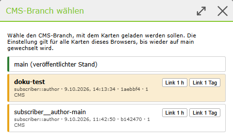

.. _portal-branches:

Testing CMS branches
====================

.. versionadded:: 9.26.4102

If a working branch has been deployed as a branch in the WebGIS CMS (see :ref:`cms-deploy-branch`), this state can be tested in the WebGIS without other users noticing anything. All other users still see the published state (main).

As a prerequisite, the WebGIS API must allow branches (``allow-branches`` in the ``api.config``, see :doc:`../../config/api/index`). Branch deploys are usually only intended for development and test systems.

Selecting a branch in the portal
--------------------------------

Map authors and owners of a portal page see a selection list with the deployed branches in the header of the portal page:

Besides *main*, all deployed branches are listed. The tooltip of an entry shows the editor, date and commit of the branch deploy.

The selection applies to **all maps in this browser** until *main* is selected again. The maps are then loaded with the CMS of the selected branch. If a CMS was not deployed in the branch, the published state is automatically used for this CMS. A branch therefore only needs to contain the CMS that have actually been changed.

Branch in the map viewer
------------------------

If a map is loaded with a branch, this is clearly indicated in the map viewer: the name of the branch is shown in the title of the table of contents, and a badge *Branch: ...* appears at the bottom left:

The ``×`` in the badge switches back to *main*. A click on the badge opens the dialog **Select CMS branch**:

Here, too, you can switch between *main* and the deployed branches.

Branch links for testers
~~~~~~~~~~~~~~~~~~~~~~~~

Users who are not map authors cannot select a branch. So that they can still test a branch, the buttons *Link 1 h* or *Link 1 day* create a **time-limited link** to the current map and copy it to the clipboard. Anyone who opens this link sees the map with the respective branch. The link is only valid for the selected duration.

.. note::

    If a branch deploy is removed in the CMS, *main* is automatically selected again the next time the portal page is opened, and a corresponding notice is shown.
