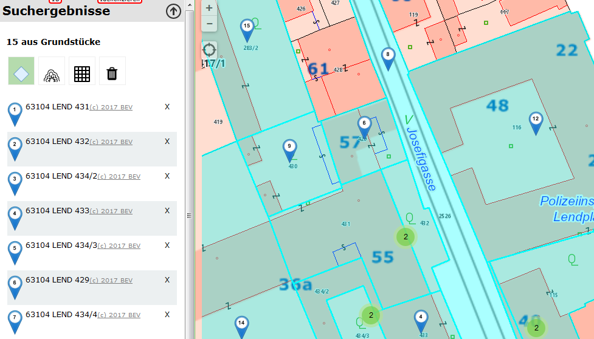
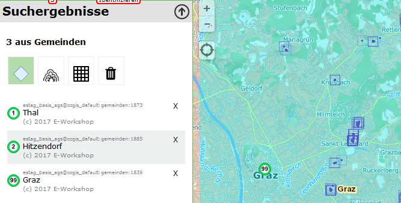
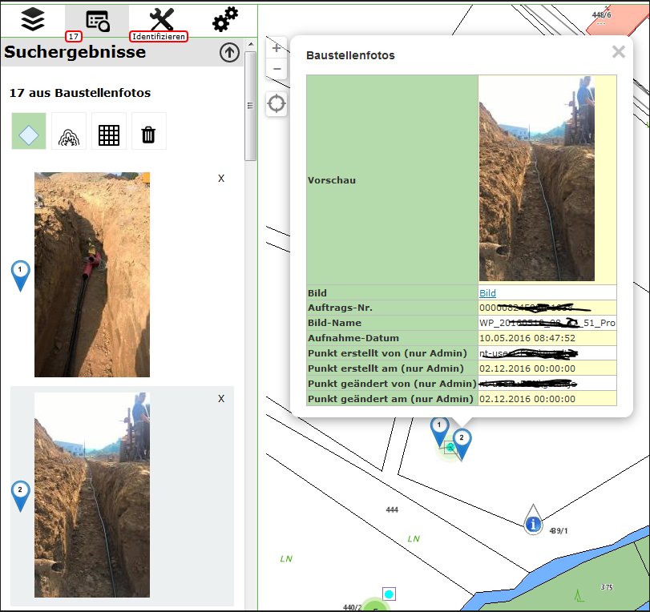

=========================
Custom Markers
=========================

In the WebGIS Viewer, results are marked with a **blue marker** by default. In some cases, however, a different symbol should be used.

General Approach
=========================

The display of **markers** is controlled via the ``webgis.markerIcons`` object in the **WebGIS API**. This array contains predefined markers that are addressed via **keys**.

**Example:**

A predefined marker for the current position:

.. code-block:: JavaScript

    this.markerIcons["currentpos_red"] = {
        url: function () {
            return webgis.css.imgResource('position_red.png', 'markers')
        },
        size: [38, 38],
        anchor: [19, 19],
        popupAnchor: [0, -20]
    };

Properties of a Marker Object
----------------------------------

.. list-table::
   :widths: 20 80
   :header-rows: 1

   * - **Property**
     - **Description**
   * - ``url``
     - A **function** that returns the **URL of the marker image**. If ``webgis.css.imgResource()`` is used, the image must be located in the **api5/content/api/img** directory. The first parameter is the **file name**, the second the **subfolder**. If the marker image is not located in this directory, an **absolute URL** can be specified:

       .. code-block::

          "http://myserver.com/markers/mein_marker.png"

   * - ``size``
     - The **size of the marker** in **pixels**.
   * - ``anchor``
     - The **coordinates of the insertion point** in the image (**from the left, top**) in **pixels**.
   * - ``popupAnchor``
     - The **coordinates of the info bubble** relative to the **insertion point of the marker** in **pixels**.

.. note::

   **Marker attributes** such as **size** or **insertion point** can also be defined as **functions**, if dynamic adjustments are required.

Markers for Query Results
============================

The markers for **query results** are defined as follows:

.. code-block:: Javascript

    this.markerIcons["query_result"]["default"] = {
        url: function (index, feature) {
            return webgis.css.imgResource('marker_blue.png', 'markers');
        },
        size: function (index, feature) { return [25, 41]; },
        anchor: function (index, feature) { return [12, 42]; },
        popupAnchor: function (index, feature) { return [0, -42]; }
    };

The following applies here:

- ``query_result``: defines markers for query results.
- ``default``: used when there is no special definition for a specific query.
- Size and insertion point as functions: unlike static values, these are **calculated dynamically**.

**Function parameters:**

.. list-table::
   :widths: 20 80
   :header-rows: 1

   * - **Parameter**
     - **Description**
   * - ``index``
     - Sequential **number of the search result** for which the marker is loaded.
   * - ``feature``
     - The **feature object** in **GeoJSON format**, for which the marker is shown.

These parameters are passed in the example, but not used.
By default, the **same marker** is always set for all results.

Overriding Markers
=========================

If a page accesses the WebGIS API, **marker properties** can be overridden after the file **api.min.js** has loaded. The syntax corresponds to the standard definition, but ``this`` cannot be used. Instead, access is done directly via ``webgis``.

**Example:** a custom marker with its own symbol:

.. code-block:: Javascript

    webgis.markerIcons["currentpos_red"] = {
        url: function () {
            return "http://myserver.com/markers/mein_super_marker_symbol.png"
        },
        size: [20, 20],
        anchor: [9, 9],
        popupAnchor: [0, -10]
    };

.. warning::

   The ``markerIcons`` array cannot be addressed with ``this``, and access must be done directly via ``webgis.markerIcons``.

Markers in custom.js
-----------------------

The first value overridden in the ``custom.js`` file is the **default marker for query results**.

**Example:** here, instead of the simple blue marker, a **blue marker with a number** is shown for each query result.

.. code-block:: Javascript

    webgis.markerIcons["query_result"]["default"] = {
        url: function (i, f) {
            return webgis.css.imgResource('marker_blue_' + (i + 1) + '.png', 'markers');
        },
        size: function (i, f) { return [25, 41]; },
        anchor: function (i, f) { return [12, 42]; },
        popupAnchor: function (i, f) { return [0, -42]; }
    };

.
The number corresponds to the **index of the search result**.

**How it works:**

- The marker is loaded from the file ``marker_blue_i.png`` in the **markers** folder, where ``i`` stands for the index of the query result (starting at 0).
- To make the numbering start at ``1``, ``(i + 1)`` is used:
- The available marker files are located in the directory: ``portal5/content/api/img/markers``.
- Files with the names **marker_blue_1.png, marker_blue_2.png, …, marker_blue_1000.png** exist there.

.. code-block:: Javascript

    'marker_blue_' + (i + 1) + '.png', 'markers'

The result of this change looks as follows:

The markers get a sequential number, which is very practical for the user, since it allows a visual match between the list and the map. The next example applies exclusively to the ``gemeinden`` query:

.. code-block:: javascript

    webgis.markerIcons["query_result"]["gemeinden"] = {
        url: function (i, f) {
            if (f.properties.Gemeinde == "Graz")
                return webgis.css.imgResource('marker_circle_sketch_vertex_99.png', 'markers');
            return webgis.css.imgResource('marker_circle_sketch_vertex_' + (i + 1) + '.png', 'markers');
        },
        size: function (i, f) { return [21, 21]; },
        anchor: function (i, f) { return [11, 11]; },
        popupAnchor: function (i, f) { return [0, -11]; }
    };

Here, too, a round marker with a sequential number is used. However, here the attributes of the queried feature are accessed directly. In the example, a feature for which the ``Gemeinde`` attribute equals ``Graz`` is assigned a fixed marker with the number 99.

.. tip:: Ice hockey fans know why the number 99 was chosen.

All other functions do not depend on the index or the feature, since all markers are the same size and have the same insertion point. If this is not the case, you could also query the feature in these functions and, if necessary, return different values. An example of an assignment based on feature properties could, for example, be a ``medical facilities`` topic. In that case, different markers could be used for doctors, hospitals, pharmacies, etc.

The result from this example would look roughly like this:

The following examples no longer concern the markers themselves, but the display of the result list. In this list, only a preview with a few attributes is always shown. These attributes correspond to the first three attributes that can be searched for this topic. WebGIS assumes that these attributes are meaningful for a preview. If a different display is desired, this can be implemented with the following examples:

.. code-block:: javascript

    webgis.hooks["query_result_feature"]["grundstuecke"] = function (map, $parent, feature, base) {
        base(map, $parent, feature);
        webgis.$("<a style='color:gray;font-size:.9em' href='http://bev.gv.at' target='_blank'>(c) 2017 BEV</a>").appendTo($parent);
    };

The ``hook`` is called when a result is rendered for the preview. The map, the parent HTML element, the feature, and the original/default function are passed. In the example, the original function is called first, to perform the rendering as usual:

.. code-block:: javascript

    base(map, $parent, feature);

This function is passed the same parameters – except for ``base`` itself. Afterwards, a link to BEV with a copyright notice is simply added. The result corresponds to the screenshot above with the blue markers. In the list, the link is visible in gray behind each result. Of course, it could also be placed on a new line.

.. tip:: This method is particularly useful when there are no meaningful attributes available for a preview for a query.

An example of this is a topic with construction-site photos that can be queried on the map using the identify function. A field ``Preview`` is set in the CMS with an ``ImageExpression`` pointing to the image. To show this image in the preview, the following code can be used:

.. code-block:: javascript

    webgis.hooks["query_result_feature"]["enetze_fotos"] = function (map, $parent, feature, base) {
        $(feature.properties.Vorschau).appendTo($parent);
    };

Here, the ``base`` function is no longer called; instead, the image is inserted directly. The result looks as follows:

The images appear directly in the preview of the search results. Clicking on a photo shows the corresponding marker popup on the map.

Dynamic Markers
-----------------

The examples shown above use static marker icons. In addition, it is also possible to generate markers dynamically. In this case, size and colors can be passed. To use dynamic markers for the query results, the entry in ``custom.js`` would look as follows:

.. code-block:: javascript

   webgis.markerIcons["query_result"]["default"] = {
       url: function (i, f) {
           return webgis.baseUrl + '/rest/numbermarker/' + (i + 1);
       },
       size: function (i, f) { return [33, 41]; },
       anchor: function (i, f) { return [16, 42]; },
       popupAnchor: function (i, f) { return [0, -42]; }
    };

The URL for dynamic markers is ``{webgis-api-url}/rest/numbermarker`` or ``{webgis-api-url}/rest/textmarker``, so for example: ``https://api.webgiscloud.com/rest/numbermarker``. The difference between ``numbermarker`` and ``textmarker`` is that for ``numbermarker`` only numbers may be passed. For ``textmarker``, on the other hand, text can also be passed. If the text is too long, it is truncated.

Here are some examples of calls with different properties:

**Marker with a number:**

.. code-block:: text

    https://api.webgiscloud.com/rest/numbermarker/42

**Marker with a specific size (default: 33x41 px):**

.. code-block:: text

    https://api.webgiscloud.com/rest/numbermarker/42?w=100&h=120

.. warning:: The value for the height must always be greater than the width!

**Marker with custom colors** (fill color, border color, text color as RGB hex code, 3 or 6 digits):

.. code-block:: text

    https://api.webgiscloud.com/rest/numbermarker/42?w=100&h=120&c=fff,f88,fcc

**Examples of text markers:**

.. code-block:: text

    https://api.webgiscloud.com/rest/textmarker/LoremIpsum?w=100&h=120&c=fff,f88,fcc&fs=22

Here, the parameter ``fs`` (font size) was also passed, specifying the text size in pixels.

.. note:: Markers can also be customized for *dynamic content*. The approach is nearly identical to the examples shown above and is explained in the next chapter. The techniques described there can also be applied to query markers.
