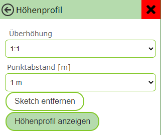

============================
Custom Tools
============================

Custom tools are tools that appear in the viewer's toolbar but are not part of the standard WebGIS tools. These tools can, for example, be simple buttons (e.g. for extended metadata of a map) or can respond to interactions with the map (click on the map or dragging a rectangle). In all cases, after a user action (click on the button, click on the map, or dragging a rectangle), a link is called, to which corresponding values can be passed.

Tools with Map Interaction
===============================

Custom tools are added to the viewer in ``custom.js`` with the following command:

.. code-block:: javascript

    webgis.custom.tools.add({
        name: 'Super Tool',
        command: 'https://www.google.com/maps/@{y},{x},19z',
    });

If you add a custom tool in ``custom.js``, it is added to all maps of this portal page. If the tool should only appear in certain maps, this can be controlled via conditions. For example, the variable ``mapUrlName`` contains the name of the currently opened map:

.. code-block:: javascript

    if (mapUrlName === "Geoland") {
        webgis.custom.tools.add({
            name: 'Super Tool',
            command: 'https://www.google.com/maps/@{y},{x},19z'
        });
    }

.. tip:: This method can be applied to all use cases described here, e.g. for markers or usability optimizations.

Properties of Custom Tools
===========================================

The parameter passed is an object that describes the tool and must contain at least the properties ``name`` and ``command``. The following table describes all possible properties:

.. list-table:: Properties of Custom Tools
   :widths: 20 80
   :header-rows: 1

   * - **Property**
     - **Description**
   * - ``name``
     - Name of the button.
   * - ``id`` (optional, from build 5.22.2401)
     - A unique ID for the tool, if it should be selectable via a parameterized call of the map viewer.
   * - ``command``
     - URL that is called on a user action. Placeholders can be used (see below).
   * - ``command_target``
     - Controls how the link is called:

       - ``'self'``: link opens in the current tab.
       - ``'dialog'``: link opens in a dialog in the viewer (may not work for third-party sites like Google Maps).
       - ``'_blank'`` (default value): link opens in a new tab.

   * - ``command_target: function(response) { }``
     - Executes the ``command`` as a **fetch** and passes the result to a callback function. ``response`` contains the following properties:

       .. code-block:: javascript

          {
             result: result,  // Das Ergebnis der Abfrage (Objekt bei JSON oder ein Text)
             map: map,        // Das aktuelle Map-Objekt
             uiElement: uiElement  // Das UI-DOM-Element des Werkzeugs, in das beispielsweise Ergebnisse geschrieben werden können
          }

       Example of a tool with a callback function:

       .. code-block:: javascript

          webgis.custom.tools.add({
              name: 'Fetch Tool',
              command: 'https://.../rest?x={x}&y={y}',
              tooltype: 'click',
              cursor: 'crosshair',
              image: 'cursor-plus-26-b.png',
              command_target: function(response) {
                  const map = response.map;
                  const result = response.result;

                  // Remove the custom tool marker
                  map.removeMarkerGroup('custom-temp-marker');

                  // Add a custom tool marker
                  map.toMarkerGroup('custom-temp-marker', map.addMarker({
                      lat: result.lat,
                      lng: result.lng,
                      text: '
'+result.text+'
',
                      openPopup: true,
                      buttons: [{
                          label: 'Marker entfernen',
                          onclick: function (map, marker) { map.removeMarker(marker); }
                      }]
                  }));

                  $('<pre>')
                      .text(JSON.stringify(response.result))
                      .appendTo($(response.uiElement));
              }
          });

   * - ``tooltype``
     - Type of the tool:

       - *not specified* (default): the tool is a simple button.
       - ``'click'``: the user clicks on the map to call the ``command`` link.
       - ``'box'``: the user drags a rectangle to call the ``command`` link.

   * - ``container``
     - Area of the toolbar in which the tool is shown:

       - ``'Navigation'``
       - ``'Auswahl'``
       - ``'Werkzeuge'`` (default)
       - ``'Darstellung'``

   * - ``image``
     - Link to a 26x26px icon for the button. Can be an absolute path or a file name, if the icon is located in ``content/api/img/tools``.
   * - ``tooltip``
     - Text shown as a tooltip when hovering the mouse over the button.
   * - ``description``
     - Description of the tool. Shown if a user interaction is required.
   * - ``modify_event`` (optional, from build 8.26.302)
     - A function can optionally be specified here that is executed before the ``command``
       is called. This function receives the ``map`` and the ``event`` object as parameters
       and can modify them (e.g. change world coordinates). Example:

       .. code-block:: javascript

          modify_event: function(map, e) {
              // set the world coordinates to a different value (lng/lat multiplied by 100)
              // this coordinate will be used in the command URL placeholders {X} and {Y}
              e.world.X = e.world.lng*100;
              e.world.Y = e.world.lat*100;
              console.log('modified Event', e);
          }

       This method can, for example, be used to convert the coordinates to a different coordinate system
       before they are passed to the target URL.

Placeholders for ``command``
============================

For the ``command`` property, various placeholders can be inserted into the URL to pass parameters from the map to another web page. Depending on the ``tooltype``, different placeholders can be used, which have a specific meaning depending on the context.

.. list-table:: Placeholders for ``command``
   :widths: 25 15 60
   :header-rows: 1

   * - **Placeholder**
     - **ToolTypes**
     - **Description**
   * - ``{map.minx}, {map.miny}, {map.maxx}, {map.maxy}``
     - ``none, click, box``
     - The extent of the current map view in geographic coordinates. Here, ``x`` corresponds to the easting (longitude), ``y`` to the northing (latitude).
   * - ``{map.bbox}``
     - ``none, click, box``
     - The bounding box of the current map view in geographic coordinates.
       Equivalent to: ``{map.minx}, {map.miny}, {map.maxx}, {map.maxy}``.
   * - ``{map.centerx}, {map.centery}``
     - ``none, click, box``
     - The center point of the current map view in geographic coordinates.
   * - ``{map.scale}``
     - ``none, click, box``
     - The current map scale.
   * - ``{map.MINX}, {map.MINY}, {map.MAXX}, {map.MAXY}, {map.BBOX}, {map.CENTERX}, {map.CENTERY}``
     - ``none, click, box``
     - As above, but here no geographic coordinates are passed; instead, coordinates in the map coordinate system are used (e.g. GK-M34). ``x`` corresponds to the easting, ``y`` to the northing.
   * - ``{x}, {y}``
     - ``click, box``
     - The point the user clicked on, in geographic coordinates. If the user drags a window, this value corresponds to the center of the window.
   * - ``{X}, {Y}``
     - ``click, box``
     - As above, but in the map coordinate system.
   * - ``{minx}, {miny}, {maxx}, {maxy}``
     - ``box``
     - The extent of the dragged rectangle in geographic coordinates.
   * - ``{bbox}``
     - ``box``
     - The bounding box of the dragged rectangle.
       Equivalent to: ``{minx}, {miny}, {maxx}, {maxy}``.
   * - ``{MINX}, {MINY}, {MAXX}, {MAXY}, {BBOX}``
     - ``box``
     - As above, but for the map coordinate system.
   * - ``{wkt}, {wkt_digits_1}, {wkt_digits_2}, {wkt_digits_3}, {wkt-4326}``
     - ``sketch0d (=point), sketch1d (=line), sketch2d (=polygon)``
     - Allows a sketch geometry to be passed as well-known text (``POINT(...)``, ``LINESTRING(...)``, ``POLYGON(...)``). The geometry can be passed either in WGS84 or in the current sketch projection.

       - ``{wkt}``: passes the geometry with full precision.
       - ``{wkt_digits_1}``, ``{wkt_digits_2}``, ``{wkt_digits_3}``: rounds the coordinates to the specified number of decimal places.

   * - ``{calc-srs}, {sketch-srs}``
     - ``sketch0d, sketch1d, sketch2d``
     - Specifies the coordinate system in which the sketch passed via ``{wkt}`` is provided. Both placeholders generally return the same values.

Custom Tools with Input Fields
===============================================

If parameters should already be selected in the viewer to be passed to the target page, this can be done via the ``uiElements`` property. This allows input fields to be provided before the tool is actually executed, in order to pass custom values to the URL.

**Example:**
A tool for elevation profiles, where the user can enter parameters such as vertical exaggeration and vertex spacing before execution.

.. code-block:: javascript

   webgis.custom.tools.add({
        name: 'Höhenprofil',
        command: 'https://server.com/profile?ueberhoehung={ueberhoehung}&hintergrund=bmapgrau&stuetzpunktabstand={stuetzpunktabstand}&title={profile_title}&polygonzug={wkt}&crs=31256',
        command_target: 'dialog',
        tooltype: 'sketch1d',
        image: 'profil.png',
        uiElements: [
            { type: 'label', label: 'Titel' },
            { id: 'profile_title', type: 'input-text' },
            { type:'label', label:'Überhöhung' },
            { id: 'ueberhoehung', type: 'select', options: [
                { label: '1:1', value: 1 },
                { label: '2:1', value: 2 },
                { label: '3:1', value: 3 }
            ]},
            { type: 'label', label: 'Punktabstand [m]' },
            { id: 'stuetzpunktabstand', type: 'select', options: [
                { label: '1 m', value: 1 },
                { label: '2 m', value: 2 },
                { label: '3 m', value: 3 }
            ]}
        ]
    });

.. note:: In this example, the user can adjust various parameters before the tool is executed. The ``id`` of the input fields can be used as a placeholder in the ``command`` URL.

Types of Input Fields
------------------------

There are different input field types available for the ``uiElements`` property:

.. list-table:: Available Input Field Types
   :widths: 20 80
   :header-rows: 1

   * - **Type**
     - **Description**
   * - ``input-text``
     - Simple single-line text field.
   * - ``input-textarea``
     - Multi-line text field for longer input.
   * - ``input-number``
     - Input field for numeric values.
   * - ``input-date``
     - Date field with time.
   * - ``select``
     - Dropdown list for selecting a predefined value. The available options must be defined as an array (see example above).

The tool dialog for the example above would look as follows:

