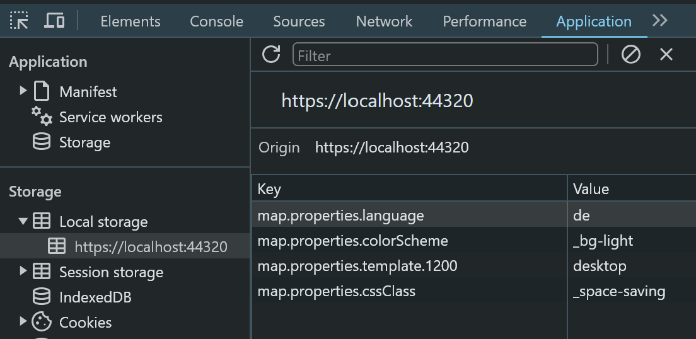

========
Defaults
========

Various default values can be set with the *JavaScript object* ``webgis.defaults``.

For example, user settings that the user makes in the viewer via
**Settings** (burger menu) are stored in the local browser storage:

If a user opens the viewer and has not yet made any settings,
default values can be set with ``webgis.defaults``:

.. code:: javascript

    // sets the default language
    webgis.defaults["map.properties.language"] = "en";  // de

    // sets the default styling (here: space-saving)
    webgis.defaults["map.properties.cssClass"] = "_space-saving";  // default

    //sets the default color scheme (here: Light)
    webgis.defaults["map.properties.colorScheme"] = "_bg-light";  // default, _bg-dark

    // sets the default viewer layout for larger screens (here: desktop)
    webgis.defaults["map.properties.template.1200"] = "desktop";  // touch

    // set defaults for user preferences
    // automatically select feature after query/identify
    webgis.defaults["user.preferences.select-new-query-results"] = "yes";
    // do not show markers automatically after query/identify
    webgis.defaults["user.preferences.show-markers-on-new-queries"] = "no";

If you want these default values to always be set, regardless of what the user
sets, a ``!`` can be prefixed to the corresponding value:

.. code:: javascript

    // forces the desktop layout for larger screens
    webgis.defaults["map.properties.template.1200"] = "!desktop";

