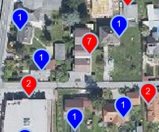
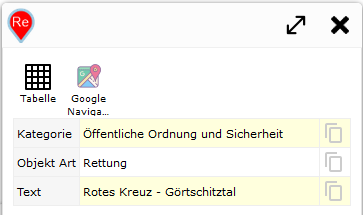
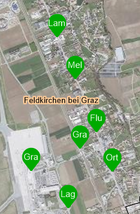

==================
Dynamic Content
==================

If *dynamic content* has been inserted into a map (see the ``MapBuilder`` section), the markers and results can also be customized via ``custom.js``.

Markers
=======

Customizing markers for *dynamic content* works analogously to query markers, via the list ``webgis.markerIcons[]``. However, the list values here are ``dynamic_content`` and ``dynamic_content_extenddependent``:

* ``webgis.markerIcons["dynamic_content"]["default"]``: definition of *marker icons* for general *dynamic content*. By default, markers with numbers are shown here.
* ``webgis.markerIcons["dynamic_content_extenddependent"]["default"]``: for *dynamic content* that is reloaded whenever the map extent changes. For this, ``viewport-dependent`` must be specified when creating the content (see ``MapBuilder``). By default, markers without sequential numbers are shown here. Sequential numbers, as with *static dynamic content*, would confuse the user here, since the numbers could change with every map pan.

If you restrict ``webgis.markerIcons["dynamic_content"]`` or ``webgis.markerIcons["dynamic_content_extenddependent"]`` with ``["default"]``, the definition applies to all *dynamic content*. Instead of ``["default"]``, the display name of the *dynamic content* can also be specified, e.g. ``webgis.markerIcons["dynamic_content_extenddependent"]["Aktuelle Baustellen"]``.

.. note:: Since a basic description of markers was already explained in the previous chapter for query results, and the approach is analogous, only practical examples are given here.

**Example:**
A *dynamic content* item shows customers as a point at their respective address. It is based on an ``API query``. Since multiple customers can live at one address (e.g. an apartment building), ``Union`` was set for the query (see the CMS - Queries tutorial). This combines customers located at the same address point into a single *object/marker*. As a result, the ``Properties`` of the feature correspond to an array (instead of a general object or ``Record``). Each entry in this object corresponds to a ``Record`` for one customer.

On the map, markers should be shown in different colors if there are multiple customers under one address. To do this, it is checked whether ``properties`` is an array. In addition, the number of customers should be shown as a number in the marker.

.. code-block:: javascript

   webgis.markerIcons["dynamic_content_extenddependent"]["Kunden"] = {
        url: function (i, f) {
            if (Array.isArray(f.properties) && f.properties.length > 1) {  // Wenn Array mit mehreren Einträgen => roter Marker
                return webgis.baseUrl + '/rest/numbermarker/' + f.properties.length + '?c=f00';
            }
            return webgis.baseUrl + '/rest/numbermarker/1?c=00f';  // Sonst blauer Marker
        },
        size: function (i, f) { return [33, 41]; },
        anchor: function (i, f) { return [16, 42]; },
        popupAnchor: function (i, f) { return [0, -42]; }
    };

Result:

Hooks
=====

``hooks`` allow you to access the features after a *dynamic content* item has been loaded. The features can also be changed there. An example use case for ``hooks`` is renaming or restricting the attributes that should be shown for the *dynamic content*.

The following lists are available:

* ``webgis.hooks["dynamic_content_loaded"]["default"]``: a function can be specified here that processes the result of a dynamic content item (GeoJSON).
* ``webgis.hooks["dynamic_content_feature_loaded"]["default"]``: a function can be defined here that processes individual features of a dynamic content item after loading.

**Example:**
On the map, a maximum of 100 results should be shown, even if the *dynamic service* returns more. The rule should only apply to the *dynamic content* named ``Solr``:

.. code-block:: javascript

    webgis.hooks["dynamic_content_loaded"]["Solr"] = function (response) {
        response.features = response.features.slice(0,100);
    };

The same content returns a lot of attributes with names that are not user-friendly. Therefore, in the next step, only a few attributes should be adopted and given meaningful names. This is done for each *feature* individually:

.. code-block:: javascript

    webgis.hooks["dynamic_content_feature_loaded"]["Solr"] = function (feature) {
        if (feature.properties) {
            var properties = feature.properties;

            feature.properties = {
                Kategorie: properties.map_category || '',
                "Objekt Art": properties.subtext || '',
                Text: properties.textexact || '',
            };
        }
    };

Result:

In the last step, the markers for this service should also be customized. The coloring is based on ``Kategorie``. In addition, the marker should show ``Objekt Art`` as text. If the category is ``Haltestelle``, the second word from ``Text`` is used as the label, since in this example it always corresponds to the name of the stop (the first word would be the town/municipality):

.. code-block:: javascript

    webgis.markerIcons["dynamic_content_extenddependent"]["Kagis Solr"] = {
        url: function (i, f) {
            var label = f.properties["Objekt Art"].substr(0, 2);
            switch (f.properties.Kategorie) {
                case 'Öffentliche Ordnung und Sicherheit':
                    return webgis.baseUrl + '/rest/textmarker/' + label + '?c=f00';
                case 'Gesundheit':
                    return webgis.baseUrl + '/rest/textmarker/' + label + '?c=0f0';
                case 'Soziale Einrichtung':
                    return webgis.baseUrl + '/rest/textmarker/' + label + '?c=00f';
                case 'Haltestelle':
                    var words = f.properties.Text.split(' ');
                    return webgis.baseUrl + '/rest/textmarker/' + words[Math.min(words.length, 1)].substr(0, 3) + '?c=0a0,0a0';
            }
            return webgis.baseUrl + '/rest/textmarker/' + label + '?c=f0f';
        },
        size: function (i, f) { return [33, 41]; },
        anchor: function (i, f) { return [16, 42]; },
        popupAnchor: function (i, f) { return [0, -42]; }
    };

Result:

