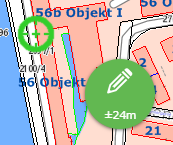
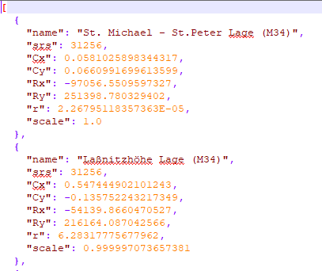

================
Special Topics
================

Vector Tile Caches
===================

Vector tile caches are integrated client-side via the ``mapLibreGL`` JavaScript library.
For the library to be loaded, the following entry must be present in ``custom.js``:

.. code-block:: javascript

    webgis.options.load_vtc = true;

The value is set to ``false`` by default, since integrating vector tile caches is generally not necessary and loading the library causes additional load time.
As soon as the option is enabled, the ``mapLibreGL`` library is automatically loaded once a map with a vector tile cache is integrated.

Spatial Reference System
========================

Various coordinate systems can be used for a WebGIS map. Certain calculations, such as measuring a distance, are performed *cartesian* in the respective map coordinate system. *Cartesian* in this context means that the ``(X, Y)`` values of the current coordinate system are used directly for the calculation.

This can cause problems if the coordinate system has strong distortions, since then the ``(X, Y)`` values are no longer true to scale either. A typical example is the **WebMercator projection**, which shows strong distortion in the **north-south direction** at our latitudes.
Measured lengths and areas in this projection are therefore always larger than in reality.

To solve this problem, the variable ``calcCrs`` can be used. This lets you specify the **EPSG code** of a coordinate system in which calculations are performed:

.. code-block:: javascript

    if (mapUrlName === "Basemap_at") {
        calcCrs = 31287;  // Lambert
    }

In this example, calculations are performed in the Austria-wide **Lambert coordinate system**. All coordinates relevant to the calculation are automatically converted internally to **Lambert** before the calculation is performed.

**Further examples:**

.. code-block:: javascript

    calcCrs = 31256;    // Berechnungen im GK-M34

If ``calcCrs`` is not set, the calculation is performed by default in the respective **map coordinate system**. If this is **geographic** (longitude and latitude) or **WebMercator**, it is recommended to explicitly set ``calcCrs``!

WebGIS and GNSS
===============

WebGIS can be used with an external **GNSS antenna** (GPS) for surveying. Since this is a specialized application, only a basic description is given here. More detailed documentation is available on request.

The relevant settings for the ``custom.js`` entry are:

.. code-block:: javascript

    webgis.currentPosition = webgis.currentPosition_watch;

    webgis.currentPosition.minAcc = 0.5;   // Mindestgenauigkeit in Metern
    webgis.currentPosition.maxAgeSeconds = 0.1;  // Maximales Alter der Positionsdaten in Sekunden
    webgis.currentPosition.useWithSketchTool = true;

The last setting enables the use of GPS with all **sketch tools**. For this, the user gets an additional *GPS bubble*. This is **disabled** (gray) by default. If you drag the bubble out of the **inactive area**, it changes color from **red** to **green** once the configured **accuracy** is reached.

As soon as both the *bubble* and the displayed **crosshair** are green, the user can click the *bubble* to adopt a **vertex** for the sketch. This process can be repeated as often as needed, as long as the bubble stays active (the map follows the crosshair as it moves). If the bubble is pushed back into the **inactive area**, GNSS capture ends.

.. important:: As long as the *GPS bubble* is active, a **vertex can only be set via this tool**!

Helmert Transformation (2D)
===========================

If an additional **Helmert transformation (2D)** is needed to compensate for tensions in the **control point network**, it can be defined as follows:

.. code-block:: javascript

    webgis.continuousPosition.helmert2d = {
            srs: 31256,
            Cx:  0.600,
            Cy: -0.234,
            Rx: -67946.151,
            Ry: 215079.498,
            r: 399.9992 * Math.PI / 200,
            scale: 1 + (-6.576 * 1e-6)
    };

Transformations via a WebGIS Service
-----------------------------------------

If different transformations are needed for different regions, these can be automatically retrieved via a **transformation info service**:

.. code-block:: javascript

    webgis.continuousPosition.useTransformationService = true;

This **transformation info service** is a WebGIS service that provides the definitions of the respective transformations. The information for the individual transformations must be stored in the directory ``etc/trafo`` in the file **helmert.json**.

The structure of this file looks, for example, as follows:

