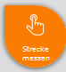
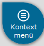
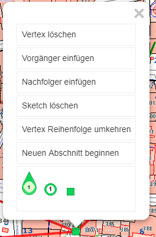
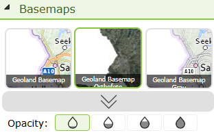
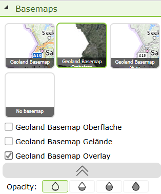

=========
Usability
=========

Some functions of the API can be controlled via so-called *usability constants*. These can be set in ``custom.js`` for individual maps or entire portal pages.

ClickBubble
===========

The *ClickBubble* improves the usability of the viewer on touch devices. Tools that require a click on the map (e.g. *Identify*) are often difficult to use on touchscreens, since a finger tap can be imprecise.
When the *ClickBubble* is enabled, it appears for all tools that require a click interaction:

Instead of clicking directly on the map, the user drags the bubble to the desired location. The tip of the bubble marks the exact point for the action. Releasing the bubble automatically returns it to the top-right corner and performs the desired action (e.g. *Identify*).

If the user clicks on the bubble (without dragging it), a description of how to use it opens.

Context Menu Bubble
===================

Some tools require a right mouse click (e.g. the context menu for measuring or editing a sketch). For this, an additional *ContextMenu Bubble* can be enabled.
The user can click it to open the context menu, or drag it to a specific position to perform an action exactly there (e.g. move or delete a specific *vertex*, construct at a right angle to the edge, etc.).

This function also enables precise control of constructions with *snapping* on mobile devices.

Enabling in ``custom.js``
============================

These functions are disabled by default and must be explicitly enabled in ``custom.js``:

.. code-block:: javascript

    // Enable ClickBubble
    webgis.usability.clickBubble = true;
    // Enable ContextMenu Bubble
    webgis.usability.contextMenuBubble = true;

Since these functions only make sense on touch devices, the ``isTouchDevice()`` method can be used:

.. code-block:: javascript

    webgis.usability.clickBubble =
    webgis.usability.contextMenuBubble = webgis.isTouchDevice();

Sketch Optimizations
====================

By default, the user can click on a *vertex* of a *sketch* to open a popup menu:

If the right mouse button or the *ContextMenu Bubble* is available, this menu is no longer needed. However, it can still be explicitly enabled:

.. code-block:: javascript

    webgis.usability.sketchMarkerPopup = true;  // Empfehlung: false!!

Restricting Construction Tools
===================================

In some applications, not all construction tools are needed. In particular, the advanced construction options are aimed at experienced users and can be disabled in specific maps:

.. code-block:: javascript

    webgis.usability.constructionTools = false;

Disabling the Complete Context Menu
===================================

If the context menu is not needed while drawing, it can be disabled with the following code:

.. code-block:: javascript

    webgis.usability.sketchContextMenu = false;

Keyboard Shortcuts for Sketches
===============================

Various **keyboard shortcuts** can be used when constructing a *sketch*:

- **A**: adds a *vertex* on an edge.
- **D**: deletes a *vertex*.
- **Ctrl**: allows dragging a window to select multiple *vertices*, which can then be moved or deleted together.

This functionality can be controlled via the following switches:

.. code-block:: javascript

   webgis.usability.allowSketchShortcuts = true;
   webgis.usability.allowSelectSketchVertices = true;

Table of Contents
==================

The following settings are available to customize the behavior of the table of contents:

* ``makePresentationTocGroupCheckboxes`` (**``true``** / ``false``)):
  if this option is set to ``true``, checkboxes are automatically offered for expandable group layers
  in the table of contents, if all the layers/presentation variants below them also have a checkbox.
  This checkbox can then be used to show or hide all the layers below it with a single
  click.

* ``orderPresentationTocContainsByServiceOrder`` (``true``/ **``false``**):
  this specifies that the containers in the table of contents are sorted according to the drawing order
  of the services. Otherwise, the sort order from the CMS applies, as defined
  under ``Viewer/Presentation Variants``.
  If you do not use presentation variants but dynamic tables of contents,
  the containers would be sorted alphabetically without this option.

.. code:: javascript

   webgis.usability.makePresentationTocGroupCheckboxes = true;

   webgis.usability.orderPresentationTocContainsByServiceOrder = true;  // default: false

Toolbox
=======

These settings can be used to configure the tools in the *toolbox*.
The settings are made per tool; the syntax is as follows:

.. code:: javascript

   webgis.usability.toolProperties['{tool-id}'] = {
        container: 'a custom container for this tool', // optional
        name: 'a custom name for this tool', // optional
        tooltip: 'a custom tooltip for this tool', // optional
        priority: 100 // optional, default: 0
   };

The ``{tool-id}`` is the ID of the tool. You can get the **IDs** of the individual tools
via the WebGIS API ``/rest/tools``

One example use case is when tools should be moved to a different container (tab),
e.g.:

.. code:: javascript

  webgis.usability.toolProperties['webgis.tools.fullextent'] =  {
        container: 'Start'
  };
  webgis.usability.toolProperties['webgis.tools.identify'] = {
    container: ['Start','Abfragen'], priority: 10
  };
  webgis.usability.toolProperties['webgis.tools.boxzoomin'] = { priority: 12 };

Here, the *Full Extent* tool is moved to the *Start* tab, and the *Query*
tool to the *Start* and *Abfragen* tabs. So if a tool should be visible in
multiple tabs, the container must be specified as an array.
The *Box Zoom* tool gets a higher priority and thus ends up further forward in the tab
(container) (``priority`` can be used to influence the order of tools within a container).

Furthermore, the order of the containers can be determined:

.. code:: javascript

    webgis.usability.toolContainerOrder = [
        'Start',
        'Abfragen',
        'Messwerkzeuge',
        'Zeichnen',
        'Navigation'
    ];

If nothing is specified here, the order of the containers corresponds to the order in which the
tools were added to the map.

.. note::

    If you change the ``toolProperties`` of the tools, the container order should always
    also be defined, since otherwise the order of the containers is assigned more or less randomly.

.. note::

    Not all containers need to be specified in the order. If there is a container
    that is not in the list, it is always shown at the end.

If a tool is not shown in the UI, even though it was, for example, added in the MapBuilder,
this may be because it is not defined in the ``toolProperties`` configuration. In this case, it must be defined with an empty object:

.. code:: javascript

    webgis.usability.toolProperties['{tool-id}'] = {
        visibility: 'hidden' // optional, default: 'visible', other possible value: 'hidden'
    };

.. note::

   This makes sense if a tool should only be visible to logged-in users.

   .. code:: javascript

       if(!webgis.hmac.userName()) {
          webgis.usability.toolProperties['webgis.tools.serialization.loadmap'] = { visibility: 'hidden' };
          webgis.usability.toolProperties['webgis.tools.serialization.savemap'] = { visibility: 'hidden' };
       }

   Here, anonymous access to the corresponding REST endpoints should also be disabled
   at the same time, so that the tools cannot be called via the URL. To do this, an entry ``allow-anonymous-access``
   with the value ``false`` is required in the corresponding tool section in ``api.config``, e.g.:

   .. code:: xml

       	<section name="tool-savemap">
           <add key="allow-anoymous-access" value="false" />
           <!-- other settings -->
        </section>

        <section name="tool-loadmap">
           <add key="allow-anoymous-access" value="false" />
           <!-- other settings -->
        </section>

Keyboard Shortcuts
==================

The WebGIS API offers the ability to use keyboard shortcuts for various actions.
These shortcuts can be enabled in ``custom.js`` to improve usability.

.. code:: javascript

   webgis.usability.useAdvancedKeyShortcutHandling = true;

The default value is ``false``, which means that the advanced keyboard shortcuts are not enabled for WebGIS API applications
by default. If you use the WebGIS Viewer, ``custom-recommendations.js`` is also loaded by default,
which sets this value to ``true``. In the viewer, the shortcuts are therefore enabled by default.

If the advanced keyboard shortcuts are enabled, the following actions can be performed:

**Editing selection tool**

- **Space bar**: select only one object. The object closest to the clicked point is selected.
- **E**: as above, except that the edit form is opened immediately.
- **D**: as above, except that the delete form is opened immediately.

.. note::

   **Requirement**: the selection tool must be active (point selection), and a topic from the list must be selected.

.. _customjs-domain-pro-behaviour:

Selection Lists Pro Behavior
============================

If you parameterize edit-form fields in the CMS as a selection list (type ``Domain``), the behavior of the
selection list can be set to ``Pro`` in the CMS dialog under ``optional: Domain Behaviour (experimental)``.
This shows the selection list as *select2*, which offers a better user experience.

This requires that the *select2* library be used for this purpose.
By default, the ``Pro`` behavior of the selection lists only changes once the
``webgis.usability.select_pro_behaviour`` constant is set in ``custom.js``.

.. code:: javascript

   webgis.usability.select_pro_behaviour = "select2";

.. note::

    Currently, the only possible value for this constant is ``select2``.
    All other values are ignored, and the behavior of the selection lists remains unchanged.

.. note::

    A description of the ``Pro`` behavior of the selection lists can be found in
    :ref:`CMS Changing Domain Behavior <cms-fields-domain-behaviour>`.

Quick Search
============

For the quick search, various settings can be made via the `webgis.usability.quickSearch` configuration:

.. code:: javascript

   // allows enter geocodes in quicksearch
   //    default is false, but set to true for the view in custom-recommendations.js
   webgis.usability.quickSearch.displayMetadata.geocodes = true;

   // select first result on enter
   //    default is false, but set to true for the view in custom-recommendations.js
   webgis.usability.quickSearch.selectFirstOnEnter = true;  //

   // minimum length of search term to trigger quick search
   //  default is 0, if larger than 0, qick search will not show info item, when
   //  user clicks in the search field
   webgis.usability.quickSearch.minLength = 0;

   // delay in ms before quick search is triggered after user stops typing
   //  default is 0, but set to 300 for the view in custom-recommendations.js
   //  0 means no delay, but that can lead to performance issues if the search is triggered on every keystroke
   webgis.usability.quickSearch.debounceDelay = 300

With ``selectFirstOnEnter``, the first suggested value is automatically selected when the
user presses Enter. Otherwise, Enter triggers a complete search using the
search term entered so far (same as clicking the magnifying glass icon).

.. note::

    If the user has narrowed down the suggestions to a single suggestion by typing,
    ``ENTER`` always selects that suggested value, regardless of what
    is set here.

Calculate Proximity
=======================

For the calculate proximity function, the default buffer distance in meters can be set via `webgis.usability.defaultBufferDistance`:

.. code:: javascript

   // default buffer distance in meters
   webgis.usability.defaultBufferDistance = 15; // default is 30 meters

.. note::

    From version 8.x

Result List
================

*  `webgis.usability.showQueryLayerNotVisbleNotification`: this switch can be used to enable a notification
   when the result layer of a query tool is not visible. The notification
   informs the user that the results may not be shown because the layer
   is hidden. It is recommended to enable this notification to improve
   usability and avoid misunderstandings. The notification appears
   as a red bar above the results. Clicking the notification makes the layer visible.
   This notification is enabled by default.

   To disable the notification, the following code can be used in ``custom.js``:

    .. code:: javascript

        webgis.usability.showQueryLayerNotVisbleNotification = false; // default is true

Overview Map (Minimap)
=========================

The overview map (minimap) shows the current extent of the main map by default.
The minimap is implemented via the `Leaflet.Minimap <https://github.com/Norkart/Leaflet-MiniMap>`__
plugin. The options for the minimap can be customized via the `webgis.usability.miniMapOptions`
configuration.

.. code:: javascript

   // default options for the minimap
   webgis.usability.miniMapOptions = {
        zoomLevelOffset: -5,
        position: 'bottomleft',
        toggleDisplay: true,
        minimized: true
    };

The available options are described in the plugin documentation.

Metadata
=========

Metadata for presentation variants (topics) is usually shown in the table of contents.
There is the option to show the metadata as an i-button or as a link button.

On touch displays (phones), clicking on the checkboxes for the presentation variants often leads to
confusion, since the i-button for the metadata is often clicked instead.
For this reason, the following options are now available:

.. code:: javascript

   // Also shows the metadata links in the map's copyright area
   webgis.usability.show_presentation_metadata_in_copyright = true;

   // Shows i-buttons in the TOC
   webgis.usability.show_metadata_i_button_toc = true;

   // Shows link buttons in the TOC
   webgis.usability.show_link_button_in_toc = true;

To avoid the confusion when clicking described above, ``custom-recommendation.js``
is extended as follows:

.. code:: javascript

   webgis.usability.show_metadata_i_button_toc = webgis.isMobileDevice() !== true;

In this case, the i-button is no longer shown in the TOC on phones.
The metadata link can then only be found in the map's copyright area.

Basemaps
=========================

By default, only the first three tiles are shown in the *Basemaps* container.
The user can manually expand or collapse the remaining basemaps via an arrow:

When expanded, the user sees all available basemaps, including additional basemaps
such as overlays, which can then be shown or hidden via their own checkboxes:

The following switch controls whether this container is automatically expanded to show
all available tiles when services are added to the map (e.g. when this adds further
basemaps/overlays), instead of showing only the first three tiles:

.. code:: javascript

   webgis.usability.expandBasemapsOnAddServices = true;  // default: false

If this option is enabled, the user immediately sees all available basemaps without
having to manually expand the container first.

