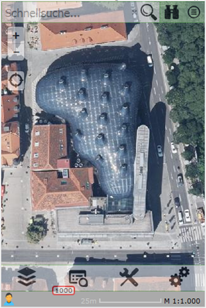
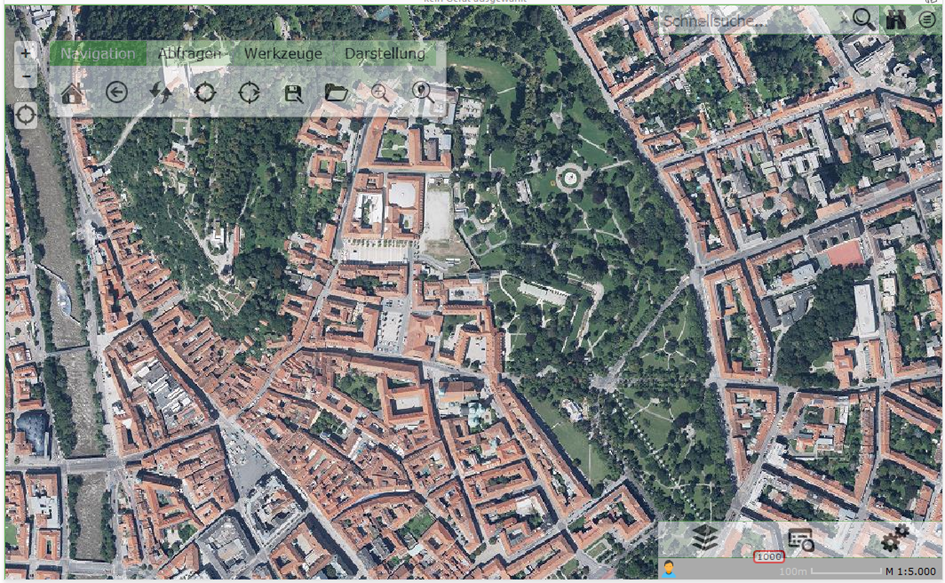
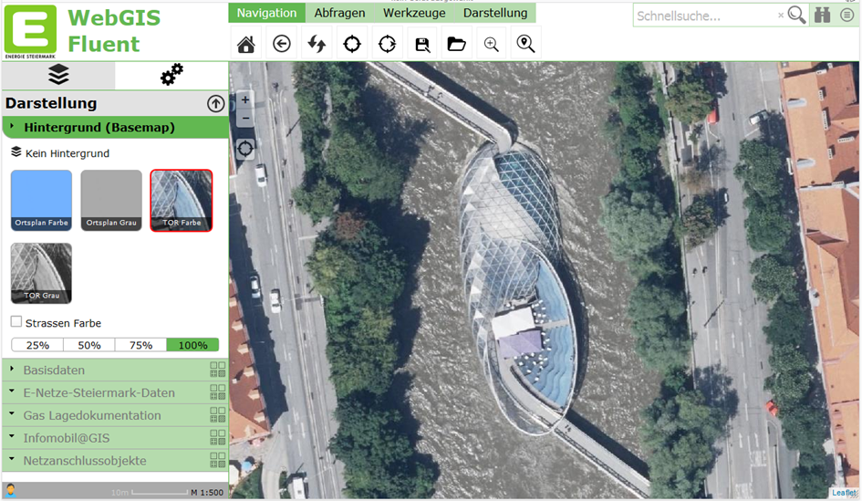

==========================
Custom Layouts
==========================

WebGIS is API-based, and in theory you can develop applications with HTML and JavaScript. To save yourself this effort for every map application (you would have to create an HTML document each time and also host it somewhere via a web server), there is the WebGIS Portal, in which you can create map applications from the services parameterized in the CMS via a simple web interface (MapBuilder). These map applications are then hosted directly in the portal. The general approach for creating them can be found in the subscriber documentation.

The default layout of the map viewer for the portal is optimized for phones. In addition to the screen-filling map, all elements such as the layer switcher, toolbox, and quick search are placed sparingly and semi-transparently:

Since WebGIS is a web application, it can also be called from any end device. The only requirement is a modern browser. On larger displays or screens, operating the map viewer is possible, but for more complex applications, clearer layouts would help save many clicks and scrolling.

So that WebGIS can also cover the desktop area in the future, a way was created to define layouts for larger displays.

Prerequisites
===============

The mechanism for using different layouts must first be enabled via the ``portal.config`` file. The following key is responsible for this:

.. code-block:: xml

   <add key="query-custom-map-layout" value="true" />

If this value is set to ``true``, after the map viewer is called, the client sends an additional Ajax request with the current browser window size to the server. The server then decides which layout is ideal for the client and, if applicable, returns a custom layout as an HTML fragment. Only once the custom layout has been inserted into the map viewer does the initialization of the map start.

If you generally don't want to offer custom layouts, you can delete this key or set it to ``false`` and save yourself this intermediate step/request.

Parameterizing the Layouts
==========================

Custom layouts are text files that contain HTML fragments. You can define these layouts per portal page, i.e. you can offer different layouts (different logo, styles, etc.) for each portal page.

These files are stored in the directory:

``portal/ViewerLayouts/{url-of-the-portal-page}``

For our portal, for example, this would be under:

``portal/ViewerLayouts/eni``

The name of the individual files must be as follows:

``w{browser-window-width}.html``

The ``browser window width`` must be an ``integer > 0``, so for example ``w1024.html``, ``w1200.html``, etc. The ``w`` at the beginning stands for ``width``.

If these files exist for a portal page, WebGIS checks, using the mechanism described above, which layout is ideal. The window size must be at least as large as the number in the file name. Of all possible candidates, the layout with the largest number always wins.

The two layouts described here as examples are also included in releases and can therefore be used as a template for your own layouts. The individual sections are briefly covered here.

w1024.html
----------

The idea for this layout was to achieve an optimized display for somewhat larger displays, such as tablets. In principle, all UI elements except the toolbox should stay the same as in the phone layout. However, the toolbox should appear larger and more easily accessible next to the "+/-" zoom buttons, transparently over the map. As soon as you focus the toolbox, the transparency changes to fully visible.

Regardless of whether you only want to change the toolbox – in a custom layout, all UI elements must always be listed:

- **Map**
- **Tabs** (the menu with the layer switcher)
- **Topbar** (quick search with queries and map switcher)
- **Toolbar** (no longer located with the tabs)

The first section lists styles for the toolbox:

.. code-block:: html

   

The toolbox should essentially float transparently over the map. To achieve this effect, the toolbox should get a (3D) shadow with these styles.

.. code-block:: html

   

   

Here, the map is inserted into the layout. The UI elements are always ``div`` tags. The ``id`` is important, so that the viewer knows which element it is. ``id="map"`` corresponds, for example, to the map. The styles are used to position the map absolutely, filling the browser window.

The ``opacity`` value is initially set to ``0`` here, i.e. the map is fully transparent. This can be used to achieve a "nicer" loading process for the viewer. As soon as the map has been fully initialized, the API automatically sets this value to ``1``, causing the map to appear with a fade-in effect.

Since the map is sometimes still being zoomed during initialization, which can cause a certain amount of "jitter," the user does not notice this. The map thus only appears, optionally, once everything is ready.

.. code-block:: html

   

   

The tabs do not need to be positioned separately and appear at the bottom left. Specifying the class ``tabs-layout-container-options`` determines that some options for the tabs control are overridden here.

The tabs do not need to be positioned separately and appear at the bottom left. Specifying the class ``tabs-layout-container-options`` determines that some options for the tabs control are overridden here.

.. list-table:: Options for the Tabs Control
   :widths: 20 80
   :header-rows: 1

   * - **Option**
     - **Description**
   * - ``data-option-add_tools``
     - Set to ``false`` here, because the tools are shown in their own area.
   * - ``data-option-add_tool_content``
     - When a tool is selected, the tool dialog must be shown somewhere. This option must be set here so that this happens in the tab control, even though the toolbox is shown elsewhere.
   * - ``data-option-selected``
     - This specifies that the layer switcher (tab ``presentations``) is selected and expanded. This is more a matter of taste and is only meant to show the possibilities.

The next block describes where the hourglass (the small gray strip that shows which services are currently being loaded) is shown. It is usually located below the tab control.

.. code-block:: html

   

       …
   

The **topbar** (quick search, etc.) is positioned similarly. It appears at the top right:

.. code-block:: html

   

   

The actual difference from the original layout is the **toolbox**. It is integrated into the layout via the following line:

.. code-block:: html

   

   

Again, the ``id="toolbar"`` is important. The class ``webgis-ui-trans`` makes the toolbar transparent and only fully visible once it has focus (mouseover or touch).

Positioning can likewise be done via inline styles. In this example, however, the position is already defined in the first section, in the styles.

w1200.html
----------

For larger displays, the idea was to design a layout similar to the usual web map atlas. The presentation variants should be on the left and the toolbox at the top. There is also still enough space at the top left for a logo.

In this layout too, the necessary styles resulting from the layout are defined at the top. The next section contains a script part:

.. code-block:: html

   

This indicates that a different GDI schema is used in this layout. For example, in this layout the user can see different (more) presentation variants in the TOC than on a small display. There is a further whitepaper on this topic (*GDI schemes and presentation variants*).

Next comes a block in which the logo and the logo text are placed at the top right:

.. code-block:: html

   

       <table>
           <tr>
               <td>
                   
               </td>
               <td style="font-size:2.5em;
                          color:#62B851;
                          font-weight:bold;
                          vertical-align:top;
                          padding:0px 12px;">
                   WebGIS Fluent
               </td>
           </tr>
       </table>
   

Next comes the area for the map. This time it is no longer window-filling; instead, an area for tools and the TOC is left free on the left and top:

.. code-block:: html

   

   

After that, the left frame with the contained tabs and the hourglass is defined:

.. code-block:: html

   

       

       

       

           

           

           

           

       

   

In addition to the options described above for the tabs, this also adds the positioning of the controls and the setting that the control may fill the entire area. The hourglass is pinned to the bottom of the frame.

The last section describes the top frame with the toolbox and quick search:

.. code-block:: html

   

       

       

       

       

   

There are practically no limits to your imagination when it comes to layouts. However, in our opinion, you should stay roughly within the variants shown here (especially for the desktop layout). The reason is that users should be able to recognize the application and how to use it across different installations.

This description is meant to show the possibilities, so that anyone can adapt their own logos, texts, and background colors.
