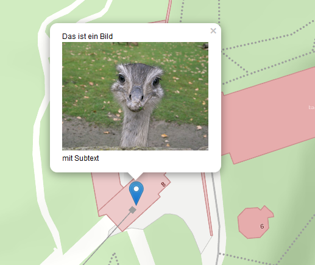
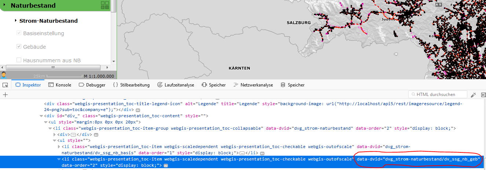
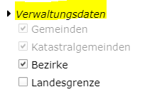

==============
URL Parameters
==============

In addition to the normal call, parameters can be passed:

.. code-block::

    https://{Host}/{Portal-Application}/{Portal-Page}/{Category}/{Map-Name}?param1=1&param2=2

Map Extents and Markers
============================

Map Extents
----------------

.. list-table::
   :widths: 20 80
   :header-rows: 1

   * - **Parameter**
     - **Description**
   * - ``bbox``
     - Specifies a bounding box that the map view automatically zooms to.
       Syntax: ``[x-min],[y-min],[x-max],[y-max]`` or, for geographic coordinates,
       ``[lng-min],[lat-min],[lng-max],[lat-max]``, where **lng** stands for longitude
       and **lat** for latitude.
       **Values are separated by commas**, decimal numbers use ``.`` as the separator.

       Example:

       .. code-block:: text

          &bbox=14.6,47.3,15.2,48.1
   * - ``center``
     - Defines the center that the map view jumps to after starting.
       Syntax: ``[x],[y]`` or ``[lng],[lat]``.
       **Values are separated by commas**, decimal numbers use ``.`` as the separator.

       Example:

       .. code-block:: text

          &center=14.6,47.3

       If no scale is specified (``scale``), the view zooms to **1:1000**.
   * - ``srs``
     - Specifies the **coordinate system**, if the coordinates are not in WGS 84.
       The **EPSG code** is expected as an integer (without the ``EPSG:`` prefix).

       Example (GK-M34):

       .. code-block:: text

          &srs=31256
   * - ``scale``
     - Defines the **scale** to zoom to.
       Only taken into account if the ``center`` or ``marker`` parameters are also passed.
   * - ``marker``
     - Shows a **marker** on the map.
       Expects a **JavaScript object** with properties for the position and, optionally, a label.

       Example:

       .. code-block:: text

          &marker={lng:14.7,lat:47.2}

       - The object is written in **curly braces**.
       - Properties are separated by **commas**.
       - Assignment is done in the form **property:value** (e.g. ``lng:14.2``).
       - **Strings** must be enclosed in **single quotes**:

         .. code-block:: text

            'Popup Text'

       If no other parameters (``center`` or ``bbox``) are defined, the map zooms to the marker.
       The scale can be specified with ``scale``.

Passing a Single Marker
-----------------------

As described above, a marker can be passed when a map is called via the ``marker`` parameter. It is passed as **JSON** with various properties.

Formatting rules:

- Double values use a period (``.``) as the decimal separator
- Integer values consist only of numbers
- Strings must be enclosed in quotes ``'``

.. list-table::
   :widths: 15 15 70
   :header-rows: 1

   * - **Property**
     - **Data type**
     - **Description**
   * - ``lng``
     - Double
     - Geographic **longitude** at which the marker is inserted.
   * - ``lat``
     - Double
     - Geographic **latitude** at which the marker is inserted.
   * - ``x``
     - Double
     - If no geographic coordinates are used, **X/Y coordinates**
       and the coordinate system can be passed here as the ``srs`` value.
       If these values are specified, ``lng`` and ``lat`` are not required.
   * - ``y``
     - Double
     - If no geographic coordinates are used, **X/Y coordinates**
       and the coordinate system can be passed here as the ``srs`` value.
       If these values are specified, ``lng`` and ``lat`` are not required.
   * - ``srs``
     - Integer
     - EPSG code of the coordinate system (without the ``EPSG:`` prefix), if ``x`` and ``y`` are used.
   * - ``icon``
     - String
     - **(Currently not used)** – the default marker is always used.
   * - ``text``
     - String
     - Text information for the marker, shown as **popup text** on click. Images can be embedded by prefixing them with ``img:``.

       Example:

       .. code-block:: text

           img:http://…../bild.jpg
   * - ``openPopup``
     - Boolean
     - Specifies whether the popup text is shown automatically or only after a click.

**Examples:**

A marker with the text **"Hello World"**:

.. code-block:: text

    &marker={lng:14.7,lat:47.2,text:'Hallo Welt'}

A marker with projected coordinates:

.. code-block:: text

    &marker={x:-68014.6,y:215601.4,srs:31256}

A marker with **text and an image** that is automatically opened when loading (``openPopup=true``):

.. code-block:: text

    &marker={
        lng:15.4,
        lat:47.09,
        openPopup:true,
        text:
        'Das ist ein Bild img:https://upload.wikimedia.org/wikipedia/de/6/68/Nandu_gesamtes_Bild.jpg mit Subtext'
    }

Passing Multiple Markers
------------------------

Multiple markers can be passed via the ``markers`` parameter. The syntax corresponds to an **array** of individual markers.

**Notes:**

- The markers are not only shown on the map, but are also included as **dynamic content**.
- The optional parameter ``markers_name`` can be used to define a name under which the **dynamic content** is shown in the TOC.

.. list-table::
   :widths: 20 15 65
   :header-rows: 1

   * - **Parameter**
     - Data type
     - **Description**
   * - ``markers``
     - Array
     - A list of markers to be shown on the map.
       Each element in the array corresponds to a **marker object** with the same properties as the ``marker`` parameter.
   * - ``markers_name``
     - String
     - Defines the **display name** for the *dynamic content* in the TOC.

**Example:**

Multiple markers with individual popup texts:

.. code-block:: text

   &markers_name=Ziele&markers=[{lng:14.7,lat:47.2,text:'Ziel 1'},
                                {lng:14.9,lat:46.8,text:'Ziel 2'},
                                {lng:14.8,lat:47.4,text:'Ziel 3'},
                                {lng:15.8,lat:47.1,text:'Ziel 4'},
                                {lng:15.2,lat:46.9,text:'Ziel 5'}]

Queries
========

A query with values can be passed to the viewer when it is called. This query then automatically becomes the **current query/identify topic** in the viewer.

**How it works:**
- If the query is passed without values, the query topic is activated in the user interface.
- If **query values** are also passed, the query is executed and the view **zooms to the results**.
- Results are **selected on the map and marked with markers**.

.. list-table::
   :widths: 20 15 65
   :header-rows: 1

   * - **Parameter**
     - Data type
     - **Description**
   * - ``query``, ``abfragethema``
     - String
     - Name of the query, as defined in the CMS.
       **Example:** ``&query=gemeinden``
   * - Query values (``name``, ``plz``, ``str``, ``hnr``, …)
     - String
     - The query values are named as defined in the CMS.
   * - ``query2``, ``abfragethema2``, ``querythemeid``
     - String
     - Sets the preset query topic for **identify** and **search** to a different topic.

       **Example:**

       - ``querythemeid=bezirke``
       - ``querythemeid=%23``

.. note::

   The query ID for **"visible topics"** is ``#``. Since the ``#`` character is reserved in URLs, it must be encoded as ``%23``.

.. note::

   The results of the query are **selected** on the map and marked with **markers**.
   If you want to **prevent** the selection of the query results, the parameter
   ``&mode=noselect`` can be used.

Display Filters
==================

If **display filters** are offered on a map, a filter can be passed via a **URL parameter**.

.. list-table::
   :widths: 20 15 65
   :header-rows: 1

   * - **Parameter**
     - Data type
     - **Description**
   * - ``filter``
     - String
     - ID of the filter, as defined in the CMS.
   * - ``filterarg_{argument}``
     - String
     - Placeholder for **filter arguments**. A value must be passed for each argument of the filter.
   * - ``filterservice`` (optional)
     - String
     - If the **filter ID is not unique** and occurs in different services, the **service ID** can be specified here. Without this, the filter is applied to **all matching services**.

       - **Format of the service ID:** ``{Service-ID}@{CMS-ID}``
       - Alternatively, the service ID can be combined directly in ``filter``:
         ``{service-id}~{filterid}``.

.. note::
   If the filter should also be shown in the **display filter tool** (when the user clicks the **"Display Filter"** tool), the service ID **MUST** be passed as well.

**Examples:**

A simple filter:

.. code-block::

   &filter=my-filter&filterarg_WERT1=abc

A filter with a unique **service assignment**:

.. code-block::

   &filter=my-filter&filterservice=my-service@my-cms&filterarg_WERT1=abc

Or alternatively:

.. code-block::

   &filter=my-service@my-cms~my-filter&filterarg_WERT1=abc

Tools
=========

The viewer can be called with a preset **tool**.

.. list-table::
   :widths: 20 15 65
   :header-rows: 1

   * - **Parameter**
     - Data type
     - **Description**
   * - ``tool``
     - String
     - ID of the tool that should be **automatically selected** when the map loads.
       **Example:**

       .. code-block::

          &tool=webgis.tools.measureline

.. note::
   **Only tools** can be passed, not simple tool buttons.
   *Simple tool buttons* are tools that directly perform an action when clicked,
   e.g. *Full Extent*, *Refresh*, *Back*.

The possible **tool IDs** can be looked up at the following link:
`https://api.webgiscloud.com/rest/tools <https://api.webgiscloud.com/rest/tools>`_

Advanced Parameters for the **Edit Tool**
----------------------------------------------

For the edit tool ``&tool=webgis.tools.editing.edit``, the following additional parameters can be passed:

.. list-table::
   :widths: 20 15 65
   :header-rows: 1

   * - **Parameter**
     - Data type
     - **Description**
   * - ``editthemeid``
     - String
     - ID of the **edit theme** that should be set active.
       The ID is stored in the **CMS** on the corresponding edit theme.
   * - ``ed_[FIELD_NAME]``
     - String
     - Value for a field in the **edit form**.
       The field must be defined in the edit theme.
   * - ``tooloption``
     - String
     - Specifies which **edit subtool** should be selected.

       **Example:**

       .. code-block::

          &tooloption=newfeature

       Opens the **edit form** to edit a new feature.

.. note::
   The ``tooloption`` parameter only works **if** the map was opened with the
   *WebGIS Desktop Layout*.
   If this is not the case, the user must **manually click "New Object"**.

Visibility/Presentation Variants
==================================

To specify a particular **presentation variant** when calling the map, a list of variants can be passed.
These are then **automatically activated** in the order specified.

**Notes on how this works:**

- In the **CMS**, each presentation variant has its own **URL**.
- In the **viewer**, however, these variants can be grouped as **buttons**, **checkboxes**, or in **dropdowns**.
- **Individual variants** can only be passed if they are **not** in a group.
- If the variant is in a group, **only the entire group** can be passed as a parameter.
- The internal **URL of a group** always has the format:
  ``dvg_[group name in lowercase with underscores instead of spaces]``.
- If the internal name of a group or variant is unknown, it can be determined using the **browser's developer tools** (**F12**).
  Every element in the **presentation variants in the TOC** has a **"data-dvid"** attribute, whose value is the ID to be passed.

.. list-table::
   :widths: 20 15 65
   :header-rows: 1

   * - **Parameter**
     - Data type
     - **Description**
   * - ``presentation``, ``darstellungsvariante``
     - String
     - Name of the presentation variant or group.
       Both parameters are possible and have the same function.

**Example:**

A call with multiple presentation variants:

.. code-block::

   &presentation=dvg_strom-naturbestand/dv_ssg_nb_geb,dvg_kataster

.. note::

   If the presentation variant is a **checkbox** or **option box**,
   you can also specify whether it should be **enabled** or **disabled**.
   To do this, add the suffix ``=off`` to the name of the presentation variant.

   **Example:**

   .. code-block::

       &presentation=dvg_strom-naturbestand/dv_ssg_nb_geb=off,dvg_kataster

Visibility of Individual Layers
=================================

If toggling visibility via **presentation variants** is not possible, **individual layers** can also be directly toggled **visible** or **invisible**. The names of the layers (including group) are passed as a parameter.

**Notes on how this works:**

- If the **layer is in a group**, the **complete path** must be passed with a **backslash** (``\``) as the separator.
- Multiple layers can be separated by **commas**.

**Example:**

This results in the layer name:

.. code-block::

   Verwaltungsdaten\Bezirke

.. list-table::
   :widths: 20 15 65
   :header-rows: 1

   * - **Parameter**
     - Data type
     - **Description**
   * - ``showlayers``, ``sichtbar``
     - String
     - Switches the specified **layers visible**.
       **Example:**

       .. code-block::

          showlayers=Verwaltungsdaten\Bezirke,Verwaltungsdaten\Landesgrenze
   * - ``hidelayers``, ``unsichtbar``
     - String
     - Switches the specified **layers invisible**.
       **Example:**

       .. code-block::

          hidelayers=Verwaltungsdaten\Bezirke,Verwaltungsdaten\Landesgrenze

.. note::
   Targeted showing and hiding of individual layers should be used **only in exceptional cases**.

   **Possible problems**

   - Layer names and groups can change over time, which can make **call links unusable**.
   - It is not checked which service a layer belongs to. If there are multiple layers with **the same name** in different services, this can **lead to display errors**.

Visibility of Background Services
====================================

Background services (**basemaps**) can be enabled via the ``basemap`` parameter. Multiple services can be passed, **separated by commas**:

- The **first service** is used as the **background basemap**.
- All **further services** are **overlay basemaps**.

**Examples:**

A single basemap service:

.. code-block::

   basemap=orhto_tiles_gray@my_cms

A basemap service with an additional **overlay service**:

.. code-block::

   basemap=ortho_tiles_gray@my_cms,streets_tiles_default@my_cms

Snapshots
=========

If multiple *snapshots* have been defined for a map in the **MapBuilder**, a specific **snapshot** can be loaded via the ``snapshot`` parameter. The map is then opened with the **visibility and stored extent** set for the snapshot.

**Example:**

.. code-block::

   snapshot=snapshot-name

Adding Services
==================

Additional **services** can be passed when a map is called. The parameter ``append-services`` or ``gdiservices`` can be used for this. The specified services are inserted **in the order in which they were passed**.

- **New services** are added to the map.
- **Already existing services** are ignored.
- **The last inserted service** covers all previous services.

**Available parameters:**

.. list-table::
   :widths: 20 15 65
   :header-rows: 1

   * - **Parameter**
     - Data type
     - **Description**
   * - ``append-services``, ``gdiservices``
     - String
     - A comma-separated list of **service IDs**.

       **Example:**

       .. code-block::

          append-services=service1,service2,service1@cms1

General (Native) URL Parameters
==========================================

In addition to the specific URL parameters, **general parameters** can also be passed. These are treated as **native call parameters** and are transmitted to the server with every request in the viewer session. There, they can be processed accordingly.

.. note::
   A **general parameter** is any parameter that does not correspond to one of the defined keywords
   (e.g. ``query``, ``abfragethema``, etc.).

**Example use case:**

A map should be called with a **project ID**, so that only the associated objects are shown. This can be implemented using a **locked filter**.

**Call:**

.. code-block::

   http://...?...&project_id=4711...

The locked filter can then access this parameter:

.. code-block::

   PROJECT_ID='[url-parameter:project_id]'

Here, the prefix ``url-parameter:`` is used to set the value from the URL as the filter criterion. This only works **for locked filters**.

**Automatic Adoption of the Project ID When Editing**

For the **project ID** to be automatically adopted into a field, the following configuration can be used in the CMS on the **edit field**:

- Set **AutoValue** to ``custom``.
- As the value for ``custom``, reference the URL parameter:

.. code-block::

   url-parameter:project_id

The prefix can be extended for **specific actions**:

.. code-block::

   oninsert:url-parameter:project_id
   onupdate:url-parameter:project_id
