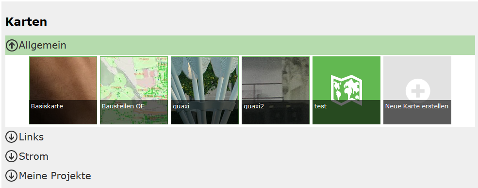

=============
Prerequisite
=============

This document describes how maps created for a **portal page** can be called with **parameterized URLs**.
The prerequisite is that a **portal page exists** that contains maps.

Maps are organized within a portal page into **map collections**. Each map has a **name** and is assigned to a **category**:

Calling a Map and URL Components
=================================

A map is always called via the following URL structure:

.. code-block::

    https://{Host}/{Portal-Application}/{Portal-Page}/{Category}/{Map-Name}

**Explanation of the URL Components**

.. list-table::
   :widths: 20 80
   :header-rows: 1

   * - Component
     - Description
   * - ``Host``
     - The server on which the portal application is installed.
   * - ``Portal-Application``
     - The name of the portal application in IIS.
   * - ``Portal-Page``
     - The URL of the portal page, as defined by the subscriber/creator.
   * - ``Category``
     - The category in which the map is located.
   * - ``Map-Name``
     - The name of the map.

.. caution::

    If the map name or the category contains **special characters**, these must be **encoded** for display in the URL.
    **Spaces** can be specified either with ``%20`` or – for better readability – with a **tilde** (``~``), e.g.:
    ``Planning~and~Cadastre``.

Example Call of a Base Map
-------------------------------

To call the **base map** directly, the URL is:

.. code-block::

    https://{host}/{portal-application}/{portal-page}/Allgemein/Basiskarte
