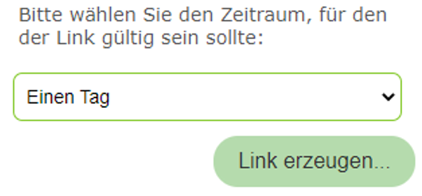
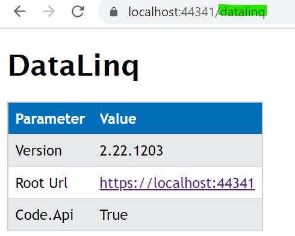

=====================================
Configuration of the API application
=====================================

File ``_config/api.config``
============================

If this file does not exist, it is automatically created with default values the first time the API starts. This section shows how it can be adapted for **production use**.

The file is an **XML configuration file** that contains various **key-value pairs**.

.. code-block:: xml

    <?xml version="1.0" encoding="utf-8" ?>
    <configuration>
        <appSettings>

            <!-- App Roles -->
            <add key="app-roles" value="all" />

            ...

        </appSettings>
    </configuration>

Below is an overview of the most important configuration parameters.

Section ``CMS``
-----------------

.. list-table::
   :widths: 20 80
   :header-rows: 1

   * - **Attribute**
     - **Description**
   * - ``cmspath_default``, ``cmspath_custom``
     - Paths to the CMS files that are integrated into the API. The names of the CMS files should not be changed afterwards, since they are used to uniquely identify maps when they are created.
   * - ``cmsgdischema_default``
     - Default GDI schema used from the CMS. If empty, no specific schema is enforced.
   * - ``outputPath``
     - Path to the output directory where images and generated files are stored. The web application should be able to access it and have write permissions.
   * - ``outputUrl``
     - URL of the output directory that must be reachable for the user. This can be a virtual directory, but it should not be listable via the browser.
   * - ``server-side-configuration-path``
     - Path to the server-side configuration of the API. This directory contains configuration files for the entire instance, including ``etc`` (e.g. print layouts) and ``config``.

Section ``Proj4 Database``
-----------------------------

.. list-table::
   :widths: 20 80
   :header-rows: 1

   * - **Attribute**
     - **Description**
   * - ``p4database``
     - Connection string to a database containing projection information (table ``P4``). The same database used by WebGIS can be specified here. This key is provided only for compatibility reasons with WebGIS. If you want to use the default projection information, it is sufficient to specify ``value="#"``.

Section ``Cache Database``
-----------------------------

The **sessions** are stored in this database. It must contain the ``webgis_cache`` table (see below). If the **Portal application** is also used, both systems must use the same **session cache**. Alternatively, the cache can be stored in the **file system**, which means no database table is required.

.. list-table::
   :widths: 20 80
   :header-rows: 1

   * - **Attribute**
     - **Description**
   * - ``cache-provider``
     - Determines whether the cache database is stored as a **database** (``db``) or in the **file system** (``fs``).
   * - ``cache-connectionstring``
     - Connection string to the database or path in the file system.

Section ``Cache Aside``
------------------------------------

To reduce the number of accesses to the **cache database** (since it is accessed on every API request), it is recommended for **heavily used instances** to set up an **additional cache** alongside the database. This enables fast access.

.. list-table::
   :widths: 20 80
   :header-rows: 1

   * - **Attribute**
     - **Description**
   * - ``cache-aside-provider``
     - Defines the **side cache** used:

       - ``redis``: use Redis cache (allows sharing across multiple instances).
       - ``InApp``: use InApp cache (data is kept directly in the application's memory).
       - ``""``: no cache-aside active.
   * - ``cache-aside-connectionstring``
     - The corresponding **connection string**.

       - For **Redis**, e.g. ``localhost:6379``.
       - For **InApp**, this specifies the time in seconds for which a value should be kept in the side cache (e.g. ``3600`` for one hour).

Section ``Subscriber Database``
----------------------------------

Subscribers are users who can log in to the **WebGIS Portal** to create maps. The information for these users can be stored either in a **database** or, in a simplified way, in the **file system**.
For storage in the file system, the connection string can be specified as follows:
``value="fs:C:\webgis\webgis-repository\..."``

.. list-table::
   :widths: 20 80
   :header-rows: 1

   * - **Attribute**
     - **Description**
   * - ``subscriber-db-connectionstring``
     - Connection string to the **subscriber database** or to the storage location in the file system.
   * - ``subscriber-admins``
     - List of **administrator subscriber names**, separated by commas (e.g. ``admin``). These users can manage other profiles (delete, change, etc.).

Section ``Subscriber Registration``
-------------------------------------

.. list-table::
   :widths: 20 80
   :header-rows: 1

   * - **Attribute**
     - **Description**
   * - ``allow-subscriber-login``
     - Specifies whether subscribers can log in to this instance (``true`` or ``false``).
       This option is useful for closed instances that are managed exclusively by an administrator. This prevents malicious access to the configuration.

       Example: An **intranet instance** could be used for configuration, while the **internet instance** is locked for access. Both instances can share the **storage**, or it can be copied between them.
   * - ``allow-register-new-subscribers``
     - Specifies whether new subscribers may register themselves for the API (``true`` or ``false``).

       - During the **initial installation**, this value should be set to ``true`` so that at least one administrator subscriber can be created.
       - Afterwards, the value can be set to ``false``. It is then recommended to provide a separate **intranet or test instance** of the API, to which only the administrator has access and through which new subscribers can be created as needed. This instance must access the same **database**.
   * - ``subscription-tools``
     - Determines which functions a subscriber is allowed to create in the **Portal**.

       Possible values:
       - ``clients``: allows creating clients.
       - ``portal-pages``: allows creating portal pages.
       - ``dataLinq-endpoints``: allows creating DataLinq endpoints.

Section ``Api/Portal Url``
----------------------------

.. list-table::
   :widths: 20 80
   :header-rows: 1

   * - **Attribute**
     - **Description**
   * - ``api-url``
     - URL of the API as visible to the user.
   * - ``portal-url``
     - URL of the portal as visible to the user.
   * - ``portal-internal-url``
     - The API must be able to communicate with the portal, e.g. to populate selection lists for authentication. An **internal URL** is recommended here if both applications are installed on the same server (e.g. ``http://localhost/webgis-portal``). If this value is not set, the API automatically uses ``portal-url`` for internal requests.

Section ``Storage``
---------------------

User projects, portal page content, etc. are stored here. This is **not** a classic database, but a **file-system-based storage** (blobs).

.. list-table::
   :widths: 20 80
   :header-rows: 1

   * - **Attribute**
     - **Description**
   * - ``storage-rootpath``
     - Path to a directory used as **storage**. The directory can be changed at any time by copying the content to another storage location.

       .. important::
          The API application requires **read and write permissions** for this directory!

Section ``Marker``
--------------------

* ``default-marker-colors``
  If you use dynamic markers (recommended), the default color values for the markers can be defined here. The value must consist of three hex values separated by commas for fill color, border color and text color, e.g.: ``82C828,b5dbad,fff``.

  How dynamic markers are integrated into the viewer is shown in the ``custom.js`` description:

  https://docs.webgiscloud.com/de/webgis/apps/viewer/customjs/benutzerdefmarker.html

  If you use ``custom-recommendtion.js``, dynamic markers are automatically used for search results.

  .. note::

     Changes to this value are not necessarily visible immediately, because markers are cached on the client => clear the browser cache!

* ``default-text-download-encoding``
  If, for example, users download CSV files, the encoding must be set so that all special characters contained are correctly encoded. The name of the *encoding* can be set here. The default value is ``iso-8859-1`` and should cover all German special characters. Which values are possible can be seen by calling the ``/admin/info`` page for the API. It also shows which *encoding* is currently in use.

Section ``Logging``
---------------------

.. code-block:: xml

  <!-- Logging (optional) -->
  <add key="logging-type" value="files" />
  <!-- Path for logging: the directory must have write permissions for WebGIS -->
  <add key="Log_Path" value="C:\\apps\\webgis\\local\\webgis-repository\\logs" />

  <add key="logging-log-performance" value="true" />
  <add key="Log_Performance_Columns" value="SESSIONID;MAPREQUESTID;CLIENTIP;DATE;TIME;MAPNAME;USERNAME;X;Y;SCALE" />
  <add key="logging-log-exceptions" value="true" />

  <add key="trace" value="true" />
  <!-- For debugging only, do not use in production -->
  <add key="logging-log-service-requests" value="true" />

Logging can be done to files (``logging-type = files``).

.. list-table::
   :widths: 20 80
   :header-rows: 1

   * - **Attribute**
     - **Description**
   * - ``logging-log-performance``
     - Stores **map requests** and their access times in a **CSV log file**.
   * - ``logging-log-exceptions``
     - Logs **exceptions** that occur during the runtime of the **WebGIS API**.
   * - ``logging-log-service-requests``
     - Stores **requests to the map server** as well as their responses.

       This setting should be used **only for debugging**, since it generates a **large amount of data** and can negatively affect **performance**.

       .. important::
          **Important:** Requests are only logged if ``trace=true`` is also set.

Section ``Query Results``
---------------------------

(from version 8.26.801)

This section allows you to set how the results of
**identify or search queries** are displayed on the map.

.. code:: xml

  <section name="query-results">
    <add key="selection-color" value="#0ff" />  <!-- optional, default: Cyan -->
    <add key="selection-fill-color" value="#10ff" /> <!-- option, if differs from color -->

    <add key="highlight-color" value="#0f0" />	<!-- optional, default: Yello -->
    <add key="highlight-fill-color" value="#cf00" /> <!-- option, if differs from color -->

    <add key="buffer-color" value="#f00" /> <!-- optional, default: Gray -->
    <add key="buffer-fill-color" value="#300f" /> 	<!-- option, if differs from color -->
  </section>

.. list-table::
   :widths: 20 80
   :header-rows: 1

   * - **Attribute**
     - **Description**
   * - ``selection-color``
     - Sets the color for the selection of features.
   * - ``selection-fill-color``
     - Sets the fill color for the selection of features.
   * - ``highlight-color``
     - Sets the color for highlighting features.
   * - ``highlight-fill-color``
     - Sets the fill color for highlighting features.
   * - ``buffer-color``
     - Sets the color for buffer zones.
   * - ``buffer-fill-color``
     - Sets the fill color for buffer zones.

The ``fill-color`` is optional in each case and only needs to be specified if it is not
identical to the corresponding ``color``. By default, the fill color is automatically derived
from the corresponding color by increasing the transparency (e.g. cyan becomes a transparent cyan).
If you want a different color for the fill, or want to define the transparency yourself,
this can be done via ``fill-color``.

**Hex color codes** can be specified as values, e.g. ``#0ff``, ``#00ffff`` for cyan
or ``#f00``, ``#ff0000`` for red.
If you specify four or eight characters, the transparency can also be defined,
e.g. ``#300f`` for a transparent red (20% opacity) or ``#300000ff`` for a
transparent blue (20% opacity). The first part of the hex code defines the transparency
(00 = fully transparent, ff = fully opaque), while the second part defines the color.

Section ``Quick Search``
---------------------------

In this section you define which results are shown in the quick search and which search criteria can be used for it.

.. code:: xml

  <section name="quick-search">
    <add key="max-result-items" value="10" />  <!-- default: 5 -->
    <add key="allowed-geocodes" value="*" />
  </section>

.. list-table::
   :widths: 20 80
   :header-rows: 1

   * - **Attribute**
     - **Description**
   * - ``max-result-items``
     - Sets the maximum number of results shown in the quick search (e.g. 3). It is recommended not to set this value too high, to keep the results clear.
   * - ``allowed-geocodes``
     - Specifies which GeoCodes should be recognized in the quick search, separated by commas (e.g. ``mrgs,pluscode,geohash``). All GeoCodes listed at https://docs.webgiscloud.com/de/webgis/annex/geocodes.html can be activated. ``*`` activates all available GeoCodes.

Tool configuration
----------------------

Some tools offered in the **WebGIS Viewer** require their own configuration entries. These are located in ``api.config``. To keep ``api.config`` clear, the entries are grouped by *sections*.

``<section>`` tags must be located inside the ``<appSettings>`` tag.

The following attributes can be defined in all sections for tools:

.. code:: xml

    <section name="tool-...">
      <add key="allow-anoymous-access" value="false" />  <!-- optional, default: true -->
    </section>

* ``allow-anonymous-access`` (from 8.26.1001): Specifies whether the tool may also be used by **anonymous users**.
  By default this is allowed (``true``), but for certain tools
  that offer sensitive functions, this should be set to ``false``,
  so that only logged-in users have access.

    .. note::

      The tool is always visible in the viewer if it was integrated via the **MapBuilder**.
      If an anonymous user clicks it, they receive an error message
      (e.g. *Anonymous access is not allowed for this tool*).

      To hide a tool from anonymous users in the viewer, this must additionally
      be set in ``custom.js``, for example for the **load/save** tool:

      .. code:: javascript

        if(!webgis.hmac.userName()) {
          webgis.usability.toolProperties['webgis.tools.serialization.loadmap'] = { visibility: 'hidden' };
          webgis.usability.toolProperties['webgis.tools.serialization.savemap'] = { visibility: 'hidden' };
        }

      In this case, the tool is completely hidden for anonymous users, while it remains visible for logged-in users.

Here are the tools that require their own configuration:

Tool ``MapMarkup``
~~~~~~~~~~~~~~~~~~~~~~

The configuration for the **MapMarkup tool** looks as follows:

.. code:: xml

    <section name="tool-mapmarkup">
      <add key="allow-add-from-selection" value="true" />
      <add key="allow-add-from-selection-max-features" value="1000" />
      <add key="allow-add-from-selection-max-vertices" value="10000" />
      <add key="allow-download-from-selection" value="true" />
      <add key="default-download-epsg" value="4326" />
      <add key="save-name-maxlength" value="20" /> <!-- default: 40 -->
    </section>

.. important::

    For **MapMarkup (drawing)**, all objects must be rendered directly in the **client (browser)**. Therefore, a **very high number of objects** or **objects with many vertices** (e.g. **cadastrally accurate district boundaries**) can lead to **performance problems**.

    Restrictions on the max values should therefore be applied depending on the use case. This is especially important for (freely accessible) internet applications.

Tool ``Coordinates (XY)``
~~~~~~~~~~~~~~~~~~~~~~~~~~~~~

.. code:: xml

    <section name="tool-coordinates">
      <add key="allow-upload-max-rows" value="200" />
    </section>

The **XY tool** allows the **upload of coordinate lists**. It can be used for **visualization** or for **projection**, when the coordinates are downloaded again after processing.

In addition, **elevation values are automatically determined** for the coordinates:

1. Coordinates are uploaded.
2. Depending on the configuration in the ``etc`` directory (see below), **elevation values** are calculated and added as attributes.
3. When **downloading**, these elevation values are also included in the output.

The **number of coordinates that can be uploaded** can be limited via the following parameter:

.. list-table::
   :widths: 30 70
   :header-rows: 1

   * - **Attribute**
     - **Description**
   * - ``allow-upload-max-rows``
     - Sets the maximum number of rows that may be uploaded via the **XY tool**.

Tool ``Printing``
~~~~~~~~~~~~~~~~~~~~

The configuration allows you to define the available **print qualities (DPI)**.

.. tip::

  A higher DPI improves **readability**, especially of text, but also increases the **file size** of the generated PDFs and the **server load**. In **public internet applications**, a **print resolution above 150 DPI** should be avoided, since it can put a heavy load on the server for large paper formats.

The configuration in ``api.config`` looks as follows:

.. code-block:: xml

    <section name="tool-print">
        <add key="qualities-dpi" value="150:Hoch (150 dpi),120:Mittel (120 dpi),225:Sehr hoch (225 dpi)" />
        <add key="scales" value="1000000,500000,250000,100000,50000,25000,10000,5000,3000,2000,1000,500,250,100" />
        <add key="default-format" value="A4.Landscape" />
        <add key="scale-wysiwyg" value="false" />
    </section>

**Print qualities and scales**

The individual values are separated by **commas**. Each entry consists of a **DPI number (integer)** and a **description**, separated by a colon ``:``. In the **viewer**, the DPI values are shown **sorted** (e.g. 120, 150, 225). The first value in the list serves as the **default value** and is preselected when the print tool is first opened.

Optionally, the print scales can also be defined. If no values are specified, the system uses the available **map zoom levels**.

An alternative way to define print scales is to set them directly in the **print layout file**:

.. code-block:: xml

    <?xml version="1.0" encoding="iso-8859-1" ?>
    <layout scales="5000,2500,1000,500">
      ...
    </layout>

.. tip::

  The settings in the **layout file** take precedence over the values in ``api.config`` and the map scales. It is recommended to define the scales directly in the layout file, since this way suitable scales are predefined for each layout, which the user then has to use.

Tool ``Series Printing``
~~~~~~~~~~~~~~~~~~~~~~~~

.. note::

   From version 8.X

The configuration for the **series printing tool** looks as follows:

.. code-block:: xml

   <section name="tool-map-series-print">
      <add key="qualities-dpi" value="150:Hoch (150 dpi),120:Mittel (120 dpi),225:Sehr hoch (225 dpi)" />
      <add key="scales" value="50000,25000,10000,5000,3000,2000,1000,500,250,100" />
      <add key="default-format" value="A4.Landscape" />
      <add key="max-pages" value="10"/>
      <add key="max-intersection-iterations" value="5000" />  <!-- default: max-pages * 50 -->
      <add key="overview-page-layout" value="" />  <!-- default: layout_map_services_overview.xml  -->
      <add key="overview-page-format" value="A4.Portrait" />  <!-- default: empty => use same format as series pages -->
   </section>

The settings for **print qualities**, **format** and **scales** work in the same way as for the
normal **print tool** (see above).

In addition, the following parameters can be configured:

.. list-table::
   :widths: 30 70
   :header-rows: 1

   * - **Attribute**
     - **Description**
   * - ``max-pages``
     - Sets the maximum number of pages that may be generated in the **series print**.
       This is used to avoid an **excessive server load** when very large areas are selected.
   * - ``max-intersection-iterations``
     - Sets the maximum number of iterations for calculating the intersections.
       This is used to avoid an **excessive server load** when very complex geometries are processed.
       The value is currently used for the **Intersect Raster** creation method. If the default value of 50*[max-pages] is too low,
       it can be increased here.
   * - ``overview-page-layout``
     - Defines the **layout file** for the **overview page** in the series print.
       If no value is specified, the default layout ``layout_map_services_overview.xml`` is used.
   * - ``overview-page-format``
     - Sets the **paper format** for the **overview page** (e.g. ``A4.Portrait``).
       If no value is specified, the same format as for the series print pages is used.

Tool ``Display Filter``
~~~~~~~~~~~~~~~~~~~~~~~~~~~~~~~

.. code-block:: xml

   <section name="tool-visfilter">
      <add key="allow-toc-visfilter" value="true" />
   </section>

From version 8.x, a **display filter** can be defined for each layer in the **table of contents (TOC)**.
For this to be usable, the following parameter must be set in ``api.config``:

.. list-table::
   :widths: 30 70
   :header-rows: 1

   * - **Attribute**
     - **Description**
   * - ``allow-toc-visfilter``
     - Must be set to ``true`` so that a **display filter** can be defined for layers in the **table of contents (TOC)**.

The behavior then is such that, for topics in the **table of contents (TOC)**, a
small **filter icon** is displayed that opens a **query builder**, with which the user
can define a **display filter** in SQL style.
Which fields are offered for this can be defined in the CMS for the service under **QueryBuilder**.

.. note::

  This function should only be used in **protected environments** (intranet, never internet),
  since users can cause **performance problems** through improper filtering
  or exploit **security vulnerabilities**.

.. note::

  Since this function must additionally be enabled
  via ``custom.js``: ``webgis.usability.allowTocVisFilters=true;`` (default: ``false``).
  This allows the function to be enabled only for specific maps.

Tool ``LiveShare``
~~~~~~~~~~~~~~~~~~~~~~

For **LiveShare** to be usable, the URL of the **hub** must be specified in ``api.config``.

.. code-block:: xml

    <section name="tool-liveshare">
      <add key="simplify-session-ids" value="true" />

      <add key="hub" value="https://liveshare.webgiscloud.com" />
      <add key="clientId" value="gültige client Id" />
      <add key="clientSecret" value="gültiges client secret" />
    </section>

.. list-table::
   :widths: 30 70
   :header-rows: 1

   * - **Attribute**
     - **Description**
   * - ``simplify-session-ids``
     - Converts the **session IDs** into a **simplified 9-digit number**.
   * - ``hub``
     - URL of the **LiveShare hub** through which the real-time sessions are managed.
   * - ``clientId``
     - Unique **client ID**, required if the hub is not publicly accessible.
   * - ``clientSecret``
     - Secret **client token**, required if the hub is not publicly accessible.

If the **hub is not publicly accessible**, a **client ID** and a **client secret** must be provided. These credentials are provided by the operator of the hub.

Tool ``3D Measurement``
~~~~~~~~~~~~~~~~~~~~~~~~

For **3D measurements** to work, the following values must be configured in ``api.config``:

.. code-block:: xml

  <section name="tool-threed">
    <add key="min-resolution" value="5" />
    <add key="max-resolution" value="100" />
    <add key="max-model-size" value="1500" />
    <add key="max-scale" value="100000" />
    <add key="texture-ortho-service" value="geoland_bm_of@default:0" /><!-- serviceId:layerId -->
    <add key="texture-streets-overlay-service" value="geoland_bm_ov@default:0" /><!-- serviceId:layerId -->
  </section>

.. list-table::
   :widths: 30 70
   :header-rows: 1

   * - **Attribute**
     - **Description**
   * - ``min-resolution``
     - Minimum **resolution** of the 3D model in **meters**.
   * - ``max-resolution``
     - Maximum **resolution** of the 3D model in **meters**.
   * - ``max-model-size``
     - Maximum **model size** in **pixels** (e.g. ``1500 x 1500``).
   * - ``max-scale``
     - **Maximum scale**, above which no 3D model is created any more.
   * - ``texture-ortho-service``
     - Defines the **service for aerial imagery textures**, consisting of the **service CMS ID** and **layer ID** in the format ``Dienst-CMS-Id : Layer-Id``.
   * - ``texture-streets-overlay-service``
     - Defines the **service for street map textures**, consisting of the **service CMS ID** and **layer ID** in the format ``Dienst-CMS-Id : Layer-Id``.

Tool ``Save Map``
~~~~~~~~~~~~~~~~~~~~~~~~~~~~

With the **Save Map** tool, users can save the current map (services, visibility, map markup) as a **project**. The following settings can be configured for this:

.. code-block:: xml

  <section name="tool-savemap">
    <add key="name-maxlength" value="40" />
  </section>

.. list-table::
   :widths: 30 70
   :header-rows: 1

   * - **Attribute**
     - **Description**
   * - ``name-maxlength``
     - Specifies how many characters the **project name** may contain at most.
       The project is stored **on the server in the file system** (including encryption).
       This setting prevents the **file names** from becoming too long.

Tool ``Load Map``
~~~~~~~~~~~~~~~~~~~~~~~~

With the **Load Map** tool, saved maps can be reopened by the user.

If a saved map is opened via the **portal page (My Projects)**, a **link** is generated through which the map can be called. This link is shown in the **browser's address bar** and can thus be copied and shared.

The following settings determine who is allowed to open saved maps. By default, maps can only be opened by the user who saved them.

.. code-block:: xml

  <section name="tool-loadmap">
    <add key="allow-collaboration" value="false" />
    <add key="allow-anonymous-collaboration" value="false" />
  </section>

.. list-table::
   :widths: 30 70
   :header-rows: 1

   * - **Attribute**
     - **Description**
   * - ``allow-collaboration``
     - By default, saved maps can **only be opened by their creator**.
       If another user tries to open the map via a link, they receive an error message (*Collaboration of projects is not allowed*).
       To enable the **sharing of saved maps**, this option must be set to ``true``.
   * - ``allow-anonymous-collaboration``
     - If ``allow-collaboration`` is set to ``true``, only **logged-in users** can open shared links.
       If **anonymous users** should also have access to the maps, this option must also be set to ``true``.

.. danger::

  For data protection reasons, sharing saved links should not be allowed. Via a link, the current state of the map, including **map markup**, can be accessed at any time!

  The recommended way to share a map is the **Share Map** tool. This creates and shares a **snapshot** of the current map. Later changes, in particular to **map markup**, are no longer visible in the shared version.

Tool ``CMS Upload``
~~~~~~~~~~~~~~~~~~~~~~~

The configuration allows you to define whether **CMS.xml** files may be uploaded from a **WebGIS CMS** instance.

.. code-block:: xml

  <section name="cms-upload-{cms-name}">
    <add key="allow" value="true" />
    <add key="client" value="cms-upload-client" />
    <add key="secret" value="my-super-secret-with-min-length-24" />
  </section>

``{cms-name}`` is the **CMS name** as defined in ``api.config``. Example:

.. code-block:: xml

  <!-- here {cms-name} equals my-cms -->
  <add key="cmspath_my-cms" value="{path-to-cms.xml}" />

.. list-table::
   :widths: 30 70
   :header-rows: 1

   * - **Attribute**
     - **Description**
   * - ``allow``
     - Must be set to ``true`` for an **upload** to be allowed.
   * - ``client``
     - Defines an arbitrary **client name** that is authorized for the upload. This value must match the one in the ``deployment`` section of ``cms.config``.
   * - ``secret``
     - Secure **password** with at least **24 characters** to authenticate the upload. The value must match the one in the ``deployment`` section of ``cms.config``.

Tool ``Share Map``
~~~~~~~~~~~~~~~~~~~~~~~~~

Maps can be shared via a **hyperlink**. This saves the current map, including **map markup** and **layer visibility**, **on the server**.

To avoid unnecessary storage of maps in the **WebGIS storage**, these links have an **expiration date**. The user can specify how long a link should remain valid.

Default values: **one day, one week, or one month**.

If other values should be selectable, this can be configured via ``api.config``:

.. code-block:: xml

  <section name="tool-share">
    <add key="duration" value="1:1 Tag, 7:1 Woche, 31:1 Monat, 365: 1 Jahr, 36500:Für immer" />
  </section>

.. list-table::
   :widths: 30 70
   :header-rows: 1

   * - **Attribute**
     - **Description**
   * - ``duration``
     - Defines the **validity period** for shared maps. The value consists of a **number of days** (integer) and a **label**, separated by ``:``.  Multiple values can be specified separated by **commas**.

       The syntax for ``duration`` is: ``[number of days (integer)]:[display text], [additional values]…``

Tool ``Identify``
~~~~~~~~~~~~~~~~~~~~~

The **Identify tool** allows you to query **geo-objects**. When the user clicks on the map (**point identify**), the system searches for objects within a certain **pixel tolerance**.
This tolerance determines how large the area around the click point is, within which objects are captured.
It is necessary because it can be difficult to click exactly on a desired **point- or line-shaped** object.

By default, a search is performed with a **tolerance of ±20 pixels** around the mouse cursor.
For **area-shaped objects**, this can be undesirable. Therefore, the **tolerance per geometry type** can be adjusted in ``api.config``:

.. code-block:: xml

   <section name="tool-identify">
      <add key="tolerance" value="20" />
      <add key="tolerance-for-point-layers" value="10" />
      <add key="tolerance-for-line-layers" value="5" />
      <add key="tolerance-for-polygon-layers" value="0" />

      <add key="show-layer-visibility-checkboxes" value="true" />

      <add key="max-vertices-for-hover-highlighting" value="0" />

      <add key="result-date-format" value="dd.MM.yyyy" />  <!-- optional -->
      <add key="result-time-format" value="HH.mm" />
      <add key="result-date-time-culture" value="de-AT" />
   </section>

.. list-table::
   :widths: 30 70
   :header-rows: 1

   * - **Attribute**
     - **Description**
   * - ``tolerance``
     - General **tolerance** in **pixels**, within which objects are searched for.
   * - ``tolerance-for-point-layers`` *(optional)*
     - Specific **tolerance** for **point-shaped objects**.
   * - ``tolerance-for-line-layers`` *(optional)*
     - Specific **tolerance** for **line-shaped objects**.
   * - ``tolerance-for-polygon-layers`` *(optional)*
     - Specific **tolerance** for **area-shaped objects**.

       .. tip::

          Often set to ``0`` to ensure an exact selection.

   * - ``show-layer-visibility-checkboxes`` *(optional)*
     - Specifies whether a checkbox is also displayed in the list of found topics,
       with which the affected layer can be shown or hidden on the map.
   * - ``max-vertices-for-hover-highlighting`` *(optional)*
     - Sets the maximum number of **vertices** used for the **hover highlighting**
       of objects. **Hover highlighting** takes effect when the
       user moves the mouse cursor over the row in the result table.
       Since the geometry of the object is sent to the client during the query,
       a maximum value should be set here so as not to impair performance.
       The default value is ``1000``. A value of ``0`` disables **hover highlighting**.

       .. tip::

         If at least one feature in a query has more vertices than the specified number,
         hover highlighting is disabled for all features in that query, since it would otherwise
         be confusing for the user why only certain features are highlighted. In this
         case, the user must click on a row in the table to highlight a feature.

   * - ``result-date-format`` *(optional)*
     - Sets the **date format** for the results. The default value is ``dd.MM.yyyy``.
       This value is used for all **date fields** in the results.

   * - ``result-time-format`` *(optional)*
     - Sets the **time format** for the results. The default value is ``HH.mm:ss``.
       This value is used for all **time fields** in the results.

   * - ``result-date-time-culture`` *(optional)*
     - Sets the **culture** for the date and time formats.
       The default is the culture under which the application is run (server operating system).
       This value affects the formatting of date and time values in the results.

       .. tip::

         The values for date format, time format and **culture** follow the ``C#``/``dotnet``
         naming conventions (https://learn.microsoft.com/de-de/dotnet/standard/base-types/custom-date-and-time-format-strings).

**ArcGIS Server Spatial-Query Workaround**

.. note::

   Only affects map services of type **ArcGIS Server (REST)**.

Under certain circumstances, the **ArcGIS Server** can return **fewer results than actually
exist** for spatial queries (e.g. Identify by area, polygon selection), in extreme cases even
**no results at all**, despite matching objects being present. To work around this, a
multi-step **workaround** is applied internally.

A detailed explanation of the problem and the workaround can be found in the appendix:
:doc:`../../annex/ags-spatial-query`.

The behavior of the workaround can be adjusted via the ``tool-identify`` *section* in
``api.config``:

.. code-block:: xml

    <section name="tool-identify">
      <!-- ArcGIS Server spatial-query bounding-box workaround (see AgsQuerySettings) -->
      <add key="ags-spatial-query-max-result-cap" value="2000" />
      <add key="ags-spatial-query-default-max-record-count-fallback" value="1000" />
      <add key="ags-spatial-query-max-parallel-batch-requests" value="4" />
    </section>

.. list-table::
   :widths: 30 70
   :header-rows: 1

   * - **Attribute**
     - **Description**
   * - ``ags-spatial-query-max-result-cap``
     - Upper bound for the total number of **object ids** collected while fetching ids in
       chunks (see appendix), before the actual features are loaded. If this limit is reached
       before all chunks have been fetched, collection is aborted and the result is flagged as
       **incomplete** (``FeatureCollection.HasMore``), since further results may exist that were
       not fetched. Default: ``2000``.
   * - ``ags-spatial-query-default-max-record-count-fallback``
     - Chunk size used to load features by their **object ids** if the **ArcGIS Server service**
       does not provide a usable value for ``maxRecordCount`` (e.g. on older ArcGIS Server
       versions whose service info does not expose it). Default: ``1000``.
   * - ``ags-spatial-query-max-parallel-batch-requests``
     - Maximum number of **concurrent** ``query by objectIds`` requests issued to the **ArcGIS
       Server** while resolving a single spatial query. Default: ``4``.

Section ``Secured Tiles``
~~~~~~~~~~~~~~~~~~~~~~~~~~~

Map tiles are always fetched by the client (WMTS services). However, if the services are protected, this has the disadvantage that the client also needs information about the credentials (user, password or token). These credentials, however, should never be passed on to the client.

A workaround is the **secured tiles redirect API**. With this, the tiles are fetched via a call to the WebGIS API. The WebGIS API acts here as a reverse proxy to the protected WMTS service. The credentials thus remain on the server.

**Client** => TileRequest => **WebGIS API** => TileRequest+Credentials => **WMTS Server**

The **secured tiles redirect API** must be explicitly enabled via ``api.config``:

.. code:: XML

  <section name="secured-tiles-redirect">
    <add key="use-with-ogc-wmts" value="true" />  <!-- default: false -->
    <add key="referers" value="www.server1.com,www.server2.com" />  <!-- optional -->
  </section>

.. list-table::
   :widths: 20 80
   :header-rows: 1

   * - Attribute
     - Description
   * - ``use-with-ogc-wmts``
     - Only once this value is set to ``true`` is the **secured tiles redirect API** used for protected WMTS services. Without this entry, protected WMTS services do not work.
   * - ``referers`` *(optional)*
     - Restricts access to the **secured tiles redirect API** to specific **referers**. The **domains** of the servers on which the *WebGIS Viewer* runs can be entered here. If no value is specified, **any client** can access the API.

Proxy Server
------------

If **services from the internet** are integrated, a **proxy server** may be required.
The configuration is done in the optional *section* ``proxy`` in ``api.config``:

.. code-block:: xml

  <section name="proxy">
      <add key="use" value="true" />
      <add key="server" value="webproxy.mydomain.com" />
      <add key="port" value="8080" />
      <add key="user" value="" />
      <add key="pwd" value="" />
      <add key="domain" value="" />
      <add key="ignore" value="localhost;localhost:8080;.my-domain.com$;^8\.;" />
  </section>

.. list-table::
   :widths: 30 70
   :header-rows: 1

   * - **Attribute**
     - **Description**
   * - ``use``
     - Specifies whether the **proxy server** should be used.
   * - ``server``
     - Host name or IP address of the **proxy server**.
   * - ``port``
     - Port through which the **proxy server** can be reached.
   * - ``user`` *(optional)*
     - **User name** for the proxy server.
   * - ``pwd`` *(optional)*
     - **Password** for the proxy server.
   * - ``domain`` *(optional)*
     - **Domain name** for logging in to the proxy.
   * - ``ignore`` *(optional)*
     - List of **rules** used to **exclude** certain servers from the proxy. Multiple rules can be specified separated by ``;``. **Regular expressions** are also possible.

Security
--------

.. code-block:: xml

  <section name="security">
      <add key="disable-anti-forgery" value="true" /> <!-- default: false. true is not recommended for production -->

      <!-- optional: credentials for secured endpoints, e.g. cache/clear -->
      <add key="secure-endpoint-url-password" value="****************************" />
      <add key="secure-endpoint-basicauth-username" value="admin" />
      <add key="secure-endpoint-basicauth-password" value="**************************************" />
  </section>

For special scenarios, e.g. when the WebGIS API serves exclusively as a **backend for another application**
or a reverse proxy prevents validation, it may be necessary to disable **anti-forgery token validation**.
This can be done via the following setting ``disable-anti-forgery`` in ``api.config``.

Furthermore, **credentials** for protected endpoints (e.g. for **clearing the cache**) can also be stored here.

* **``secure-endpoint-url-password``**: A **URL password** that must be passed as the **query parameter ``pww=***``** in the URL to gain access to the protected endpoint.
* **``secure-endpoint-basicauth-username``** and **``secure-endpoint-basicauth-password``**: A **user name** and **password** for **HTTP Basic Authentication**, required for access to the protected endpoint.

.. note::

  Since ``cache/clear`` is essential for the maintenance of the WebGIS API, the endpoint is reachable by default even without authentication.
  However, it is strongly recommended to protect this endpoint to prevent misuse. Once credentials are stored in ``api.config``,
  the endpoint can only be reached with valid credentials.

  If, for example, you call ``cache/clear`` after a CMS deployment (see ``cms.config``), the *URL password* must be passed along in the link:
  ``https://my-webgis-api/cache/clear?pwd=****************************``

  For instances that are publicly accessible, authentication for this endpoint should absolutely be enabled to prevent misuse.

  If you publish the CMS via a CMS upload (see section ``CMS Upload``), additional security measures are required (client, secret) to prevent unauthorized access.
  After an upload, the cache is automatically reloaded, so calling ``cache/clear`` is not necessary in this case. Nevertheless, the endpoint should absolutely
  be protected in publicly accessible instances, to prevent misuse.

Middleware
----------

Additional functions can be implemented in the **WebGIS API** via the **middleware**,
e.g. **logging**, **forwarding** or **security checks**.

.. code-block:: xml

  <section name="middleware">
      <!-- optional: Forwarded Headers Middleware, default: false -->
      <!-- can be helpfull when WebGIS API is behind a reverse proxy and the original client IP and protocol information is needed -->
      <add key="use-x-forwarded-headers" value="true" />
      <!-- optional: log forwarded headers, default: false, only for debugging purposes -->
      <!-- logs the original client IP and protocol information in the API logs (information level) -->
      <!-- should only be enabled if use-x-forwarded-headers is true and the API is behind a reverse proxy -->
      <add key="use-x-forwarded-headers-logging" value="true" />
  </section>

HttpClient
----------

.. code-block:: xml

  <section name="httpclient">
      <add key="default-timeout-seconds" value="300"/> <!-- default:0 = 100 secs -->
  </section>

.. list-table::
   :widths: 30 70
   :header-rows: 1

   * - **Attribute**
     - **Description**
   * - ``default-timeout-seconds``
     - Specifies the maximum wait time for an HTTP request (e.g. waiting on a map service).
       If the value is ``0`` or not set,
       the default value of **100 seconds** is used.

       The value for how long to wait for a map server service is actually configured separately
       in the CMS for each service. Values higher than the value set here
       are ignored. The value specified here is the **maximum timeout** for all requests.

       Increasing or setting this value only makes sense if there are map services that,
       when printing large paper formats and resolutions, take longer than 100 seconds.
       When printing, WebGIS always waits a maximum of 100 seconds for a service, regardless of what is
       configured in the CMS. If a higher value is configured in the CMS, it must also be set here.

DataLinq
--------

This section specifies whether **DataLinq** is offered by a **WebGIS API instance**.

.. code-block:: xml

   <section name="datalinq">
      <add key="include" value="true" />
      <add key="allow-code-editing" value="true" />

      <!-- optional: Engine & Serverside Encryption -->
      <add key="razor-engine" value="default" /> <!-- default, legacy -->
      <add key="api-encryption-level" value="DefaultStaticEncryption" /> <!-- DefaultStaticEncryption, None, RandomSaltedPasswordEncryption -->

      <!-- optional -->
      <add key="allowed-code-api-clients" value="https://my-server/cms" />
      <add key="initialize-sandbox-on-startup" value="false" />  <!-- default: false -->
      <add key="environment" value="production" /> <!-- default, production, development, test -->
      <add key="add-namespaces" value="" />
      <add key="add-razor-whitelist" value="DXImageTransform.Microsoft." />
      <add key="add-razor-blacklist" value="ForbiddenNamespace." />
      <add key="add-css" value="-/content/styles/my-company/default.css?{version}" />
      <add key="add-js" value="-/scripts/api/three_d.js?{version}" />

      <!-- optional: SelectEngines>
      <add key="SelectEngines:TextFileEngine:AllowedPaths:0" value="C:\datalinq\data\" />
      <add key="SelectEngines:TextFileEngine:AllowedPaths:1" value="C:\webgis\data\" />
      <add key="SelectEngines:TextFileEngine:AllowedExtensions:1" value=".txt" />
      <add key="SelectEngines:TextFileEngine:AllowedExtensions:0" value=".csv" />

      <add key="ImageRequestWhiteList:0" value="https://localhost/" />
      <add key="ImageRequestWhiteList:1" value="https://gisserver1.com/" />
      <add key="ImageRequestWhiteList:2" value="https://gisserver2.com/" />

      <!-- optional: experimentell -->
      <add key="use-cache-token-for-one-2-n-links" value="true" />  <!-- default: false -->
   </section>

.. list-table::
   :widths: 30 70
   :header-rows: 1

   * - **Attribute**
     - **Description**
   * - ``include``
     - Specifies whether **DataLinq** is offered via this instance.
   * - ``allow-code-editing``
     - Controls whether **DataLinq objects** (endpoints, queries, views) can be edited via a **DataLinq.Code instance**.

       .. danger::

          For **security reasons**, this should only be enabled for **local or intranet instances**. On **production systems**, DataLinq should only be used as **read-only**.
   * - ``razor-engine``
     - Specifies which **Razor engine** is used. By default this is the **DataLinqLanguageEngineRazor** (``default``).
       The **LegacyEngine** (``legacy``) is an older version that is no longer being developed further.
       It should only be used if, after migrating from an older WebGIS version (6.x),
       problems occur when rendering existing *views*.
   * - ``api-encryption-level``
     - The DataLinq endpoints and queries may contain partly sensitive data such as connection strings and
       SQL statements. This value specifies at which encryption level
       *connection strings* and *query statements* stored **server-side** are stored.

       - ``DefaultStaticEncryption`` (default): data is encrypted in storage with a fixed password
       - ``None``: sensitive data is stored unencrypted in storage
       - ``RandomSaltedPasswordEncryption``: data is encrypted with a password randomly generated
         for the instance and a randomly generated salt.

       The last variant is the most secure; however, it can happen that different
       instances can no longer read the DataLinq objects, since they were encrypted with a different
       password. The ``DefaultStaticEncryption`` variant is therefore recommended; here
       the data is encrypted, but can be read by all instances.

       .. important::

          When using **DataLinq**, it is important that the **encryption** is the same for all instances.
          Otherwise, **DataLinq objects** can no longer be read.
          This applies in particular to **WebGIS instances** that are distributed across different **servers**.

   * - ``allowed-code-api-clients``
     - If **code editing** is allowed, the **URLs** of the **authorized DataLinq.Code instances** can be specified here (separated by commas). In a WebGIS environment, this is usually the URL to the **WebGIS CMS**. If an unauthorized DataLinq.Code instance attempts to make changes, an error message is returned.
   * - ``initialize-sandbox-on-startup``
     - Specifies whether the **DataLinq sandbox** should be initialized or updated when the **API starts**.
       Since the sandbox is only a development aid, it should only be initialized on **development or test systems**.
       On production systems, this value should be set to ``false``.
   * - ``environment``
     - Specifies which **environment** is used for the instance. This affects, for example, which **connection string** is used for endpoints.
       **Possible values:** ``production``, ``development``, ``test``.
   * - ``add-namespaces``
     - List of additional **namespaces** that may be used in **views** (separated by commas).

       .. danger::

          Every additional namespace can pose a **security risk**. By default, ``System``, ``System.Linq`` and ``System.Text`` are included.
   * - ``add-razor-whitelist``
     - List of **exceptions** that are ignored during the **validation of Razor views**. This can be used to explicitly allow certain values from the **blacklist**.

       Example: styles with ``DXImageTransform.Microsoft...`` are blocked by default, since ``Microsoft.`` is contained in the **blacklist**.

       To allow **specific exceptions**, only the **necessary specific value** should be entered here.
   * - ``add-razor-blacklist``
     - List of additional terms that are **blocked** in Razor views.  By default, the **blacklist** already contains: ``System.``, ``Microsoft.``.  Additional terms can be added here to avoid potential **security vulnerabilities**.
   * - ``add-css``
     - List of **custom CSS files** that are loaded in **all report views**.

       **Syntax:** absolute paths (``https://...``) or **relative paths** (``-/...``).

       The placeholder ``{version}`` ensures that outdated CSS files are not loaded from the **cache** after an API update.
   * - ``add-js``
     - List of **custom JavaScript files** that are included in **all report views**. Works analogously to ``add-css`` and allows you to **include your own scripts**.

   * - ``SelectEngines``
     - Some **SelectEngines** require extended settings

       (see https://docs.webgiscloud.com/de/datalinq/configuration-api.html#datalinq-api)

       Settings for the individual **SelectEngines** can be specified as shown in the example above

       (``dotnet-config`` convention: ``:`` separates *sections*, arrays with index values, ...).

       An example is the **TextFileEngine**, which allows text files to be served from the server.
       Here you can specify which directories and
       file extensions may be accessed.

   * - ``ImageRequestWhiteList`` (optional)
     - List of allowed URL prefixes from which external images may be loaded.
       If this section is not specified, no external image sources are allowed.

       .. note::

          Used, for example, by @SECURITY.GetAgsImage(...) to check
          whether the specified URL is contained in the whitelist and therefore allowed.

   * - ``use-cache-token-for-one-2-n-links``
     - **Experimental feature!** For 1:n links from the result list, the parameters are no longer passed via ``HTTP-GET`` to the *integrated* DataLinq API (the one integrated into the
       current WebGIS API) for reports, but are posted in advance when clicked. When called, only a ``datalinqCacheToken`` is then passed, which internally references the parameters.
       This can solve the problem of URL parameters becoming too long.

**Checking the DataLinq configuration**
To check whether the **DataLinq settings** are set correctly, the **API** can be called with the following path:

