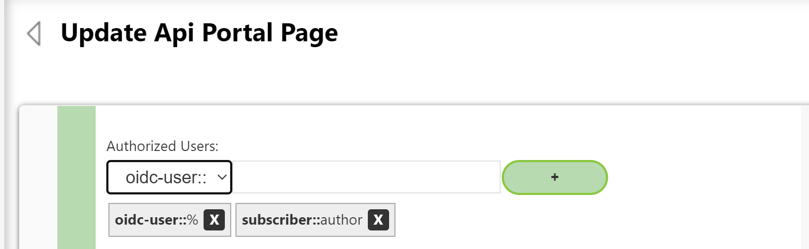
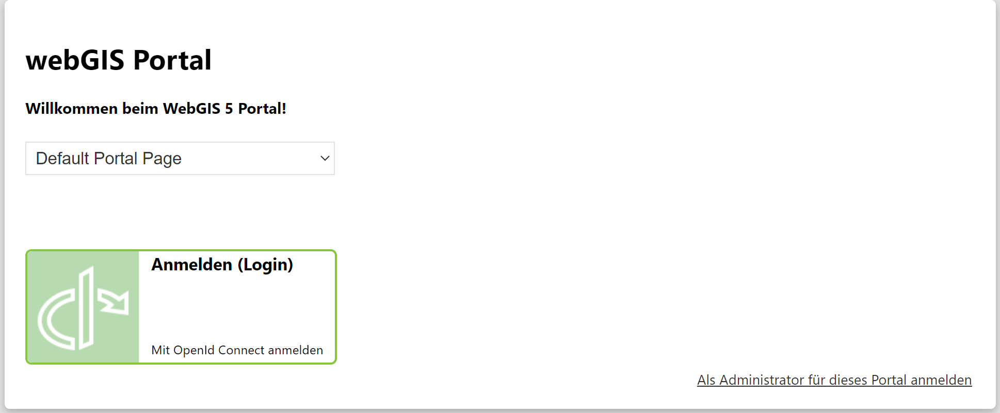

OpenID Connect Authentication
=============================

To allow users to sign in to the *WebGIS Portal* via *OpenID Connect*, the following must be set in ``portal.config``:

.. code-block:: xml

    <!-- Security -->
    <add key="security" value="oidc" />                  <!-- windows, token, clientid, forms, anonym (url) -->
    <add key="security_allowed_methods" value="oidc" /> <!-- allowed methods separated by commas, no spaces !! -->

The file ``_config/application-security.json`` must also be adjusted.
It contains the properties such as Authority, ClientId, and similar values for the **OpenID Connect** login:

.. code-block:: json

    {
      "identityType": "oidc",
      "oidc": {
        // example for Keycloak
        "authority": "http://localhost:8080/realms/webgisrealm",
        "clientId": "webgis-portal",
        "clientSecret": "",
        "scopes": ["openid", "roles"],

        // claims
        "claimsFromUserInfoEndpoint": true,
        "nameClaimType": "preferred_username",

        // optional (roles)
        "roleClaimType": "roles",  // optional, only if roles are present in the token
        "roleClaimValueSeparator": ","  // optional, only if multiple roles in the token are separated by a delimiter
      }
    }

Azure AD
--------

Login via Azure AD is also supported. It is again an **OpenID Connect** login, but the configuration in ``_config/application-security.json`` must be adjusted:

.. code-block:: json

    {
      "identityType": "azure-ad",
      "azure-ad": {
        "Instance": "https://login.microsoftonline.com/",
        "Domain": "{my-domain}.onmicrosoft.com",
        "TenantId": "{my-tenant-id}",
        "ClientId": "{my-client-id}",

        // optional (roles)
        "extended-roles-from": "windows",  // optional, only if roles should come from the local AD
        // or
        "roleClaimType": "roles",  // optional, only if roles are present in the token
        "roleClaimValueSeparator": ","  // optional, only if multiple roles in the token are separated by a delimiter
      }
    }

The parameter ``extended-roles-from = windows`` is optional.
In this mode, only the user name is taken from the Azure login, while the groups for that user are read from the Windows AD (LDAP).

If roles or groups are present directly in the Azure token, they can be read using ``roleClaimType`` and ``roleClaimValueSeparator``.
There can be multiple claims with the ``roleClaimType`` in the token, or several roles in a single claim separated by a delimiter such as a comma.

OpenID Connect login tile
-------------------------

To allow users to sign in via **OpenID Connect** on a *WebGIS Portal page*, the page security must also be adjusted
(in the WebGIS API as subscriber login → Pages → select the corresponding page).

With this setting, the *WebGIS Portal* start page will show the option ``Sign in with OpenID Connect``:

