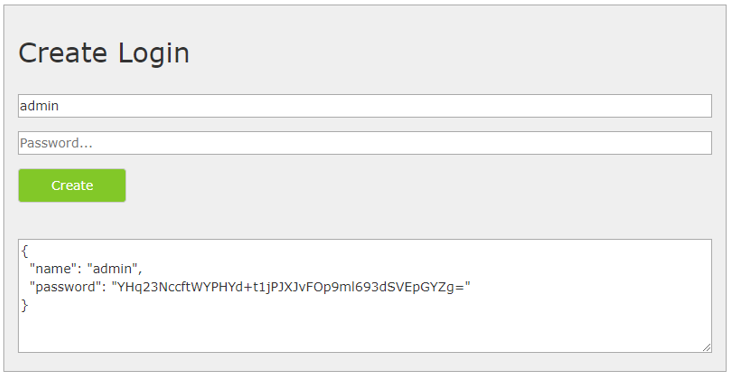

=====================================
Configuration of the CMS application
=====================================

File ``_config/cms.config``
============================

The CMS application is configured via the file ``webgis-cms/_config/cms.config``.

This is a JSON file (**JavaScript Object Notation**), a structured data format that is independent of JavaScript. When editing the file, make sure that it remains valid JSON. In particular, no comments may be inserted, and keys must be written as strings in quotation marks.

.. note:: Note on JSON syntax

    - Attributes and values are separated by ``:``, e.g.: ``"force-https": false``
    - Objects (with multiple attributes) are placed in curly braces: ``{ … }``
    - Arrays are marked with square brackets: ``[ … ]``. The individual values are separated by commas.
    - An array can list objects (e.g. ``cms-items``): ``[ { "object1": ... }, { "object2": ... } ]``
    - An array can list individual values (strings, numbers) (e.g. ``http-get``): ``[ "url1", "url2" ]``
    - A backslash ``\`` is a special character in a string in JSON. To actually specify a backslash, a double ``\\`` must be used (e.g. in paths). Otherwise the configuration file is no longer valid JSON!

The template has the following format:

.. code-block:: json

    {
      "shared-crypto-keys-path": "C:\\apps\\webgis/local/webgis-repository/security/keys",
      "company": "",
      "elasticsearch-endpoint": null,
      "force-https": false,
      "services-default-url-scheme": "http://",
      "webgis-portal-instance": "http://localhost:5002",
      "cms-display-url": "https://myserver.com/cms",
      "cms-items": [
        {
          "id": "webgis-release-default",
          "name": "WebGIS Release Default",
          "path": "C:\\apps\\webgis/local/webgis-repository/cms/param/webgis-release-default",
          "scheme": "webgis",
          "deployments": [
            {
              "name": "default",
              "target": "C:\\apps\\webgis/local/webgis-repository/cms/publish/cms-default.xml",
              "replacement-file": "",
              "postEvents": {
                "commands": [],
                "http-get": ["http://localhost:5001/cache/clear"]
              }
            }
          ]
        },
        {
          "id": "webgis-custom",
          "name": "WebGIS Custom",
          "path": "C:\\apps\\webgis/local/webgis-repository/cms/param/webgis-custom",
          "scheme": "webgis",
          "deployments": [
            {
              "name": "default",
              "target": "C:\\apps\\webgis/local/webgis-repository/cms/publish/cms-custom.xml",
              "replacement-file": "",
              "postEvents": {
                "commands": [],
                "http-get": ["http://localhost:5001/cache/clear"]
              }
            }
          ]
        }
      ]
    }

Below is an overview of the most important configuration parameters.

Section ``Root Element``
--------------------------

.. list-table::
   :widths: 20 80
   :header-rows: 1

   * - **Attribute**
     - **Description**
   * - ``webgis-portal-instance``
     - The internal URL to the **WebGIS Portal**. This parameter is required when CMS nodes should be authorized. Via this URL, the CMS application retrieves the available **users and groups** (e.g. **AD users/groups**). Since this query happens directly server-to-server, an **internal URL** can also be used here. If both applications are on the same server, ``http://localhost/webgis-portal`` can, for example, also be used.
   * - ``cms-display-url`` *(optional)*
     - This optional parameter is helpful if the CMS is operated behind a **reverse proxy server** and the application cannot automatically determine which URL is visible to the user. In this case, the desired **external URL** can be specified here.

With a **Web CMS**, multiple trees can be managed. An object is created in the ``cms-items`` array for each tree. The value of ``cms-items`` must be an **array** that contains individual ``cms-item`` objects.

A ``cms-item`` object has various attributes. The two highlighted values (``path``, ``target``), for example, specify:

- ``path``: where the root of the CMS tree is located.
- ``target``: where a CMS is published to.

Section ``cms-item``
----------------------

.. list-table::
   :widths: 20 80
   :header-rows: 1

   * - **Attribute**
     - **Description**
   * - ``id``
     - A unique ID for the CMS. It should consist only of lowercase letters and numbers (no umlauts).
   * - ``name``
     - A descriptive name for the CMS.
   * - ``path``
     - Path to the root directory of the CMS tree.
   * - ``scheme``
     - Must always be set to ``webgis``.
   * - ``secrets-password`` *(optional)*
     - If secrets are to be accessed in this CMS, a password dialog appears. The password required for access can be set here. This value can also be omitted or left empty — the dialog then still appears in the CMS, but must be confirmed without any input.
   * - ``deployments``
     - An array of deployment objects. Multiple deployments (1:n) can be created per tree. The result of a deployment is a ``cms.xml`` file that can be integrated into WebGIS.

       **Example of deployments:**

       .. code-block:: json

           [
               {
                   "deployment": "Deployment 1"
               },
               {
                   "deployment": "Deployment 2"
               }
           ]

       Multiple deployments can be helpful for generating different XML files for test, failover, training, and production systems.

Section ``deployments``
-------------------------

.. list-table::
   :widths: 20 80
   :header-rows: 1

   * - **Attribute**
     - **Description**
   * - ``name``
     - A descriptive name for the deployment (e.g. *localhost*, *Development*, *Training*, *Test*, *Production*).
   * - ``target``
     - The path for the CMS file. The CMS creates an ``_archive`` directory in the same folder, in which existing XML files are backed up before being overwritten. If these backups are no longer needed, the folder can be deleted manually. A URL to the API can also be specified here, e.g.: ``https://localhost/api/cache/upload/{cms-name}``. ``{cms-name}`` corresponds to the CMS name as defined in ``api.config``, e.g.:

       .. code-block:: xml

           <add key="cmspath_my-cms" value="{path-to-cms.xml}" />

       Results in the URL: ``https://{webgis-api-url}/cache/upload/my-cms``

       Uploading CMS XML files has the advantage that **WebGIS CMS** does not need direct access to the file system of the **WebGIS API** application.

       .. danger::

           In this case, however, a **client** and a **secret** must be defined to ensure that the upload is only performed by an authorized CMS instance.

   * - ``client`` and ``secret`` *(required if ``target`` is an API URL)*
     - An arbitrary *client* and an arbitrary *secret* can be defined here. The *secret* should be a secure password with at least **32 characters**. For the **WebGIS API** to accept the upload, a section ``<section name='cms-upload-{cms-name}'>`` must be present in ``api.config``, in which the same *client* and the same *secret* are stored.
   * - ``replacement-file`` *(optional)*
     - Path to a **replacement file** (*replacement file* from an old CMS) that should be used for this deployment.
   * - ``ignoreAuthentication`` *(optional)*
     - If this value is set to ``true``, permissions in the CMS are ignored. This can be useful for **training or test systems**, where all users should have unrestricted access.
   * - ``postEvents`` *(optional)*
     - An array of events that should be executed after a successful build.
   * - ``environment`` *(optional)*
     - Specifies the environment for the deployment. This is relevant, for example, for ``Secrets``, since a separate value can be stored for each environment (e.g. different *connection strings* for test and production systems). **Possible values:** ``Default``, ``Test``, ``Staging``, ``Production``.
   * - ``services`` *(optional)*
     - An **allow-list** (array of strings) that can be used to restrict which services (**ArcGIS Server**, **ImageServer**, **WMS**, **WMTS**, …) are actually included in the exported target XML.

       Services are matched by their **url-name** (folder name). Only in the rare case that the same folder name occurs multiple times across different service types must the full **relative path** be specified instead.

       Services not listed are skipped during export.

       If the list is left empty or unset, the previous behavior is retained: **all services** continue to be exported.

Section ``postEvents``
------------------------

.. list-table::
   :widths: 20 80
   :header-rows: 1

   * - **Attribute**
     - **Description**
   * - ``commands`` *(optional, array of strings)*
     - A list of command-line commands that are executed after the CMS is built. This can be useful if the generated CMS file should be copied to another storage location.

       **Use case:**
       If multiple WebGIS instances are operated behind a load balancer, the XML file can be automatically distributed to all instances this way.
   * - ``http-get`` *(optional)*
     - A list of **HTTP GET requests** that are executed after the CMS is built. This can be used, for example, to trigger a ``cache/clear`` on a WebGIS instance after a deployment. This ensures that the new XML file is loaded directly into the cache.

       .. note::

          If the **CMS.xml** is transferred to the **WebGIS API** via upload, a manual ``cache/clear`` call can be skipped, since this is performed automatically by the WebGIS API.

Additional attributes
-----------------------

.. list-table::
   :widths: 20 80
   :header-rows: 1

   * - **Attribute**
     - **Description**
   * - ``company``
     - An abbreviation for the company. Optionally, a ``wwwroot/css/{company}/site.css`` file can later be created to override CSS styles for the CMS. This allows colors and other design elements to be customized.
   * - ``force-https``
     - Should always be set to ``false`` for **customer installations**.
   * - ``service-default-url-scheme``
     - Specifies which **protocol** (``http://`` or ``https://``) is used when map services are integrated. In the creation dialog, often only the **server name** is entered. This attribute controls whether the full URL to the map service is generated with
       ``http://`` or ``https://``.
   * - ``webgis-portal-instance`` *(optional)*
     - If **permissions** are configured in the CMS, the CMS must query a WebGIS Portal instance in the background to determine available **login options and users**.

       This query can also be performed directly in the Web CMS by specifying the instance manually. If the value is predefined here, this increases **usability**, since the information does not need to be entered again each time.

File ``_config/datalinq.config``
=================================

The CMS application also contains **DataLinq.Code** for editing **DataLinq endpoints**, **queries** and **views**. The actual **DataLinq engine** runs inside a **WebGIS API instance**.

Which instances are shown for editing via the CMS start page can be controlled via the file ``_config/datalinq.config``:

.. code-block:: json

   {
      "instances": [
         {
            "name": "Local WebGIS API",
            "description": "My local WebGIS test and development API",
            "url": "https://my-server/webgis-api"
         }
      ],
      "useAppPrefixFilters": true,
      "autoLogin": "author"
   }

Overview of the most important configuration parameters
---------------------------------------------------------

.. list-table::
   :widths: 20 80
   :header-rows: 1

   * - **Attribute**
     - **Description**
   * - ``instances``
     - An **array** in which multiple **DataLinq API instances** can be defined. If one of these instances is called via the **CMS start page**, a login window appears. There you must log in with a **subscriber** for the respective API instance.

       .. note::

          The respective **API instance** can specify in its configuration (``api.config``) under ``datalinq => allowed-code-api-clients`` **from which URLs DataLinq.Code editing is allowed**. If the corresponding **CMS instance** is not entered there, an error message appears (*Invalid Client*).
   * - ``useAppPrefixFilters``
     - If this option is set to ``true``, the individual **endpoints** can be filtered when the **DataLinq.Code** application starts.

       **Naming convention for endpoints:**

       The endpoints are organized according to the following scheme:

       .. code-block::

          {APPLICATION}-{db/lov/...}-{etc...}

       Before the first ``-`` is the **name of the application**. Optional additional descriptions to distinguish **endpoints** follow after that.

       **Typical endpoint structure:**

       An application usually has several endpoints, including:

       - **one** endpoint for **read database access**
       - **one** endpoint for **write database access**
       - **PlainText endpoints** for selection lists

       If one or more applications are selected when the application starts, only their endpoints are shown in the tree. This improves performance and clarity, especially when many applications exist. The filter can be reset at any time by clicking on the **"DataLinq.Code" heading above the tree**.

File ``_config/settings.config``
=================================

General settings for the WebGIS CMS application can be stored in this optional file. One use case is the configuration of a **logging file** or the setup of a **proxy server**.

If external services are integrated, a **proxy server** may be required for access. With the following settings, a proxy server that is used for all internet access can be defined via this file:

.. code-block:: json

   {
      "logging_connection_string": "C:\\cms\\cms-logging.csv",
      "proxy": {
         "use": true,
         "server": "webproxy.mydomain.com",
         "port": 8080,
         "user": "",            // optional
         "password": "",        // optional
         "domain": "",          // optional
         "ignore":"localhost;my-intranet.com;.my-domain.com$;"
      }
   }

Overview of the most important configuration parameters
---------------------------------------------------------

.. list-table::
   :widths: 20 80
   :header-rows: 1

   * - **Attribute**
     - **Description**
   * - ``logging_connection_string``
     - Path to the **logging file**.
       This allows you to track which users made changes in the CMS, and when and by whom a CMS was last published.

       If the file has the extension ``.csv``, a **CSV file** with ``;`` as the delimiter is created. Otherwise, the logs are stored as a **text file**, with each line representing one entry.

       .. note::

          The file can be read via **DataLinq** (endpoint with connection type *TextFile*) to make the logs available in the browser.

   * - ``proxy``
     - Allows the configuration of a **proxy server** for internet access.

       - ``user``, ``password`` and ``domain`` are optional.
       - In the ``ignore`` field, multiple rules can be specified separated by ``;``. If the called server starts with one of these strings, the proxy is ignored.
       - **Regular expressions** can also be used here.

File ``_config/application-security.config``
=============================================

By default, the Web CMS is accessible to all users who know the URL. To restrict access with a **user name and password**, this file can be used.

If the file does **not** exist, the CMS is **freely accessible**.

.. danger::
   **Security risk when used on the internet!**

   This mechanism only offers **simple protection** via user name and password. It is **not suitable for use on the internet**, since it can be bypassed using malicious methods.

   If the Web CMS must be installed on a **public server**, it should **not be integrated directly into IIS and not exposed via the internet**.

   **Recommended security measures:**

   - The CMS should be operated **only on the intranet**, since simple protection is usually sufficient here.
   - If **remote access is required**, the CMS should **not** run as a classic web application in IIS. Instead, it should be run as a **local desktop application** on a **jump host**.
   - For **secure authentication**, **Windows authentication** or **OpenID Connect** should be used. These methods are described below.

Secured user access
--------------------------

Setting up password-protected access to the CMS
~~~~~~~~~~~~~~~~~~~~~~~~~~~~~~~~~~~~~~~~~~~~~~~~~~

To protect access to the CMS with a **user name/password protection**,
proceed as follows:

1. Open the CMS in the browser with the URL ``/admin/CreateLogin``.

   .. image:: img/config-security1.png

   .. note::

      This URL can only be called if **no** ``application-security.config`` file exists yet. If the file already exists, you must log in to access this page.

2. Enter a user name and password into the form and click ``Create``.

3. Copy the generated code snippet and insert it into the file ``_config/application-security.config``:

   .. code-block:: json

    {
        "users": [
          {
          "name": "admin",
          "password": "tcwXYZ55..."
          }
        ]
    }

   .. note::

      The ``users`` field is an **array**. Multiple users can be created
      and added separated by commas:

        .. code-block:: json

            {
              "users": [
                {
                  "name": "admin",
                  "password": "tcwXYZ55..."
                },
                {
                  "name": "admin2",
                  "password": "dA8NR..."
                }
              ]
            }

At the next call of the Web CMS, a login with user name and password is required.

.. tip::

  If access remains unprotected, it may be necessary to restart the **application pool** in IIS.

In addition to the classic login via a login form, the CMS can also be secured via **Windows authentication** or **OpenID Connect**.

Windows authentication
~~~~~~~~~~~~~~~~~~~~~~~~~

For a **Windows-based login**, ``application-security.config`` can be configured as follows:

   .. code-block:: json

      {
         "identityType": "windows",
         "users": [
           {
            "name": "domain\\user1"
           },
           {
            "name": "domain\\user2"
           },
           {
            "name": "domain\\admin123"
           }
         ]
      }

This configuration allows three **Windows domain users** to access the CMS.

.. tip::

    For this method to work, the web application in **IIS** must be configured so that **Windows authentication is enabled** and **anonymous login is disabled**.

Login via OpenID Connect
~~~~~~~~~~~~~~~~~~~~~~~~~~~~~

If you want to use **OpenID Connect-compliant authentication**, ``application-security.config`` can look as follows:

   .. code-block:: json

      {
         "identityType": "oidc",
         "oidc": {
            "authority": "https://server.com/identity",
            "clientId": "cms-local-oidc",
            "clientSecret": "secret123",
            "requiredRole": "gis-admin-webgis-cms"
         }
      }

With this configuration, **only users with the role** ``gis-admin-webgis-cms`` are allowed to access the CMS.

.. tip::

    For this method to work, the following prerequisites must be met:

    - The **client ID** and the **client secret** must be registered on the **OpenID server**.
    - At least ``openid``, ``profile`` and ``role`` must be enabled as **scopes**.

