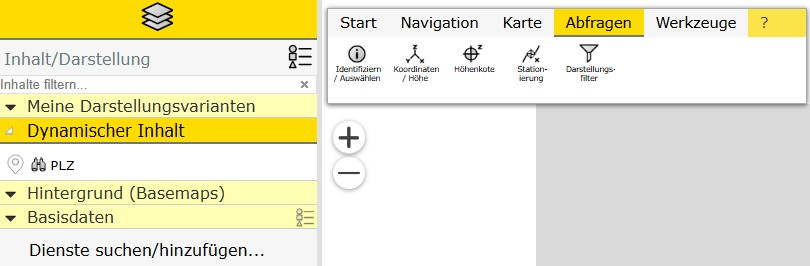

``default.css`` - Examples
==========================

This page shows concrete ``default.css`` examples in increasing complexity.
Each example includes two screenshots (TOC and tools) and a CSS snippet.

Modern: primary color plus header accent
----------------------------------------

Only the primary color is set; the light variant is calculated automatically.

.. list-table::
   :widths: 50 50

   * - .. image:: img/modern_simple-toc.jpg
          :alt: Example modern_simple - TOC
          :width: 100%
     - .. image:: img/modern_simple-tools.jpg
          :alt: Example modern_simple - Tools
          :width: 100%

.. literalinclude:: img/modern_simple.css
   :language: css

Modern: only primary and light color
------------------------------------

(STMK)

Here the light color is not calculated automatically but set explicitly.

.. list-table::
   :widths: 50 50

   * - .. image:: img/modern_with_custom_light-toc.jpg
          :alt: Example modern_with_custom_light - TOC
          :width: 100%
     - .. image:: img/modern_with_custom_light-tools.jpg
          :alt: Example modern_with_custom_light - Tools
          :width: 100%

.. literalinclude:: img/modern_with_custom_light.css
   :language: css

Flat: no underline for selected items
-------------------------------------

(BGL)

Primary and light color are set to the same value. This creates a reduced, flat look.

.. list-table::
   :widths: 50 50

   * - .. image:: img/flat-toc.jpg
          :alt: Example flat - TOC
          :width: 100%
     - .. image:: img/flat-tools.jpg
          :alt: Example flat - Tools
          :width: 100%

.. literalinclude:: img/flat.css
   :language: css

Two primary colors
------------------

(NÖ)

The light variant is set explicitly instead of being calculated automatically. This gives more control over readability and contrast.

.. list-table::
   :widths: 50 50

   * - .. image:: img/modern_two_primary_colors-toc.jpg
          :alt: Example modern_two_primary_colors - TOC
          :width: 100%
     - .. image:: img/modern_two_primary_colors-tools.jpg
          :alt: Example modern_two_primary_colors - Tools
          :width: 100%

.. literalinclude:: img/modern_two_primary_colors.css
   :language: css

Adjust the text color of selected items
---------------------------------------

(OÖ)

In addition to the brand colors, ``--webgis-ui-text-selected`` is adjusted here to improve readability on light surfaces.

.. list-table::
   :widths: 50 50

   * - .. image:: img/modern_with_custom_light2-toc.jpg
          :alt: Example modern_with_custom_light2 - TOC
          :width: 100%
     - .. image:: img/modern_with_custom_light2-tools.jpg
          :alt: Example modern_with_custom_light2 - Tools
          :width: 100%

.. literalinclude:: img/modern_with_custom_light2.css
   :language: css

Adjust dialog headers
---------------------

(VBG)

In addition to the brand color, dialog and panel headers are styled specifically through
``--webgis-ui-surface-header`` and ``--webgis-ui-text-header``.

.. list-table::
   :widths: 50 50

   * - .. image:: img/modern_with-custom-headers-toc.jpg
          :alt: Example modern_with-custom-headers - TOC
          :width: 100%
     - .. image:: img/modern_with-custom-headers-tools.jpg
          :alt: Example modern_with-custom-headers - Tools
          :width: 100%

.. literalinclude:: img/modern_with-custom-headers.css
   :language: css

Highlight presentation containers
----------------------------------

(KTN)

This example extends the default variables with targeted styling for unselected presentation containers (``.webgis-presentation_toc-title``).

.. note::

   No ``*_tools.jpg`` is currently available for this example. That is optional.

.. literalinclude:: img/modern_with_presention_containers.css
   :language: css
