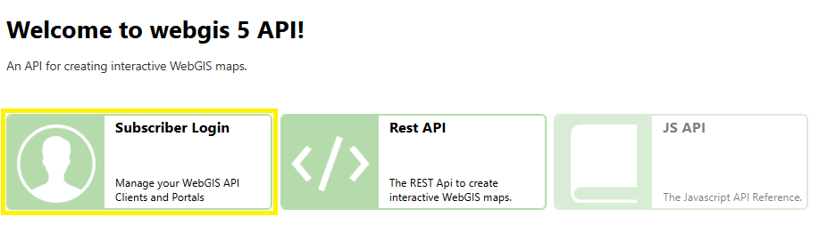
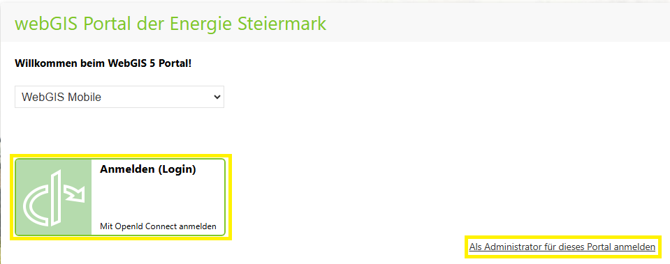

================================
Security measures (hardening)
================================

A secure configuration of the *WebGIS Portal* is essential to prevent **data loss, unauthorized access, and manipulation**. Even if the application is used only **inside an intranet**, additional protection is still required because **the same sensitive data is transmitted and stored as in a publicly accessible installation**.

.. caution::

    Web security is a complex topic that can have different requirements depending on the organization. This description is therefore only a starting point and represents a recommended minimum configuration. It is recommended to adapt further security measures individually to the specific characteristics of your own IT infrastructure.

This section describes recommended security measures to protect the system as well as possible. Further general information on the security of web applications can be found in the appendix under :doc:`Security measures for the WebGIS Portal </annex/index>`.

Change default passwords
=========================

During the initial installation, the system contains predefined user accounts with default passwords that are generally known. These passwords should be changed **immediately after installation** to prevent unauthorized access.

Author account
--------------

This account is used for **editing and publishing content**. If the default password is not changed, other people could log in without authorization and manipulate maps or other data.

Admin account in the API
-------------------------

The API administrator has **extended permissions** to change important application settings. An attacker with access to this account could control the entire application or even delete data. It is therefore essential to replace the default password.

To create an **admin user** for the API, follow these steps:

1. **Open the registration page**

   Open the following URL in the browser: ``http://hostname:5001/Subscribers/Login``. The host name and port must be adapted to the respective configuration.

   .. image:: img/create_admin_1.png

2. **Start the registration**

   Click **"Register as new subscriber"**.

3. **Fill in the form**

   Enter the required information in the registration form.

   .. image:: img/create_admin_2.png

   - The password must be at least **8 characters** long.

   .. danger::

     **Make sure to use a strong password!** The minimum length is a technical requirement, but based on the security notes above, you should choose a password that is as strong as possible.

   .. important::

     The user name **must** be ``admin`` when using the default settings. The *WebGIS API* internally uses this **fixed name** to assign the user to the **admin role**. Without this name, the user will not receive administrator rights.

     Which user name is assigned the administrator role is defined in the API configuration file ``_config/api.config``

     .. code:: xml

        <?xml version="1.0" encoding="utf-8" ?>
        <configuration>
          <appSettings>
            ...
            <add key="subscriber-admins" value="admin" />
            ...
          </appSettings>
        </configuration>

Disable self-registration for subscribers
===========================================

Once all necessary user accounts have been created, **self-registration for subscribers** should be disabled. Otherwise, any user could create an account on their own, which is undesirable in most cases.

After disabling it, new user accounts can only be created manually via the **admin account**.

Self-registration is disabled by setting ``allow-register-new-subscribers`` to ``false`` in the API configuration file (``_config/api.config``):

.. code-block:: xml

   <?xml version="1.0" encoding="utf-8" ?>
   <configuration>
      <appSettings>
         ...
         <add key="allow-register-new-subscribers" value="false" />
         ...
      </appSettings>
   </configuration>

Once this setting has been made, **self-registration for subscribers is disabled**.

Disable login options in publicly accessible instances
==========================================================

To prevent users from logging in to a **public installation** of WebGIS, the login must be disabled in both the **Portal** and the **API**.

.. tip::

  This setting is particularly useful when a configuration from an **internal installation** is transferred to a **publicly accessible instance**, as it must be ensured that **no external users can log in**.

The login is disabled by setting ``allow-subscriber-login`` to ``false`` in the configuration files of the API (``_config/api.config``) and the Portal (``_config/portal.config``):

API configuration file (``_config/api.config``)
------------------------------------------------

.. code-block:: xml

   <?xml version="1.0" encoding="utf-8" ?>
   <configuration>
      <appSettings>
         ...
         <add key="allow-subscriber-login" value="false" />
         ...
      </appSettings>
   </configuration>

Portal configuration file (``_config/portal.config``)
--------------------------------------------------------

.. code-block:: xml

   <?xml version="1.0" encoding="utf-8" ?>
   <configuration>
      <appSettings>
         ...
         <add key="allow-subscriber-login" value="false" />
         ...
      </appSettings>
   </configuration>

Once this setting has been made in both configuration files, **login for users in the public instance is disabled**.
