=============
Print Layouts
=============

This documentation uses an example to explain the structure of a custom layout XML file that can be used. The following example contains all the parameterization options:

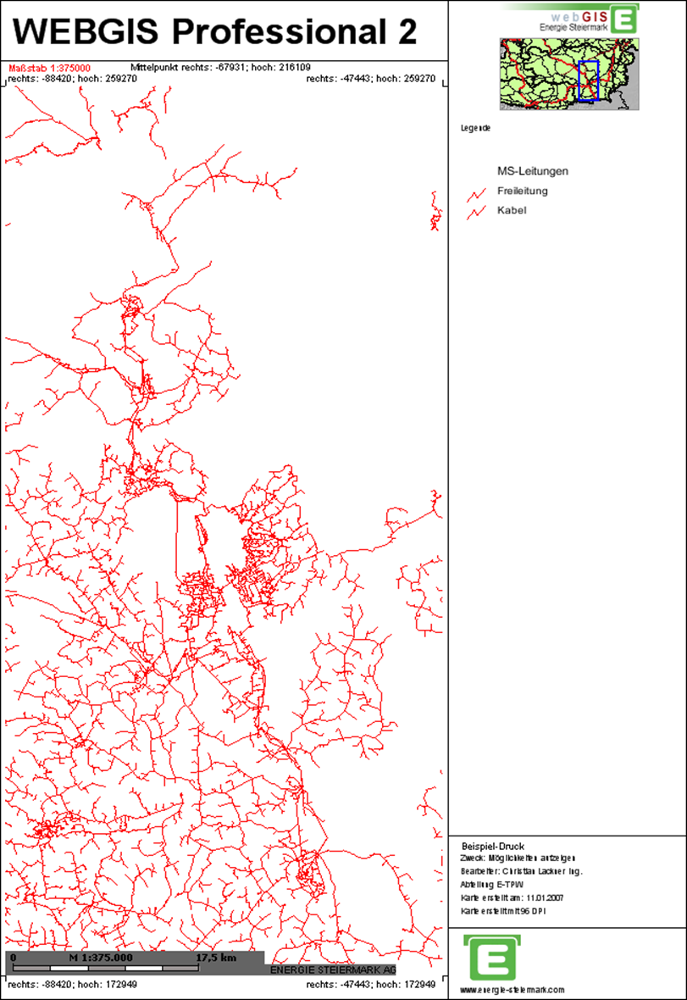

Each page (e.g. A4 portrait, A3 landscape, etc.) is fundamentally divided into freely definable so-called panels. Any number of panels can be defined per page. Among other things, maps, legends, scale bars, text, lines, and images can be integrated into these panels.

To make it easier to find a specific panel within the XML document, the colors shown here are used correspondingly in the XML text.

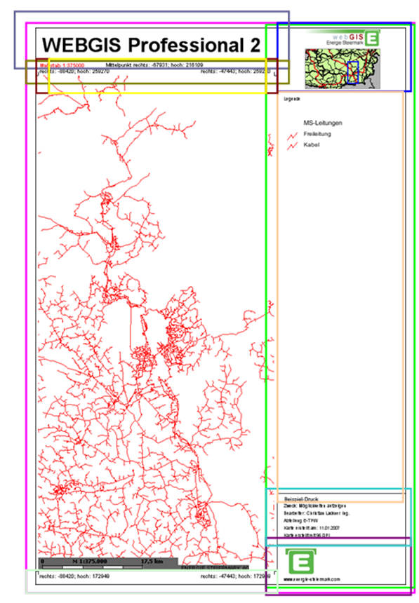

The XML document is structured so that each page – regardless of its size – uses a custom layout and fills the available space with panels. The remaining free space on the page is automatically filled with map content.

.. note:: In principle, it would also be possible to fix the area of the map. In this case, however, using different paper formats would not make sense. Therefore, this documentation describes exclusively how the remaining space is dynamically filled with the map.

Every custom layout begins with the XML tag shown below. For clarity, this is not shown again for each of the following panels.

.. code:: xml

    <?xml version="1.0" encoding="iso-8859-1"?>
    <layout>
    </layout>

The layout tag can contain the following attributes:

.. list-table::
   :widths: 20 80
   :header-rows: 1

   * - Attribute
     - Description
   * - ``coord_sys``
     - The EPSG code for a coordinate system can be specified here. Coordinates in the layout (e.g. corner coordinates) are given in this system.
       **Example:** ``coord_sys="4326"``
   * - ``coord_format``
     - Specifies the format of the coordinates. Possible values are ``dms`` (degrees, minutes, seconds) and ``dm`` (degrees, minutes). If no value is specified, the output is a decimal value.
   * - ``border``
     - Defines the page margin for the layout in millimeters [mm].
   * - ``image_format``
     - Specifies the format in which the print image is created. By default, ``PNG`` is used. Since this leads to large PDFs for aerial imagery, an alternative format can be used, for example ``JPG``.
       **Example:** ``image_format="jpg"``
   * - ``to_jpg_if_greater``
     - A value in MB can be specified here. If the PDF exceeds this value, the output is automatically switched to ``JPG``, which generally results in smaller PDFs.
       **Example:** ``to_jpg_if_greater="5"``

The Panel
=========

The layout consists of so-called panels, which can be nested inside each other and filled with various elements such as text, images, or map elements. Each panel is defined in the XML as follows:

.. code:: xml

    <panel dock="fill" border="all" fillcolor="255,255,255" bordercolor="0,0,0">
    </panel>

Panel variants:

- ``fill``
  The panel is completely filled and is used to display further objects or panels inside it.
- ``bottom``
  The panel is placed at the bottom of the parent panel.
- ``top``
  The panel is placed at the top of the parent panel.
- ``left``
  The panel is placed at the left of the parent panel.
- ``right``
  The panel is placed at the right of the parent panel.

Each panel can additionally be given the following properties:

.. list-table::
   :widths: 20 80
   :header-rows: 1

   * - Property
     - Description
   * - ``border``
     - Draws a border around the panel. Possible values: ``all``, ``left``, ``right``, ``top``, or ``bottom``.
   * - ``fillcolor``
     - Fills the panel with a background color in RGB format (e.g.: ``fillcolor="0,0,0"``).
   * - ``bordercolor``
     - Draws the border in a defined color in RGB format (e.g.: ``bordercolor="0,0,0"``).
   * - ``width``
     - Sets the width of the panel in millimeters. Only relevant for panels of type ``left`` or ``right`` (e.g.: ``width="19"``).
   * - ``height``
     - Sets the height of the panel in millimeters. Only relevant for panels of type ``top`` or ``bottom`` (e.g.: ``height="25"``).

Nesting Panels
------------------------

To use multiple panels correctly, they must be nested inside each other in a meaningful way. Nesting is explained using the following example.

First, an outer panel is defined, which is filled white and gets a border all around:

.. code:: xml

   <panel dock="fill" border="all" bordercolor="0,0,0" fillcolor="255,255,255">
   </panel>

Inside this outer panel, a right panel is now created. It extends over the full height and has a width of 60 mm as well as a left border:

.. code:: xml

   <panel dock="fill" border="all" bordercolor="0,0,0" fillcolor="255,255,255">
     <panel dock="right" width="60" border="left" bordercolor="0,0,0">
     </panel>
   </panel>

Inside the right panel, there is a further panel at the top with a height of 30 mm:

.. code:: xml

   <panel dock="fill" border="all" bordercolor="0,0,0" fillcolor="255,255,255">
     <panel dock="right" width="60" border="left" bordercolor="0,0,0">
       <panel dock="top" height="30">
       </panel>
     </panel>
   </panel>

At the bottom edge of the right panel, two panels are inserted:
one with a height of 19 mm for the Energie Steiermark logo, and another with 24 mm for text. Both panels get a border at the top:

.. code:: xml

   <panel dock="fill" border="all" bordercolor="0,0,0" fillcolor="255,255,255">
     <panel dock="right" width="60" border="left" bordercolor="0,0,0">
       <panel dock="top" height="30">
       </panel>
       <panel dock="bottom" height="19" border="top" bordercolor="0,0,0">
       </panel>
       <panel dock="bottom" height="24" border="top" bordercolor="0,0,0">
       </panel>
     </panel>
   </panel>

.. caution::

    The order of the panels within the XML determines their positioning. The panel with `dock="bottom"` defined first is located at the bottom. The following panel with `dock="bottom"` is placed above it. The sum of the height values does not matter here; the panels are joined seamlessly to each other.

Finally, above and outside the right panel, another panel is created for the map heading. This gets a height of 16 mm and a black border at the bottom:

.. code:: xml

   <panel dock="fill" border="all" bordercolor="0,0,0" fillcolor="255,255,255">
     <panel dock="right" width="60" border="left" bordercolor="0,0,0">
       <panel dock="top" height="30">
       </panel>
       <panel dock="bottom" height="19" border="top" bordercolor="0,0,0">
       </panel>
       <panel dock="bottom" height="24" border="top" bordercolor="0,0,0">
       </panel>
     </panel>
     <panel dock="top" height="16" border="bottom" bordercolor="0,0,0">
     </panel>
   </panel>

The panels are now fully nested. In the next step, they can be filled with text, images, and predefined objects.

Inserting Text
==============

Text is inserted within a panel using the following syntax:

.. code:: xml

    <text string="webgis" x="11" y="3" align="center" font="Arial" fontstyle="bold" fontsize="7" fontcolor="0,0,0" />

Properties of text elements:

.. list-table::
   :widths: 20 80
   :header-rows: 1

   * - Property
     - Description
   * - ``X="11"`` ``Y="3"``
     - Coordinates of the top-left corner of the text, relative to the panel (``X=0``, ``Y=0`` corresponds to the top-left corner of the panel).
   * - ``align``
     - Vertical alignment of the text relative to the defined coordinates. Possible values are ``center``, ``left``, or ``right``.

       .. note::

            The value of ``align`` takes precedence over the X and Y coordinates. A centered text (``align="center"``) is always shown centered in the panel, regardless of the specified X value.
   * - ``font``, ``fontstyle``, ``fontsize``, ``fontcolor``
     - Define the font, style, size, and color of the text.

       **Example:** ``font="Arial" fontstyle="bold" fontsize="7" fontcolor="0,0,0"``

The following XML example shows a text in the previously defined ``top`` panel:

.. code-block:: xml

   <panel dock="fill" border="all" bordercolor="0,0,0" fillcolor="255,255,255">
     <panel dock="right" width="60" border="left" bordercolor="0,0,0">
       <panel dock="top" height="30">
       </panel>
       <panel dock="bottom" height="19" border="top" bordercolor="0,0,0">
       </panel>
       <panel dock="bottom" height="24" border="top" bordercolor="0,0,0">
       </panel>
     </panel>
     <panel dock="top" height="16" border="bottom" bordercolor="0,0,0">
       <text string="Ihr Text hier" x="11" y="3" align="center"
             font="Arial" fontstyle="bold" fontsize="7" fontcolor="0,0,0" />
     </panel>
   </panel>

Inserting Predefined Text
============================

Predefined variables can also be used in a custom layout; these are automatically replaced with values from the print call. These variables must be specified in square brackets.

The following predefined variables are available:

.. list-table::
   :widths: 30 70
   :header-rows: 1

   * - Variable
     - Description
   * - ``[TITLE]``
     - Map heading
   * - ``[USER]``
     - Name of the creator
   * - ``[SECTION]``
     - Department
   * - ``[PURPOSE]``
     - Purpose of use
   * - ``[PAGE_SIZE]``
     - Page size of the printout (e.g.: ``A4``)
   * - ``[DPI]``
     - Quality (print resolution in DPI)
   * - ``[SCALE]``
     - Output scale
   * - ``[DATE]``
     - Date the map was created
   * - ``[DATE(Format)]``
     - Date with custom formatting (e.g.: ``dd.MM.yyyy``, ``dd.MMMM yyyy``, ``yyyy``)
   * - ``[MAP_SRS_NAME]``
     - Name of the map's coordinate system
   * - ``[EPSG]``
     - EPSG code of the map's coordinate system
   * - ``[COORD_LEFT_0]``
     - Left coordinate with 0 decimal places
   * - ``[COORD_LEFT_1]``
     - Left coordinate with 1 decimal place
   * - ``[COORD_LEFT_2]``
     - Left coordinate with 2 decimal places
   * - ``[COORD_RIGHT_0]``
     - Right coordinate with 0 decimal places
   * - ``[COORD_RIGHT_1]``
     - Right coordinate with 1 decimal place
   * - ``[COORD_RIGHT_2]``
     - Right coordinate with 2 decimal places
   * - ``[COORD_BOTTOM_0]``
     - Bottom coordinate with 0 decimal places
   * - ``[COORD_BOTTOM_1]``
     - Bottom coordinate with 1 decimal place
   * - ``[COORD_BOTTOM_2]``
     - Bottom coordinate with 2 decimal places
   * - ``[COORD_TOP_0]``
     - Top coordinate with 0 decimal places
   * - ``[COORD_TOP_1]``
     - Top coordinate with 1 decimal place
   * - ``[COORD_TOP_2]``
     - Top coordinate with 2 decimal places
   * - ``[COORD_CENTER_0]``
     - Center-point coordinate with 0 decimal places
   * - ``[COORD_CENTER_1]``
     - Center-point coordinate with 1 decimal place
   * - ``[COORD_CENTER_2]``
     - Center-point coordinate with 2 decimal places
   * - ``[PAGE_SIZE]``
     - Page size of the printout (e.g.: ``A4``)
   * - ``[PAGE_NAME]``
     - Name/number of the page, when a map series (series print) is created (e.g.: ``001``, ``002``, etc.)

In the following XML example, several of these predefined variables are inserted into the second-to-last panel on the right side:

.. code-block:: xml

   <panel dock="fill" border="all" bordercolor="0,0,0" fillcolor="255,255,255">
     <panel dock="right" width="60" border="left" bordercolor="0,0,0">
       <panel dock="top" height="30">
       </panel>
       <panel dock="bottom" height="19" border="top" bordercolor="0,0,0">
       </panel>
       <panel dock="bottom" height="24" border="top" bordercolor="0,0,0">
         <text string="[TITLE]" x="3" y="1.5" fontsize="2" />
         <text string="Zweck: [PURPOSE]" x="3" y="4.5" fontsize="1.6" />
         <text string="Bearbeiter: [USER]" x="3" y="8" fontsize="1.6" />
         <text string="Abteilung: [SECTION]" x="3" y="11.5" fontsize="1.6" />
         <text string="Karte erstellt am: [DATE]" x="3" y="15" fontsize="1.6" />
         <text string="Karte erstellt mit [DPI] DPI" x="3" y="18.5" fontsize="1.6" />
       </panel>
     </panel>
     <panel dock="top" height="16" border="bottom" bordercolor="0,0,0">
       <text string="Ihr Titel hier" x="11" y="3" align="center" font="Arial"
             fontstyle="bold" fontsize="7" fontcolor="0,0,0" />
     </panel>
   </panel>

Inserting Lines
===============

There is also the option to draw lines within a panel by specifying the coordinates of the lines. As an example, the border lines for the coordinate labels are used here:

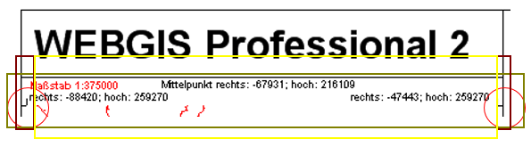

First, we create the panel in which these should be visible. For this, we first need a panel below the heading panel, and within it, a panel aligned to the left and one aligned to the right.

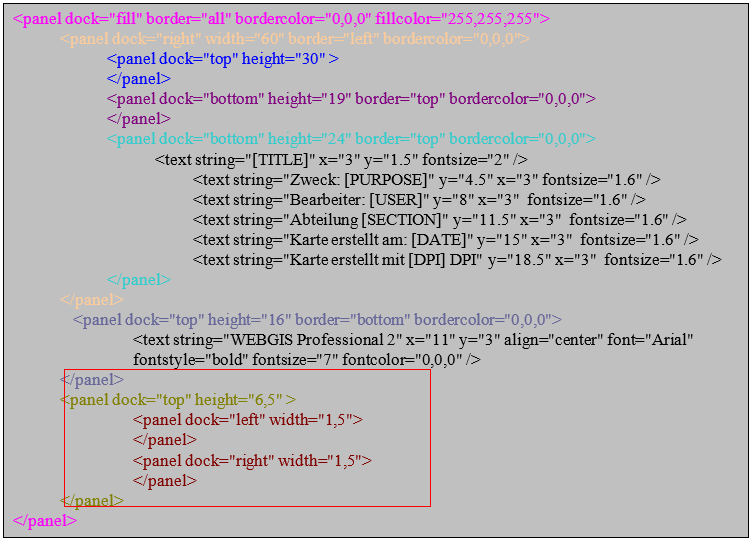

Now the lines are drawn inside these panels:

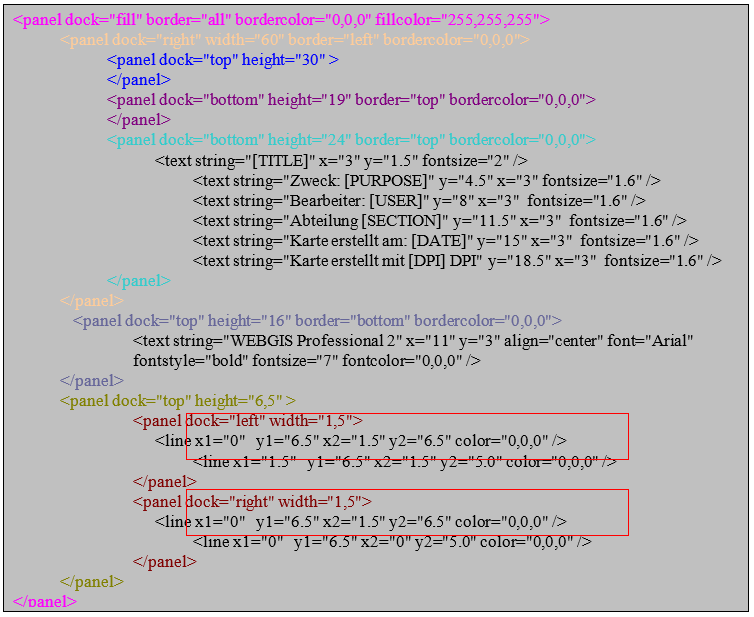

The remaining space of this panel should now be filled, and then also given the coordinates and the scale:

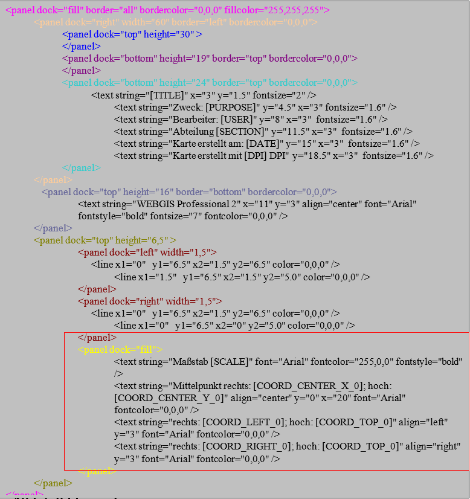

Inserting Images
================

Images located in a subfolder under ``\Viewer\`` can also be integrated into a custom layout. The following syntax is used for this:

.. code-block:: xml

   <image src="img/logos/e_steiermark_kl.png" x="13" y="1" width="35" height="8" />

The parameters ``x`` and ``y`` represent the insertion point of the image within the panel (0,0 corresponds to the top-left corner of the panel). ``width`` and ``height`` define the size of the image. The image is automatically stretched/distorted to these dimensions. To preserve the correct aspect ratio, width and height should be calculated accordingly.

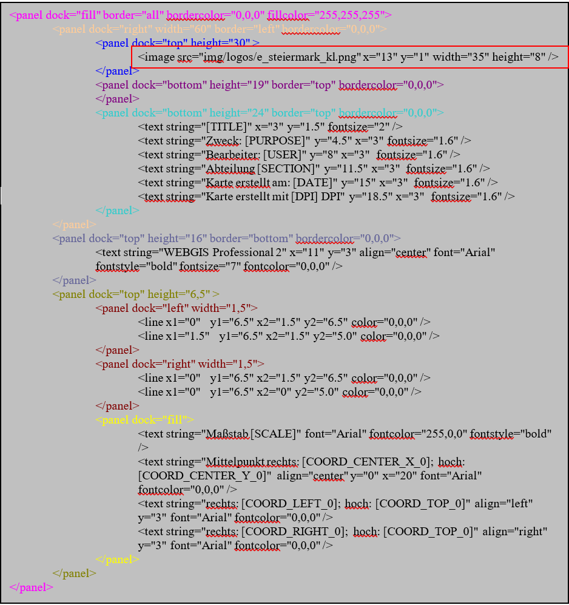

Inserting an Overview Map
=========================

The overview map can be inserted into a panel using the following syntax:

.. code-block:: xml

   <ovmap x="13" y="10" width="35" height="19" border="all" bordercolor="150,150,150" />

The specifications for coordinates (``x``, ``y``), width (``width``), height (``height``), and the border display (``border`` and ``bordercolor``) work exactly as described for panels and images.

To complete our example, we now add the bottom panel, in which the bottom coordinates are shown (analogous to the top coordinate panel). The Energie Steiermark logo and the homepage address are also integrated.

The syntax for this panel looks as follows:

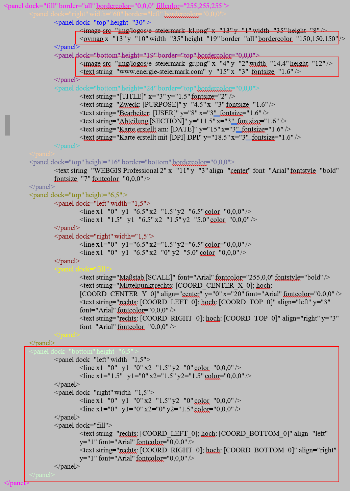

Inserting a Legend
==================

The legend is inserted so that it completely fills the remaining space of the right panel. The following XML is used for this:

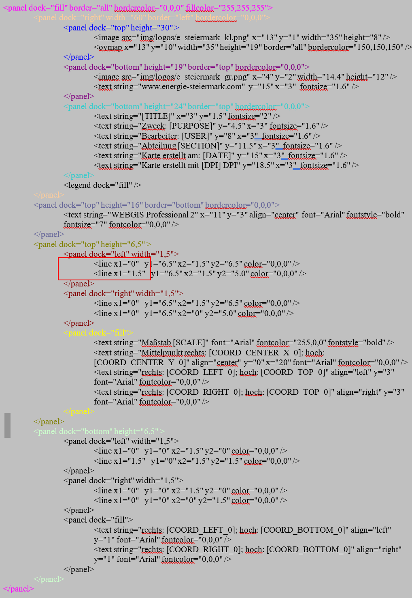

Inserting the Main Map
======================

Once all the panels around the main map have been created, the remaining space is filled with a final panel that gets a margin on both the left and right. The main map is shown in this panel.

The correct syntax is:

.. code-block:: xml

   <panel dock="fill" border="all" bordercolor="0,0,0" fillcolor="255,255,255">
     <panel dock="fill">
       <panel dock="left" width="1.5" />
       <panel dock="right" width="1.5" />
       <map dock="fill" />
     </panel>
   </panel>

In this example, a margin of 1.5 mm each is created to the left and right of the main map.

Inserting a Scale Bar
=======================

Inside the main map, the scale bar is now inserted, as well as the text `ENERGIE STEIERMARK AG 2007`.

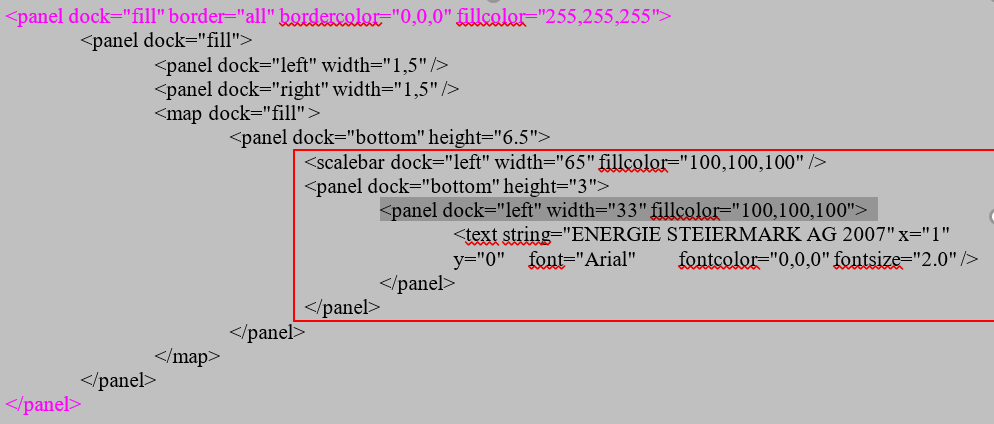

Inserting a North Arrow
=======================

The north arrow symbol is used to clarify the orientation of the map and indicate the direction north. It is particularly helpful when the print extent of the map is rotated. This way, the orientation is preserved regardless of the rotation of the map layout. The position and size of the symbol, as well as the background color, can be customized.

.. code-block:: xml

   <northarrow x="4" y="7" width="7" height="8.5" fillcolor="255,255,255"/>

Custom Text
========================

Custom text fields are placeholders that the user can fill in directly in the print dialog.

.. code-block:: xml

   <layout>
     <variables>
       <variable name="TITLE" alias="Kartenüberschrift" />
       <variable name="PURPOSE" alias="Verwendungszweck" />
       <variable name="TEXT1" alias="Text 1" default="text1!" maxlength="12" />
     </variables>
   </layout>

Custom text fields have the following properties:

.. list-table::
   :widths: 20 80
   :header-rows: 1

   * - Attribute
     - Description
   * - ``name``
     - Internal name of the placeholder used in the layout.
   * - ``alias``
     - Name shown to the user in the print dialog.
   * - ``default`` *(optional)*
     - Default value used if the user does not enter a value.
   * - ``maxlength`` *(optional)*
     - Maximum number of characters allowed for this text.

Overview Windows
=================

With overview windows, any number of overview maps can be positioned in a print layout. The difference from a "normal" overview map is that a fixed scale is specified in the layout for overview windows. Overview windows and the map window always share the same geographic center point.

.. code-block:: xml

   <panel x="82" y="1" width="60" height="60">
    <text string="1:10.000" x="1" y="0" font="Arial" fontcolor="0,0,0" fontsize="6.0" />
    <overview_window dock="fill" scale="40000" presentations="Kataster,EVU">
      <image src="img/hotspots/hotspot3.gif" width="10" height="10" align="center" />
    </overview_window>
   </panel>

In addition to the usual positioning attributes, the ``<overview_window>`` tag also has the following properties:

- ``scale`` specifies the fixed scale for the overview window.
- ``presentations`` allows presentation variants to be specified.

The current map is always shown in the overview windows by default. The display of the overview map can therefore also be additionally controlled via presentation variants. In the example above, a hotspot symbol is inserted at the center of the window, which shows the geographic center point of the map.

Scale and presentation can alternatively also be defined via placeholders in the layout:

.. code-block:: xml

   <overview_window dock="fill" scale="[SCALE]" presentations="[PRESENTATION]" />

In this case, however, a translation of the parameters MUST be specified in the CMS:

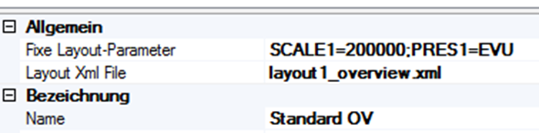

The fixed layout parameters are assigned here (without [ and ]), separated by ;.

Database Connection
===================

If values that come from a database should be inserted into the layout, the connections to the databases must be defined at the end of a layout document (within the ``<layout>`` tag):

.. code-block:: xml

   <dbconnections>
     <dbconnection id="0" connectionstring="C:\ArcIMS\ww_web.mdb" />
     <dbconnection id="1" connectionstring="SQL:server=localhost;database=db1;uid=1;pwd=2" />
   </dbconnections>

The value for ``id`` can be freely chosen (number or text), but must be unique for each connection!

Within the layout, these database connections can then be accessed via the ``<dbtext>`` tag:

.. code-block:: xml

   <dbtext connectionid="0" sql="SELECT Einkehrmöglichkeiten FROM Routen WHERE RoutenID=[HEADERID]" x="1" y="0" fontsize="1.8" wrap="true" />

The ``connectionid`` attribute establishes the connection with the connections defined above. The SQL clause defined in the ``sql`` attribute must be defined so that it returns exactly one value.

The attribute ``wrap="true"`` causes an automatic line break if the text becomes too long.

[HEADERID]
----------

The placeholder ``[HEADERID]`` shown here refers to a value from an object of a topic/layer selected by the user. To allow the user to make a selection, a query must exist in the CMS for the desired topic, which must also be added to the corresponding map.

As an example, a parcel query is used here. The corresponding field that should serve as ``HEADERID`` is, for example, called "KEY". Below the ``<dbconnections>`` tag, the following must also be entered:

.. code-block:: xml

   <dbconnections>
          <headerid query="grundstuecke" field="NR" />
      	<dbconnection id="0" connectionstring="SQL:…" />
   </dbconnections>

The ``query`` attribute of the ``<headerid>`` tag specifies the URL (parameterized in the CMS) of the query. The ``field`` attribute specifies the field that should serve as ``HEADERID`` in the SQL statements.

If the user now wants to print a map with this layout, they can select from objects. All objects from the query parameterized above that are visible in the printout are available for selection – here, for example, all parcels within the print extent. The user can select exactly one of these.

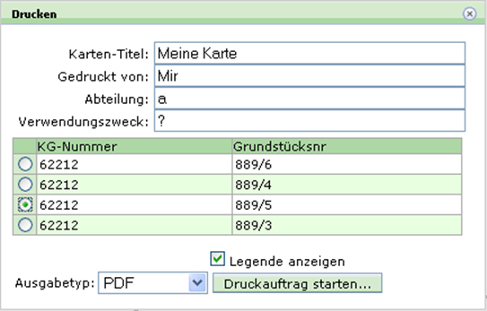

Database texts can thus be made dependent on an object located on the map.

Constraints
=========================

Constraints can be used to hide individual tags of a layout when a condition is met or not met. Analogous to the database connections, the possible constraints are defined at the end of the document (within the ``<layout>`` tag):

.. code-block:: xml

   <constraints>
     <constraint id="noHeaderId" value="[HEADERID]" tester="" />

     <constraint connectionid="0" id="legendpic1"
                 value="SELECT Wegkategorie FROM Routen WHERE RoutenID=[HEADERID]" tester="1" />

     <constraint connectionid="0" id="legendpic2"
                 value="SELECT Wegkategorie FROM Routen WHERE RoutenID=[HEADERID]" tester="2" />

     <constraint connectionid="0" id="legendpic3"
                 value="SELECT Wegkategorie FROM Routen WHERE RoutenID=[HEADERID]" tester="3" />
   </constraints>

Constraints (``<constraint>`` tag) always consist of the following attributes:

- ``id``: unique identifier of the constraint
- ``value``: the value to be checked
- ``tester``: value against which the content of ``value`` is compared

An SQL query can also be specified as ``value``, if the ``connectionid`` attribute is additionally set.

To make individual tags (``panel``, ``text``, ``image``, ``dbtext``, etc.) dependent on a constraint, the attributes ``if_constraint`` (inserted if the constraint is met) or ``if_not_constraint`` (inserted if the constraint is not met) are used.

Examples:

.. code-block:: xml

   <panel if_not_constraint="noHeaderId" dock="bottom" height="26" border="all" bordercolor="0,0,0">

This panel is only inserted if the constraint ``noHeaderId`` is **not** met, i.e. if the value ``[HEADERID]`` is not empty.

.. code-block:: xml

   <image if_constraint="legendpic1" x="0" y="0" width="5" src="vww_gelb.gif" height="17" />
   <image if_constraint="legendpic2" x="0" y="0" width="5" src="vww_rot.gif" height="17" />
   <image if_constraint="legendpic3" x="0" y="0" width="5" src="vww_blau.gif" height="17" />

These images are each only inserted if the corresponding constraint is met.

Modules (Include Files)
========================

If certain elements occur repeatedly within a layout document (so-called "tag building blocks"), they can be stored in separate include files for better maintainability. Such building blocks must be defined within an ``<include>`` tag in the include file. These files must be located in the directory ``etc\layouts\`` (relative to the WebGIS installation).

Example of an include file named ``layout_vogis_wander_legende.xml``:

.. code-block:: xml

   <include>
   	    <!-- untere zeile / Legende -->
        <panel dock="bottom" height="7.5" border="top" bordercolor="0,0,0">
          <panel dock="left" width="1.5" />
          <panel dock="left" width="33">
            <image src="img/vogis_logo.gif" width="33" height="7" />
          </panel>
          <panel dock="left" width="33">
            <text string="www.vorarlberg.at/vorarlberg/bauen_wohnen/bauen/vermessung_geoinformation/start.htm"
                  fontsize="1.8" wrap="true" x="0" y="0" />
          </panel>
        </panel>
   </include>

Such a file is included in the layout document via the ``<include>`` tag with the ``file`` attribute, which specifies the file name of the include file:

.. code-block:: xml

   <include file="layout_vogis_wander_legende.xml" />

Coordinate System
=================

If coordinates should be output in a different coordinate system, this must be specified in the ``<layout>`` tag of the XML file. This is done via the following attributes:

.. code-block:: xml

   <layout coord_srs="4326" coord_format="dms">

Here, for example, the coordinates are output in the WGS 84 system. The output format is degrees, minutes, and seconds (``dms``). Alternatively, the coordinates can also be output in degrees and minutes with the attribute ``coord_format="dm"``.

The following placeholders are available for coordinate values, where the number at the end specifies the number of decimal places:

.. code-block:: text

  [COORD_CENTER_X_0]
  [COORD_CENTER_Y_0]
  [COORD_CENTER_X_1]
  [COORD_CENTER_Y_1]
  [COORD_CENTER_Y_2]
  [COORD_CENTER_X_3]
  [COORD_CENTER_Y_3]

  [COORD_LEFT_0]
  [COORD_LEFT_1]
  [COORD_LEFT_2]
  [COORD_LEFT_3]

  [COORD_RIGHT_0]
  [COORD_RIGHT_1]
  [COORD_RIGHT_2]
  [COORD_RIGHT_3]

  [COORD_BOTTOM_0]
  [COORD_BOTTOM_1]
  [COORD_BOTTOM_2]
  [COORD_BOTTOM_3]

  [COORD_TOP_0]
  [COORD_TOP_1]
  [COORD_TOP_2]
  [COORD_TOP_3]

The ``coord_format`` attribute allows the following values:

- ``dms``: output in degrees, minutes, seconds
- ``dm``: output in degrees and minutes

If ``coord_format`` is not specified, the coordinates are output as a decimal value.

The ``coord_srs`` attribute defines the coordinate system (e.g. ``4326`` for WGS 84).

.. caution::

  It must be ensured that a corresponding coordinate system is parameterized in the CMS.

Sub-Pages
=========

Subpages can be used to generate multi-page PDF files. For example, the legend can be printed on a second page, or an overview page can be created (e.g. an overview map on a second page with an overview window, see above).

Subpages are parameterized in the layout XML file:

.. code-block:: xml

   <layout>
     <subpages>
       <subpage name="layout1_legend.xml" />
       <subpage name="layout1_overview.xml" />
     </subpages>
   </layout>

The additional pages are simply listed by their name.

If placeholders are used in one of the listed layouts (such as in the overview windows), they must be translated in the CMS and specified as parameters.

For the plot server, these parameters can be passed via the URL, e.g.:

.. code:: text

    http://localhost/webgis4/plotservice.aspx?bbox=-18728.8693937747,213438.796875772,-17929.4201750753,214761.687500797&psid=ole&param=GEMNR=62212-1606/1|darstellungsvariante=flaewi;strom=on|layoutparameters=SCALE1=200000;PRES1=EVU

