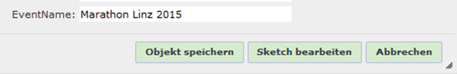
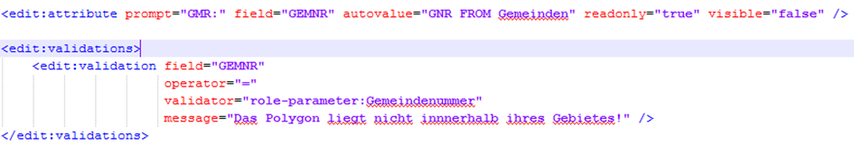
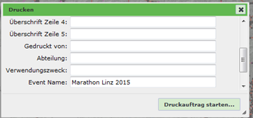

===============
Role Parameters
===============

Role parameters in WebGIS are specific key/value pairs assigned to a WebGIS user. The term and the idea actually come from the PVP environment, where a role can also be passed additional parameters. For example, a role **Municipality** can be further specified by a parameter ``GemeindeNummer``. The role authorizes an authenticated user for a specific application (map). The role parameter determines the actual municipality and can be used for different use cases.

Using Role Parameters
=========================

If PVP is used as the authentication method, the role parameters are read from it automatically. In addition, role parameters can also be passed to each user from a database. For this, the following two tags are required in ``webgis.config``:

.. code:: xml

   <add key="portal_extended_role_parameters_source" value="postgres:Server=127.0.0.1;Database=webgis;User Id=postgres;Password=…"/>
   <add key="portal_extended_role_parameters_statement" value="select EventID,OrgID,EventName,OrgName from digikat_user_rights where User=@username"/>

The parameter ``portal_extended_role_parameters_source`` specifies the database connection string. The data can come from SQL Server, Postgres, or Oracle. The parameter ``portal_extended_role_parameters_statement`` specifies the SQL statement used to retrieve the role parameters for a given user. The following values can be specified here as SQL parameters:

- ``@username``: the name with which the user authenticated to the viewer.
- ``@pvp_gvgid``: the value from the header variable ``X-AUTHENTICATE-gvGid``.

Columns starting with ``Webgis`` have a special role here:

- ``WebgisAddRoles``: values from this column are not adopted as role parameters, but as a role. Multiple roles can be listed here, separated by commas.

  .. image:: img/image_1.png

HTTP header variables are another way to extend the role parameters. These are usually passed by a portal software (e.g. PVP) when the viewer is called. To be able to access these variables, the following entry is required in ``webgis.config``:

.. code:: xml

   <add key="portal_extended_role_parameters_header" value="X-AUTHENTICATE-cn,X-AUTHENTICATE-email" />

Here, the header variables that should later be available as role parameters are listed, separated by commas. These values can then also be accessed, as shown below, via the syntax ``[role-parameter:ParameterName]``, e.g. ``[role-parameter:X-AUTHENTICATE-cn]``.

.. warning::

   If you specify multiple groups under the ``WebgisAddRoles`` field, they must be separated by commas. For the other roles, however, the individual role parameters are separated by a tilde (~). The reason is that, as in the example above, general text can also be defined for an expression. Since these texts can contain commas, the tilde was chosen instead. For example, if you want to define a role ``KANALVERBUND`` with the parameters ``61001`` and ``61002``, the value of the ``KANALVERBUND`` column must be ``61001~61002``.

Role Parameters for Different Tools
==============================================

Areas of application for role parameters:

1. Locked display filters
2. Edit forms
3. Print layout
4. Viewer layout

Role Parameters in Locked Display Filters
-------------------------------------------------

A more detailed description of locked display filters can be found in the CMS documentation. These are display filters of type ``locked``, which the user cannot influence via the viewer's user interface. This can be used to control the visibility of objects within a layer for a specific user. For example, if a user should only see a subset of the objects in a layer, locked display filters are the right choice.

Within the filter statement, placeholders can be specified in square brackets, such as [username] (see CMS documentation). For role parameters, the following placeholder is available:

[role-paramerter: ...]
~~~~~~~~~~~~~~~~~~~~~~

This placeholder can be used to embed role parameters in a filter. For example, a role from PVP could be passed as ``X-AUTHORIZE-roles: GEM(gemnr=41725,gemnr=41728,gemnr=41733,gemnr=41720)``. The filter placeholder could implement these parameters as follows: ``[role-parameter:gemnr,GEM_NR like '{0}',OR]``.

Three parameters can be passed to the role-parameter placeholder:

1.	The role parameter name: the name of the parameter in PVP, or, for extended role parameters, the name of the corresponding database column
2.	The actual SQL clause. The corresponding value is inserted at {0}
3.	The join operator for the SQL clause, when there are multiple values for the same parameter. This parameter is optional.

Role Parameters in Edit Forms
~~~~~~~~~~~~~~~~~~~~~~~~~~~~~

Role parameters can be automatically adopted into an edit form as an ``autovalue``. To do this, the parameter name must be adopted into the form as follows:

.. code:: text

   <edit:attribute prompt="EventName:" autovalue="role-parameter:EventName" ... />

For edit forms, the prefix ``oninsert`` or ``onupdate`` can additionally be specified here, for example to indicate that the autovalue is only automatically set when an object is created or changed:

.. code:: text

   <edit:attribute prompt="EventName:" autovalue="oninsert:role-parameter:EventName" ... />
   <edit:attribute prompt="EventName:" autovalue="onupdate:role-parameter:EventName" ... />

Role parameters can also be used within edit validations.
Validations are always checked at the end, before the object is saved. If the validation is not successful, the user receives a corresponding error message. Validations are parameterized together with the edit form, within the ``<edit:mask>`` tag:

The ``feld`` attribute specifies the field to be validated. The value of this attribute should have the same spelling as the corresponding ``<edit:attribute>`` tag. The operator can be ``=`` or ``==``. ``=`` checks whether the field and the validator are equal, ignoring case. ``==`` checks for exact spelling. As with the example here, a role parameter can again be specified as the operand. Such a validation makes sense, for example, if you want to check whether a drawn object is located within a municipality. For this, the field must first be calculated as an autovalue via a geometric intersection (see above, ``GNR FROM Gemeinden``). Since validation happens only after the autovalues have been calculated, an error message would be shown if the calculated value does not match the logged-in user's municipality-number role parameter.

Role Parameters in the Print Layout
~~~~~~~~~~~~~~~~~~~~~~~~~~~~~~~~~~~

Parameterizing print layouts is described in the WebGIS admin documentation and is assumed here as a prerequisite.

If role parameters should be shown in the printout, they must be defined as a variable in the print layout (layout.xml):

.. code:: xml

   <variables>
      <variable name="TITLE" alias="Karten-Titel 0" />
      <variable name="TITLE1" alias="Überschrift Zeile 1" />
      <variable name="EVENTNAME" alias="Event Name" default="role-parameter:EventName"  />
   </variables>

Here, the variable gets the EventName parameter as its default value. Of course, the variable must also be positioned somewhere in the layout:

.. code:: xml

   <text string="[EVENTNAME]" x="3" y="3.5" font="Arial" fontcolor="0,0,0" fontstyle="bold" fontsize="2.0"/>

As a result, the parameter is shown in the print dialog before printing and then inserted into the printout:

The user also has the option to change the text. If this should not be possible, the variable can be marked with ``visible="false"`` in the print layout. This means it does not appear in the dialog and cannot be changed. However, the parameter is still included in the printout.

Role Parameters in the Viewer Layout
~~~~~~~~~~~~~~~~~~~~~~~~~~~~~~~~~~~~

To show role parameters in the viewer layout, the [role-parameter:…] placeholder is also available in layout_viewer.xml.

Example:

.. code:: xml

   [role-parameter:X-AUTHENTICATE-cn]:
