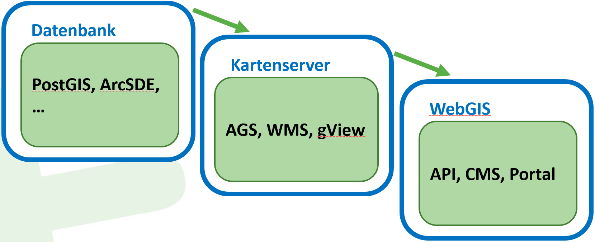
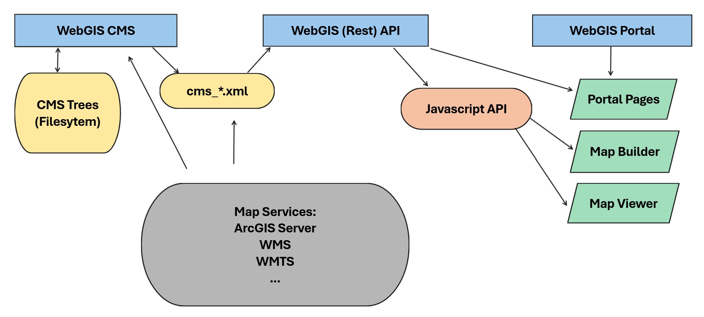
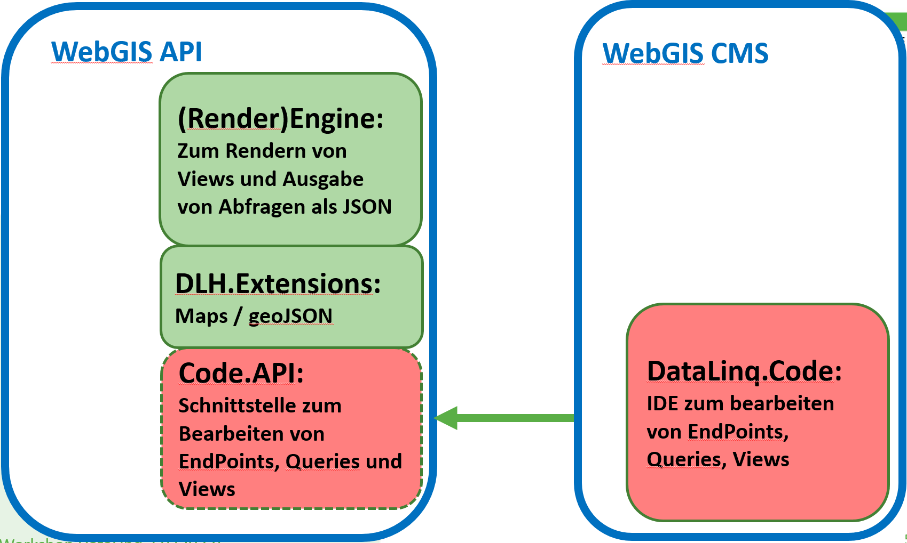

Welcome to WebGIS
========================

WebGIS is a flexible open-source framework for creating and publishing interactive map and feature services. Map applications can be configured and managed via an intuitive web interface – whether hosted locally on the client or on a server. Maps are created using built-in tools that allow various geodata sources to be integrated as individually styled layers.

Finished map applications can be published via the WebGIS server and accessed through standardized interfaces such as WMTS, WMS, ArcGIS Server, or ArcIMS. This makes WebGIS a modular platform for building modern geographic information systems that serve both administrators and end users.

Structure of the WebGIS Platform (Architecture)
-----------------------------------------------

Via the *WebGIS platform*, maps with *background* and *thematic data* can be offered through a browser application.
The *background* and *thematic data* must be implemented via common map service interfaces:

* WMTS
* WMS
* ArcGIS Server
* ArcIMS

The *WebGIS platform* offers tools for displaying and querying these map services. Depending on the properties of the map service, the geodata can also be created and edited.

*WebGIS* does not provide tools for *hosting* map services. The map services must be hosted by dedicated applications, so-called map servers.
Examples of map servers include *GeoServer* (https://geoserver.org/), *gView Server* (https://github.com/jugstalt/gview-gis), or commercial products such as *ArcGIS Server* (https://www.esri.com/).
Map servers typically access geodata in a database via their backend (e.g. PostgreSQL/PostGIS) and implement one of the interfaces listed above.

This method is well suited for building distributed map applications. If you want to publish your own data via *WebGIS*, a map server is additionally required:

WebGIS Applications (Overview)
------------------------------

WebGIS consists of three applications:

* **WebGIS CMS**: for administrators
* **WebGIS API**: REST interface and JavaScript API
* **WebGIS Portal**: entry page for the user. This is where portal pages (map collections)
  and the map viewer are offered.

Via the **WebGIS CMS**, administrators can define which services are offered via the **WebGIS API**.
It can also be used to specify which topics can be queried from a service, how the query result is displayed, which topics may be edited, etc.
The parameterization is stored on the server in a tree structure in the file system
(roughly corresponding to the tree structure in the CMS interface).
To communicate changes made in the **WebGIS CMS** to the **WebGIS API**, a **deploy** is run in the CMS
that builds an XML file from a CMS tree.

Based on the CMS XML files, the **WebGIS API** provides map services. These
services can be retrieved via HTTP REST requests or via a JavaScript API.

The **WebGIS Portal** is the entry page for the user. Portal pages are offered here.
These are collections of maps. A map, in turn, is an application offered in the
*map viewer* that consists of at least one *map service*. An administrator determines which maps
are offered. Maps are created with the **MapBuilder**.
There, it is defined which *map services* and *tools* are offered in a *map*.

Authentication of the user is also handled via the **WebGIS Portal**. The permissions of a
user (or their role) can likewise be defined in the **WebGIS CMS** and are then
taken into account by the **WebGIS API** when accessing the *map services*.

WebGIS API
^^^^^^^^^^

The *WebGIS API* is the core of the WebGIS platform. This application provides (programming) interfaces for accessing map services.
A REST API is offered as the interface. For developing browser-based applications, a JavaScript API is also offered, in which
the REST API calls are already encapsulated. A description of the JavaScript API can be found here: https://docs.webgiscloud.com/dev/index.html

If you want to develop your own map applications (via JavaScript), you generally only need to install this application.

WebGIS Portal
^^^^^^^^^^^^^

The *WebGIS Portal* is a web application that accesses the interfaces of the *WebGIS API* and can use them to provide ready-to-use interactive (online) maps.
This application is aimed at all users/WebGIS operators who do not want to develop map applications via programming interfaces (REST, JavaScript).

The *WebGIS Portal* already offers a fully functional map viewer that already fulfills the following functions:

* Display of multiple map services within a single map application
* Toggling individual topics/layers of the integrated map services
* Legend
* Querying and searching within the integrated map services
* Scale-accurate printing of maps in PDF format
* various map tools (measuring, 3D model, redlining, editing geodata, queries, search, coordinates, ...)

As an example, you can look at a simple map (background maps only):
https://maps.webgiscloud.com/examples/map/Basemaps/Geoland%20Basemap.at

For administrators, the *WebGIS Portal* offers a MapBuilder for creating maps. These maps can then be published on so-called *map portals* (map collections) (e.g. https://maps.webgiscloud.com).

WebGIS CMS
^^^^^^^^^^

The *WebGIS CMS* is relevant only for administrators and does not need to (and should not) be accessible to all WebGIS users.
This application is used to define which map services are made available via a *WebGIS API* instance. It can also be used to determine, for individual services,
which topics are visible, queryable, or editable.

The configuration of the map services is done via a web interface in a tree structure. This *CMS tree* can then be published for a *WebGIS API* instance. In this step, the tree is combined into a
*CMS file*. This file can be integrated into a *WebGIS API instance* via the *WebGIS API configuration*. A *WebGIS API* can integrate multiple *CMS files*.

(WebGIS) DataLinq
^^^^^^^^^^^^^^^^^

WebGIS includes a *DataLinq instance* that extends DataLinq with support for handling integrated maps.
DataLinq rendering is performed within a WebGIS API instance. The configuration is done in the
``datalinq`` section of ``api/_config/api.config``.

Editing of DataLinq objects (endpoints, queries, views) is done via *DataLinq.Code*. The editor
is integrated into WebGIS as part of the CMS application and can be configured via the file ``cms/_config/datalinq.config``.

.. toctree::
   :maxdepth: 2
   :caption: Contents:

   installation/index
   run/index
   config/index
   apps/index
   extended_config/index
   annex/index
