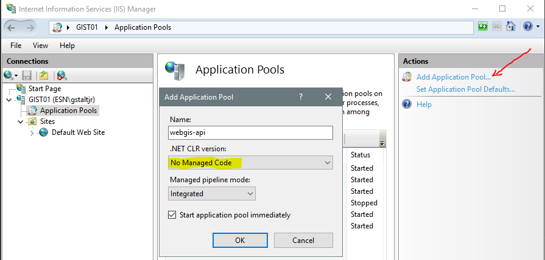
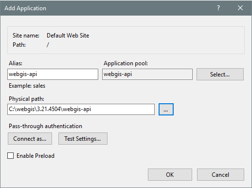
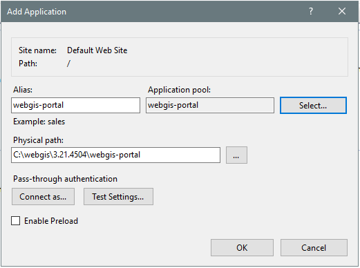
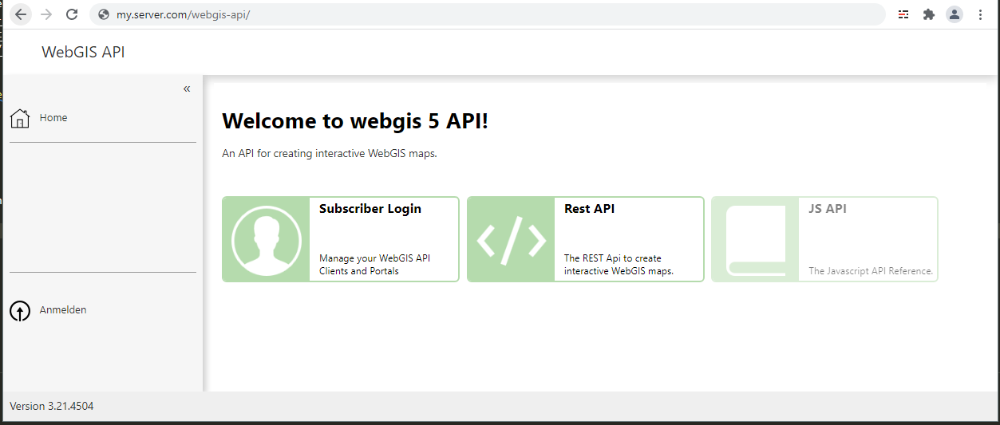
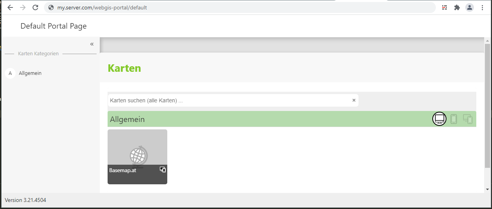

Running in Internet Information Services (IIS)
=================================================

This section shows how, building on the Windows installation shown above, WebGIS can be published via Microsoft IIS. This WebGIS can then be used by all users without a local installation, via a *web browser*.

In the first step, application pools must be created for the individual web applications.

.. note::
   One application pool must be created per application (WebGIS API and WebGIS Portal). It is not possible for both applications to share a pool.

For the WebGIS application, two application pools (``webgis-api`` and ``webgis-portal``) must be created with the following settings:

Before the actual applications are created in IIS, the configuration should be adjusted. To do this, open in the installation directory
the files ``webgis-api/_config/api.config`` and ``webgis-portal/_config/portal.config``

If the two web applications should later be named ``webgis-api`` and ``webgis-portal``, the configuration files must be adjusted as follows:

.. code:: xml

   <!-- webgis-api/_config/api.config adjustments -->
   <add key="api-url" value="https://my.server.com/webgis-api" />
   <add key="portal-url" value="https://my.server.com/webgis-portal" />
   <add key="portal-internal-url" value="http://localhost/webgis-portal" />

.. code:: xml

   <!-- webgis-portal/_config/portal.config adjustments -->
   <add key="api" value="https://my.server.com/webgis-api" />
   <add key="api-internal-url" value="http://localhost/webgis-api" />
   <add key="portal-url" value="https://my.server.com/webgis-portal" />

The two applications can be created with ``Add Application`` (e.g. on the ``Default Web Site``).
For each application, the corresponding *ApplicationPool* must be specified and the correct directory in the file system must be selected:

After that, the applications should be reachable:

Permissions
--------------

The WebGIS web applications need read and write access to the ``webgis-repository`` directory. A user that ensures this must be used for the application pool.
The IIS default user ``ApplicationPoolIdentity`` usually does not have this right. If the web application has insufficient (write) permissions, calling up a map results, for example, in the following
error message:

   .. image:: img/install_iis_6.png

.. warning::

   For test purposes, the application pool user ``LocalSystem`` can be used. This usually has access to all directories. In production environments, however, this is not advisable.
   Here, a user should be used (created) that has only exactly the permissions that are absolutely necessary.

