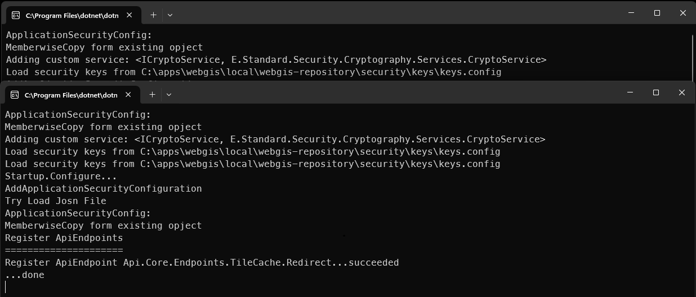
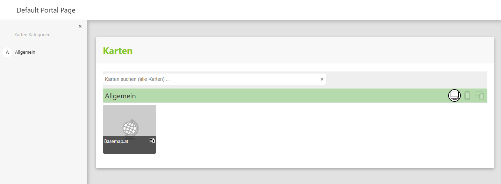
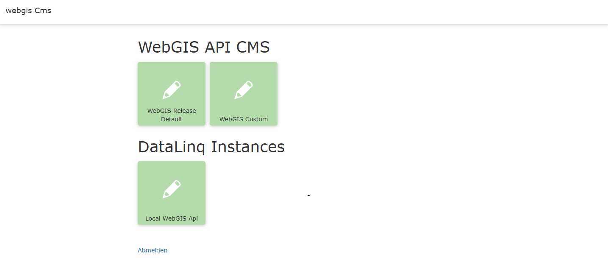

Running Locally (Windows Desktop Mode)
=======================================

.. Sowohl *gView.WebApps* als auch *gView.Server* können lokal auf dem Desktop gestartet werden.

.. Der Einsatz von *gView.Server* lokal macht hauptsächlich für Testzwecke Sinn.

.. .. note::

..     Ein möglicher Anwendungsfall wäre jedoch, den *gView.Server* innerhalb einer Offline-Lösung
..     zu verwenden. Dazu müssten auf den Offline-Geräten folgende Komponenten vorhanden sein:

..     * Kartenserver (*gView.Server*)
..     * Alle notwendigen Daten (z.B. in einer SQLite-Datenbank)
..     * Eine WebGIS-Lösung, die über den Kartenserver Karten darstellt.

.. Da *gView.WebApps* die früheren Desktop-Anwendungen *gView.Carto* und *gView.DataExplorer* ablöst, kann
.. es sinnvoll sein, diese Applikation nur bei Bedarf zu starten.

.. Dazu muss man in das Verzeichnis wechseln, in dem im vorherigen Schritt die Anwendung *deployed* wurde
.. (hier: C:\\apps\\gview-gis\\local\\6.24.1801)

.. .. note::

..     Die letzten beiden Unterverzeichnisse entsprechen dem Profil und der Versionsnummer des zuvor
..     erstellten *Deployments*.

.. In diesem Verzeichnis sollten sich folgende Dateien und Ordner befinden:

.. .. image:: img/run01.png

.. * ``gview-server.bat`` startet den *gView.Server* lokal.
.. * ``gview-web.bat`` startet *gView.WebApps* (*gView.Carto*, *gView.DataExplorer*) lokal.

.. Wenn man ``gview-web.bat`` startet, erhält man folgende Ausgabe:

In the directory ``C:\apps\webgis`` there are two executable batch files. These can be used to start WebGIS *locally*. This means that WebGIS is started here like a desktop application.
For each individual application, a *local web server* is started and the applications are displayed via the browser.

.. code:: text

    C:\apps\webgis>
    └── webgis
        └── local
            ├── 7.25.701
            │   ├── _requirements
            │   ├── _scripts
            │   ├── start-webgis-cms.bat
            │   ├── start-webgis.bat
            │   ├── webgis-api
            │   ├── webgis-cms
            │   └── webgis-portal

* ``start-webgis.bat``:
  Starts the ``WebGIS API`` (local web server on HTTP port 5001) and the ``WebGIS Portal`` (local web server on HTTP port 5002). In addition, a browser window is opened showing the WebGIS Portal.

* ``start-webgis-cms.bat``:
  Starts the ``WebGIS CMS`` application on a local server on HTTP port 5003. In addition, a browser window is opened showing the CMS application.

.. note::
   Before *WebGIS* can be operated in production, some *configuration steps* are necessary. Every application in the *WebGIS* package must contain a corresponding configuration file in the ``_config`` folder (``api.config``, ``portal.config``, ``cms.config``).
   The configuration files are included in the installation package. However, a default configuration is created the first time the application starts. This can then be adapted to individual requirements.
   See also the **Configuration** section.

The first time ``start-webgis.bat`` is started, it is checked whether a configuration file exists for the *WebGIS API* and *WebGIS Portal* applications (``webgis-api/_config/api.config`` and ``webgis-portal/_config/portal.config`` respectively).
If this is not the case, a prototype of the WebGIS configuration is created. This can be adapted later. In addition to the configuration files, a ``webgis-repository`` directory is also created.

.. code:: text

    C:\apps\webgis>
    └── webgis
        └── local
            └── webgis-repository
                ├── cms
                ├── configuration
                ├── db
                ├── output
                └── security

Additional files required for the operation of *WebGIS* are stored there (map projects, CMS database, ...).

.. note::
   Some files in the ``webgis-repository`` are stored encrypted. The internal communication between the individual WebGIS web applications and login cookies are likewise encrypted.
   The ``keys`` for this encryption are stored under ``webgis-repository/security/keys`` after the first start. The files contained there should not be shared with third parties.
   If you operate WebGIS both on the internet/intranet and as an *offline solution*, the same ``keys`` should not be used for the *offline solution* as on the server. For an *offline solution*,
   users receive a package with all program and configuration files.

When ``start-webgis.bat`` is started, two console windows open in which the local web servers run:

A browser window shows the *WebGIS Portal* application:

.. note::

    Especially on the first start, some configuration files are created and copied. Unfortunately, it can happen that the *WebGIS API* starts more slowly and is not yet available in time for the *WebGIS Portal*.
    In this case, WebGIS shows an error message (``No connection could be made because the target machine actively refused it.``). This error can easily be fixed by reloading the browser with ``F5``.
    As soon as the API has finished its initial configuration, the portal should display correctly.

The default configuration already provides a basic map. The tools offered in it (quick search for addresses, coordinate and elevation query, 3D model) already work as well.

If you want to integrate additional map services (WMS, ArcGIS Server services), this can also be done via the viewer's user interface (``Add services``). If you want to reuse services in maps repeatedly,
this can be done via the *WebGIS CMS web application*. The general procedure for creating WebGIS maps is as follows:

1. Integrate services (WMS, AGS, ...) into the CMS.

2. Configure specific properties of the services (possible queries, table of contents or display variants, editing forms, permissions).

3. Publish the CMS (this makes these settings visible to a WebGIS API instance).

4. Log in as administrator/map author to the *WebGIS Portal*, and from there open an existing map in the *MapBuilder* or create a new map directly via the *MapBuilder*.

5. In the *MapBuilder*, add the desired services and tools to a map.

6. Publish the map for the *WebGIS Portal* via the *MapBuilder*. This makes the map available to other users.

The *WebGIS CMS* can be started locally via the batch file ``start-webgis-cms.bat``. A *default configuration* is also created on the first start.

**Default credentials**

The predefined credentials for the CMS system are:

- **User name:** ``author``
- **Password:** ``webgisauthor``

.. warning::

    If the CMS runs on a system other than a protected test system, or is publicly accessible,
    the default password **must** urgently be changed for security reasons!
    Otherwise there is a high risk of unauthorized access.

The application starts as a local server application (HTTP port 5003) and is displayed in a browser:

**Default configuration of the WebGIS CMS trees**

In the *default configuration*, two WebGIS CMS trees are created automatically:

1. **``WebGIS Release Default``**
   - Contains predefined **basic map services** (e.g. *Basemap.at*).
   - This was created by the *WebGIS developers* and serves as an **unchangeable base** for map applications.
   - Changes to this tree are **not recommended**.

2. **``WebGIS Custom``**
   - **Your own services** can and **should** be configured here.
   - This tree serves as an individual customization layer for specific requirements.

In addition, a **tile for the base installation of DataLinq** is shown.
More information about this is available in the official `DataLinq documentation <LINK_ZUR_DOKU>`_.

